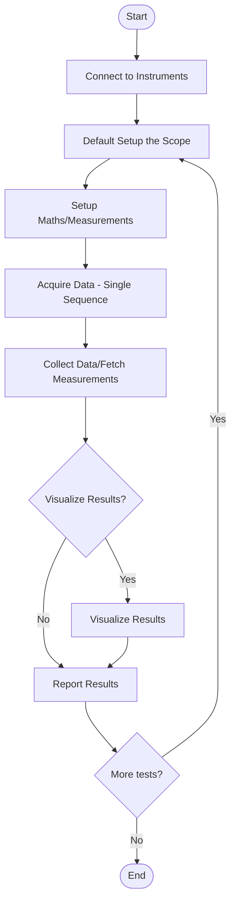

# Automated Test Measurement Workflow Guidelines

---

## LLM Context & Guide Purpose

> **Note for LLMs and Users:**
> This document is designed as a comprehensive reference for automating and documenting workflows for Tektronix oscilloscope measurements using Python, with a focus on LLM-assisted code generation and review. It contains domain knowledge, best practices, and implementation patterns that are typically missing from LLM training data. Use this guide to:
> - Enable LLMs (and humans) to generate, review, and validate robust, production-quality automation scripts for Tektronix oscilloscopes.
> - Ensure all code and documentation meet Tektronix standards for measurement setup, data acquisition, error handling, and reporting.
> - Provide a single source of truth for workflow, rules, and troubleshooting for scope automation tasks.

---

## Use Case Covered by This Guide

This guide specifically addresses the simple cases for **measurement test workflow** for Tektronix oscilloscopes. The primary focus is on automating the essential measurement and data collection steps required for typical test and validation tasks. In addition to faithfully covering the original workflow, this guide is **augmented** to include plotting and visualization features, enabling users to see real-time or post-test visual feedback of measurements and waveforms during testing. This makes the workflow more transparent, debuggable, and user-friendly for both engineers and LLMs.

---

## Workflow Overview (Visual)



---

## 1. High-Level Workflow Overview
- Connect to instruments
- Default setup the scope:
  - Reset scope
  - **Setup AFG (Arbitrary Function Generator) for stable signal source**
  - Run autoset
  - Set single sequence mode
- Setup measurements and math
- Acquire data (single sequence)
- Collect data/fetch measurements
- **Visualize results (optional, but recommended for debugging and transparency)**
- Report results
- Repeat for additional tests as needed

---

## 2. Best Practices, Acceptance Criteria, Prompt Patterns, and Example Interactions

### Best Practices
- Do NOT raise exceptions that require user intervention in main loops or user-facing code. Handle errors gracefully: print a clear warning or message and exit or skip as appropriate. Exceptions are allowed within functions as long as the user sees a reasonable, actionable message and the script does not crash with a traceback.
- Use try/except blocks to catch and report errors during acquisition, measurement, and file operations.
- Print out actual UI width, number of UIs, sample density, and warnings if requirements are not met.
- **CRITICAL**: For jitter measurements, a minimum of 100 UIs must be acquired for valid statistical analysis. The program must verify this requirement and adjust the record length if necessary.
- Use debug output to diagnose SCPI command issues, timeouts, and data mismatches.
- Always prompt for connection information (IP address, etc.) if not provided by the user. Never hardcode connection details unless specifically provided by the user.
- **CHANNEL ASSUMPTION**: When no specific channels are mentioned in the user requirements, assume CH1 as the default channel. This is especially important for AFG (Arbitrary Function Generator) applications where the signal is typically routed to CH1.
- For continuous measurements, implement proper cleanup and exit handling:
  - Support both Ctrl+C and plot window close for termination
  - Save all collected data before exiting
  - Clean up resources properly
  - Use global flags for clean program termination
  - Implement real-time visualization updates
- Include the original prompt EXACTLY as provided in the header comment, without any interpretation or modification. This ensures the requirements are preserved exactly as specified.
- **CRITICAL**: When plotting is requested, ALWAYS log the data to a CSV file unless specifically told otherwise. The CSV file should:
  - Include timestamps for each measurement
  - Use clear column headers
  - Be saved in a dedicated data directory
  - Include metadata about the measurement setup
  - Be continuously updated during measurement
  - Be properly closed on program exit
  - Use a consistent naming convention (e.g., YYYYMMDD_HHMMSS_measurement_type.csv)

### Acceptance Criteria & Checklist
A test program is considered complete and acceptable when:

1. **MUST Requirements**: All requirements marked as MUST in the checklist below are satisfied
2. **User Requirements**: All requirements from the original prompt have been implemented and validated
3. **Information Handling**: 
   - Required information is obtained from the scope setup
   - Sensible defaults are used when information is not specified
   - User is informed of any assumptions made
   - Default behaviors are applied when not specified (e.g., multi-channel plots use separate subplots)
   - **CH1 is assumed as the default channel when no specific channels are mentioned**
   - Connection information is requested from user if not provided
   - Original prompt is preserved exactly as provided
4. **Execution** (SHOULD): Code should run to completion without errors and produce correct results
   > **Note**: While execution verification is desirable, it may be logically difficult for an LLM to confirm this without actual hardware access. The code should be structured to handle errors gracefully and provide clear feedback.

#### Code Development Checklist

| Category | Requirement | Priority | Description |
|----------|-------------|----------|-------------|
| **Code Quality** | Lint Clean | MUST | Code must pass all linter checks with no warnings |
| **Code Quality** | PEP 8 Compliant | MUST | Follow Python style guide |
| **Code Quality** | Type Hints | SHOULD | Use type hints for function parameters and returns |
| **Documentation** | Header Comment | MUST | Include original prompt, requirements, and changes |
| **Documentation** | Original Prompt | MUST | Include the original prompt exactly as provided, without interpretation |
| **Documentation** | Function Docstrings | MUST | Clear docstrings for all functions |
| **Documentation** | Inline Comments | SHOULD | Comments for complex operations |
| **Scope Setup** | VISA Address Format | MUST | Use correct format (TCPIP0::IP::INSTR) |
| **Scope Setup** | Timeout Setting | MUST | Set reasonable timeout (e.g., 10000 ms) |
| **Scope Setup** | Connection Error Handling | MUST | Handle connection failures |
| **Scope Setup** | Cleanup in Finally | MUST | Proper cleanup in finally block |
| **Scope Setup** | User Input for Connection | MUST | Prompt for connection info if not provided |
| **AFG Setup** | AFG Configuration | MUST | Configure AFG after reset, before autoset for stable signal source |
| **AFG Setup** | AFG Function Setting | MUST | Set AFG function (typically SINE wave) |
| **AFG Setup** | AFG Frequency Setting | MUST | Set AFG frequency (typically 5MHz for standard tests) |
| **AFG Setup** | AFG Output Enable | MUST | Enable AFG continuous output |
| **AFG Setup** | AFG Error Handling | MUST | Handle AFG setup errors gracefully (continue without AFG if not available) |
| **Channel Config** | Enable Before Autoset | MUST | Enable channels BEFORE autoset |
| **Channel Config** | Run Autoset | MUST | Get stable signal |
| **Channel Config** | Configure After Autoset | MUST | Set measurements AFTER autoset |
| **Channel Config** | Record Length | MUST | Set appropriate length for UI count |
| **Channel Config** | Manual Mode First | MUST | Set HOR:MODE MAN before changing record length or sample rate. Use `HORizontal:MODe:MANual:CONFIGure RECORDLength` to fix sample rate while scale changes adjust record length. |
| **Channel Config** | Sample Rate Validation | MUST | Calculate and set correct sample rate for desired sampling density |
| **Channel Config** | UI/Cycle Validation | MUST | Verify and adjust for minimum 100 UIs or 200 cycles as appropriate |
| **Channel Config** | Sampling Density | MUST | Ensure minimum 100 samples per UI or 200 samples per cycle |
| **Channel Config** | User Specified UIs/Cycles | MUST | If user specifies UI/cycle count, validate and adjust settings accordingly |
| **Measurement** | Clear Existing | MUST | Check MEASUrement:LIST? for 'NONE' before deleting measurements. Use `*CLS` to reset all measurement statistics to 0 acquisitions — `MEASUrement:STATIstics:COUNt` is NOT a valid command. |
| **Measurement** | Correct Order | MUST | Add measurements in proper sequence |
| **Measurement** | Source Setting | MUST | Set correct source for each measurement |
| **Measurement** | Enable State | MUST | Set STATE ON for measurements |
| **Data Collection** | Error Handling | MUST | Handle measurement query errors |
| **Data Collection** | Storage Format | MUST | Use appropriate data format |
| **Data Collection** | Timestamp Recording | MUST | Record time for each measurement |
| **Data Collection** | Continuous Save | SHOULD | Save data continuously to prevent loss |
| **Visualization** | Clear Labels | MUST | Proper plot labels and titles |
| **Visualization** | Axis Scaling | SHOULD | Appropriate axis scaling |
| **Visualization** | Legend | SHOULD | Legend for multiple measurements |
| **Visualization** | Grid | SHOULD | Grid for better readability |
| **Visualization** | Multi-Channel Layout | MUST | Use separate subplots for each channel unless specified otherwise |
| **Visualization** | Real-time Updates | MUST | Update plots in real-time for continuous measurements |
| **Visualization** | Exit Handling | MUST | Handle plot window close and Ctrl+C for termination |
| **Visualization** | Engineering Notation | MUST | Use engineering notation for axis tick labels on physical measurements |
| **Visualization** | Live Plotting | MUST | Use matplotlib interactive mode for real-time updates |
| **Error Handling** | Scope Errors | MUST | Handle scope communication errors |
| **Error Handling** | Measurement Errors | MUST | Handle measurement failures |
| **Error Handling** | Storage Errors | MUST | Handle data storage errors |
| **Error Handling** | Clean Exit | MUST | Proper cleanup on exit |
| **User Feedback** | Console Output | MUST | Clear console messages |
| **User Feedback** | Progress Indication | SHOULD | Show measurement progress |
| **User Feedback** | Error Messages | MUST | Clear error messages |
| **User Feedback** | Completion Status | MUST | Show completion status |
| **Code Org** | Reusable Functions | SHOULD | Functions for common operations |
| **Code Org** | Clear Flow | MUST | Clear main program flow |
| **Code Org** | Variable Names | MUST | Proper variable naming |
| **Code Org** | Code Style | MUST | Consistent code style |
| **Testing** | Verify Measurements | MUST | Validate all measurements |
| **Testing** | Check Storage | MUST | Verify data storage |
| **Testing** | Validate Plots | SHOULD | Test plot updates |
| **Testing** | Error Conditions | SHOULD | Test error handling |
| **Error Handling** | No Exceptions in User Code | MUST | No exceptions in user-interacting code; errors must be handled gracefully. Exceptions are allowed within functions if the user sees a reasonable message. |
| **Measurement** | Frequency Preferred | MUST | For cycle-based timing, use FREQUENCY measurement and calculate period as 1/FREQUENCY. Do not use PERIOD in IMMEDIATE mode. |
| **Measurement** | UI Count Validation | MUST | Verify and ensure at least 100 UIs for jitter measurements |

### Prompt Patterns & Example Interactions
// ... (add all unique prompt patterns and example LLM interactions here, ensuring no duplication) ...

---

## 3. Lessons Learned & Best Practices for Tektronix Jitter Measurement Automation

### 3.1 Acquisition and Setup
- Always set the scope to single sequence mode (`ACQ:STOPA SEQ`), then start acquisition (`ACQ:STATE RUN`) and wait for completion (`*WAI;*OPC?`) before making measurements or changing timebase.
- Use `*WAI;*OPC?` liberally to ensure the scope is ready before issuing new commands, especially after acquisition or configuration changes.
- After changing acquisition settings (manual mode, record length, etc.), always trigger a new acquisition and wait for completion so the scope's display and memory reflect the new settings.
- Enable all required channels before running autoset.
- Only configure measurements after autoset, as autoset resets measurement settings.
- **CRITICAL**: When setting up for UI or cycle-based measurements:
  1. Set manual mode first (`HOR:MODE MAN`)
  2. Calculate required sample rate based on UI/cycle width and desired sampling density
  3. Set sample rate using `HOR:MODE:SAMPLERATE`
  4. Calculate and set record length using `HOR:MODE:RECORDLENGTH`
  5. Verify all settings were applied correctly
  6. For jitter measurements, ensure at least 100 UIs and 100 samples per UI
  7. For cycle-based measurements, ensure at least 200 cycles and 200 samples per cycle
  8. If user specifies UI/cycle count, validate and adjust settings accordingly

#### 3.1.1 ACQ Command Behavior
**CRITICAL**: The `ACQ:STOPA SEQ` command does NOT produce OPC responses. Do NOT use `wait_for_opc()` checks after this command.

**Example of what NOT to do:**
```python
scope.write('ACQ:STOPA SEQ')
if not wait_for_opc(scope):  # This will fail - ACQ:STOPA SEQ doesn't produce OPC
    print("Warning: Failed to set single sequence mode")
    return False
```

**Example of what TO do:**
```python
scope.write('ACQ:STOPA SEQ')
print("  Single sequence mode set")
```

**Other ACQ commands that don't produce OPC:**
- `ACQ:STOPA SEQ` - Set single sequence mode
- `ACQ:STATE RUN` - Start acquisition
- `ACQ:STATE STOP` - Stop acquisition

**ACQ commands that DO produce OPC:**
- `ACQ:STATE RUN` followed by `*WAI;*OPC?` - Wait for acquisition completion

#### Default Scope Setup Sequence
The proper sequence for initializing a Tektronix oscilloscope is:

1. Reset the scope and wait for completion:
   ```python
   scope.write('*RST;*WAI;*OPC?')
   ```

2. **Setup AFG (Arbitrary Function Generator) - CRITICAL for stable signal source:**
   ```python
   # Configure AFG for 5MHz continuous sine wave output
   scope.write('AFG:FUNCtion SINE')          # Set function to sine wave
   scope.write('AFG:FREQuency 5000000')      # Set frequency to 5MHz
   scope.write('AFG:OUTPut:STATE ON')        # Enable continuous output
   # Wait for each command to complete
   scope.query('*WAI;*OPC?')
   ```

3. Run autoset and wait for completion:
   ```python
   scope.write('AUTOS EXECUTE')
   max_wait_time = 30  # Maximum wait time in seconds
   start_time = time.time()
   while True:
       response = scope.query('*WAI;*OPC?').strip()
       if response == '1':
           break
       if time.time() - start_time > max_wait_time:
           print("Warning: Autoset operation timed out after 30 seconds")
           break
       time.sleep(0.1)  # Small delay to prevent overwhelming the scope
   ```

4. Set single sequence mode:
   ```python
   scope.write('ACQ:STOPA SEQ')
   ```

**Important Notes:**
- The `*RST;*WAI;*OPC?` command resets the scope to its default settings and waits for completion
- **CRITICAL**: AFG setup must occur AFTER reset but BEFORE autoset to provide a stable signal source
- AFG configuration provides a known, stable 5MHz signal for reliable measurements
- The AFG output is typically available on Channel 1 (verify scope-specific routing)
- Autoset should be run after AFG setup to get a stable signal lock
- Always wait for autoset to complete using `*WAI;*OPC?` before proceeding
- Single sequence mode (`ACQ:STOPA SEQ`) should be set after autoset
- Channel enabling and other specific configurations should be done after this default setup
- When setting up for UI or cycle-based measurements, always set manual mode first
- Calculate and set sample rate before adjusting record length
- Verify all settings were applied correctly

**AFG Command References:**
For Tektronix scopes with AFG option, use these commands:
- `AFG:FUNCtion` - Sets the waveform function (SINE, SQUARE, RAMP, etc.)
- `AFG:FREQuency` - Sets the frequency in Hz
- `AFG:OUTPut:STATE` - Enables/disables the AFG output (ON/OFF)
- `AFG:AMPLitude` - Sets amplitude in volts peak-to-peak (optional)
- `AFG:OFFSet` - Sets DC offset in volts (optional)

**Common Mistakes to Avoid:**
- Do not skip AFG setup if a stable signal source is needed
- Do not set trigger mode manually after autoset
- Do not set display settings during default setup
- Do not set acquisition mode to SAMPLE (not needed)
- Do not enable channels during default setup (should be done later)
- Do not configure measurements during default setup (should be done after channel setup)
- Do not change record length without first setting manual mode
- Do not assume current sample rate is correct for desired sampling density
- Do not skip verification of applied settings
- Do not assume AFG routes to all channels (typically Channel 1 only)

### 3.2 Sample Density and Coverage
- **CRITICAL REQUIREMENT**: For jitter measurements, a minimum of 100 UIs must be acquired for valid statistical analysis. The program must:
  - Calculate the current UI count based on data rate and record length
  - Verify that at least 100 UIs are present
  - Automatically adjust the record length if necessary
  - Provide clear feedback about the UI count and any adjustments made
- For valid jitter or cycle-based measurements, ensure at least 100 (UIs) or 200 (cycles) samples per unit.
- For cycle-based measurements, always prefer measuring FREQUENCY and calculate period as 1/FREQUENCY. Do not use PERIOD in IMMEDIATE mode.
- Set manual mode (`HOR:MODE MAN`) and record length for acquisition control. Do not set horizontal scale in manual mode.
- The correct time axis for Tektronix waveforms is `(index - PT_OFF) * XINCR`.

### 3.3 Measurement and Data Handling
- Clear all previous measurements by first checking `MEASUrement:LIST?` for 'NONE' response, then using `MEASUrement:DELete` for each measurement if they exist.
- Add and enable all required measurements and set their sources explicitly.
- When reading binary waveform data, account for possible extra bytes and validate buffer sizes.
- Save waveform files in a dedicated directory and confirm successful saves.

### 3.4 Plotting and Visualization
- When using matplotlib subplots for scope data, avoid using `sharex=True` if subplots have different x-axis units or ranges (e.g., waveform timebase vs. elapsed time).
- Each subplot should have its own independent x-axis unless all axes represent the same physical quantity and range.
- This prevents display issues when mixing scope timebase and trend/elapsed time plots.
- **User Interface Requirement**: When displaying real-time measurement plots, the program should terminate when the plot window is closed. This provides a natural way for users to stop the measurement process without requiring keyboard interrupts.

### 3.5 Code Documentation Requirements
Every script must begin with a header documenting:
1. Original prompt/requirements
2. Test requirements
3. Changes/additions made
4. Purpose and functionality

### Digital Channels
To turn on an off digital channels: Ensure that the analog channel that contains the digital channels is on first. Then use DISplay:WAVEView1:CH<x>_D<x>:STATE command to toggle individual digital channels on or off. By default, all 8 digital channels will be on.
MSO44B, MSO46B, MSO54B, MSO56B, MSO58B, MSO64B, MSO66B, and MSO68B be default do not have digital channels.
If probe type for a particular channel is TLP058, then that channel contains 8 digital channels, numbered 0 to 7. When an analog channel that has a TLP058 is turned on, by default all 8 digital channels are on.
Best practice: keep channels off if they are not in use.
Digital Channel Setup Example to turn on CH3 digital channels 0 through 6, but keep digital channel 7 off, then turn ch3_d7 back on:
```python
probe_type = scope.query("CH1:PROBE:ID:TYPE?").strip() # returns type of probe connected to ch1
scope.write("DISplay:WAVEView1:CH3:STATE ON") # turn on Channel3
scope.write('DISplay:WAVEView1:CH3_D7:STATE OFF') # Turn off digital channel D7 on CH3
scope.write('DISplay:WAVEView1:CH3_D7:STATE ON') # Turn on digital channel D7 on CH3
```

Example header format:
```python
"""
Original Prompt:
"Create a program to enable channels CH1 and CH2 on the oscilloscope and perform various timing measurements, saving the results to a CSV file."

Test Requirements:
- Connect to scope at 10.233.66.211
- Enable CH1 and CH2
- Make TIE measurements on both channels
- Make data rate measurements on both channels
- Make phase measurement between CH1 and CH2
- Save all measurements to CSV
- Save waveforms for both channels as .wfm files

Changes/Additions:
- Added waveform saving for both channels
- Moved channel enable commands before autoset
- Added CSV output format for measurements
"""
```

---

## 4. Critical Domain Knowledge

### 4.1 Signal Types and Sampling Requirements

#### Cycles/Periods vs Unit Intervals (UIs)
- **Cycles/Periods**:
  - Related to frequency (1/frequency = period)
  - Used for periodic signals
  - Require minimum 200 samples per cycle for accurate measurements
  - Example: Clock signals, sine waves

- **Unit Intervals (UIs)**:
  - Related to data rate (1/data_rate = UI width)
  - Used for digital data signals
  - Require minimum 100 samples per UI for accurate measurements
  - Example: Serial data, Ethernet signals

#### Important Distinctions
1. **Never confuse cycles with UIs**:
   - Cycles are based on frequency
   - UIs are based on data rate
   - Using the wrong concept leads to incorrect measurements
2. **Sampling Requirements**:
   - Cycles: 200+ samples per cycle for accurate frequency/period measurements
   - UIs: 100+ samples per UI for accurate jitter/TIE measurements
   - These requirements ensure proper signal resolution
3. **Common Mistakes**:
   - Using period measurements for UI-based signals
   - Using UI measurements for cycle-based signals
   - Incorrect sampling density for the signal type
4. **Best Practices**:
   - Always verify signal type before setting up measurements
   - Use appropriate sampling density for the signal type
   - Document which type of measurement is being used

### 4.2 Jitter Measurement Guidelines
- **CRITICAL**: When a user requests "jitter measurements", they almost always mean JITTERSUMMARY. This is because:
  - JITTERSUMMARY provides a comprehensive set of jitter measurements
  - It includes all relevant jitter components (RJ, DJ, TJ, etc.)
  - It automatically configures the correct measurement settings
  - It provides statistical analysis of the jitter components
- Always use JITTERSUMMARY for jitter measurements unless specifically told otherwise
- JITTERSUMMARY requires:
  - At least 100 UIs of data
  - Proper signal setup (data rate, levels, etc.)
  - Correct trigger configuration
  - Sufficient record length for statistical analysis

### 4.3 Proper OPC Handling for Synchronization
- **Best Practice:** Always use `*WAI;*OPC?` (not just `*WAI;*OPC?`) after configuration commands that affect acquisition, measurement, or setup. This ensures all prior commands are fully completed and the scope is ready for the next operation.
- Use `wait_for_opc` logic that queries `*WAI;*OPC?` in a loop with a timeout to robustly synchronize with the instrument.
- This is especially critical after changing acquisition settings, adding measurements, or before reading results.

### 4.4 JITTERSUMMARY Setup Best Practices
- **Multiple JITTERSUMMARY measurements:** On supported Tektronix scopes, you can configure multiple JITTERSUMMARY measurements (one per channel). Do not delete all measurements before adding each one; clear all measurements once, then add a JITTERSUMMARY for each channel as needed.
- **Explicit slot assignment:** When adding multiple measurements, assign measurement numbers explicitly (e.g., MEAS1 for CH1, MEAS2 for CH3) using the loop index or a known order. Do not rely on the order of `MEASU:LIST?` to determine which slot corresponds to which channel.
- **Verification:** After setup, verify each measurement by querying `MEASU:MEAS{idx}:SOURCE?` and `MEASU:MEAS{idx}:TYPE?`. Do not use `MEASU:MEAS{idx}:STATE?` (not a valid query on most scopes).
- **OPC after setup:** Always use `*WAI;*OPC?` after adding or configuring each measurement to ensure the scope is ready before proceeding.
- **Reading results:** When reading JITTERSUMMARY results, use the explicit measurement slot numbers you assigned during setup (e.g., MEAS1 for CH1, MEAS2 for CH3).

### 4.5 Reading JITTERSUMMARY Sub-Measurements

When reading results from a JITTERSUMMARY measurement, it is best practice to explicitly query all relevant sub-measurements and their statistics using the SCPI interface. This ensures you capture the full set of results provided by the scope and can map them to user-facing outputs or CSV logs.

**Recommended sub-measurement types:**
- DATARATE
- PATTERNLENGTH
- TIE
- TJBER
- DJDIRAC
- PJ
- DDJ
- DCD
- RJ

**Canonical SCPI query format:**
For each measurement slot (e.g., MEAS1 for CH1, MEAS2 for CH3), and for each sub-measurement type, use:
- `MEASU:MEAS{idx}:SUBGROUP:RESULTS:ALLACQS:MEAN? "<SubMeasType>"`
- `MEASU:MEAS{idx}:SUBGROUP:RESULTS:ALLACQS:STDDEV? "<SubMeasType>"`
- `MEASU:MEAS{idx}:SUBGROUP:RESULTS:ALLACQS:MAX? "<SubMeasType>"`
- `MEASU:MEAS{idx}:SUBGROUP:RESULTS:ALLACQS:MIN? "<SubMeasType>"`
- `MEASU:MEAS{idx}:SUBGROUP:RESULTS:ALLACQS:PK2PK? "<SubMeasType>"`
- `MEASU:MEAS{idx}:SUBGROUP:RESULTS:ALLACQS:POPULATION? "<SubMeasType>"`

**Example code pattern:**
```python
subMeasTypes = ["DATARATE", "PATTERNLENGTH", "TIE", "TJBER", "DJDIRAC", "PJ", "DDJ", "DCD", "RJ"]
for idx, ch in enumerate(["CH1", "CH3"], start=1):
    for subMeasType in subMeasTypes:
        mean = float(scope.query(f'MEASU:MEAS{idx}:SUBGROUP:RESULTS:ALLACQS:MEAN? "{subMeasType}"'))
        stddev = float(scope.query(f'MEASU:MEAS{idx}:SUBGROUP:RESULTS:ALLACQS:STDDEV? "{subMeasType}"'))
        max_ = float(scope.query(f'MEASU:MEAS{idx}:SUBGROUP:RESULTS:ALLACQS:MAX? "{subMeasType}"'))
        min_ = float(scope.query(f'MEASU:MEAS{idx}:SUBGROUP:RESULTS:ALLACQS:MIN? "{subMeasType}"'))
        pk2pk = float(scope.query(f'MEASU:MEAS{idx}:SUBGROUP:RESULTS:ALLACQS:PK2PK? "{subMeasType}"'))
        population = int(scope.query(f'MEASU:MEAS{idx}:SUBGROUP:RESULTS:ALLACQS:POPULATION? "{subMeasType}"'))
        # Store or log these results as needed
```

**Validation:**
This pattern has been validated in code and is recommended for robust, user-friendly JITTERSUMMARY data collection. All errors should be handled gracefully (e.g., print a warning and continue if a query fails), and results should be logged in a structured format such as CSV.

**Note:**
While this section focuses on JITTERSUMMARY, similar error handling and data collection patterns should be applied to all measurement types (e.g., TIE, PERIOD, FREQUENCY, etc.) to ensure consistency and reliability across all scope automation scripts. Always verify the list of sub-measurements and query formats against your scope's firmware and documentation.

### 4.7 Common Measurement Pattern

### 4.7.1 Persistent Measurement Setup
For measurements that need to persist across multiple acquisitions and provide statistics, use slot-based measurements with the 3-step process:
```python
# Clear existing measurements first
meas_list = scope.query('MEASU:LIST?').strip().strip('"')
if meas_list != 'NONE':
    for meas in meas_list.split(','):
        if meas:
            scope.write(f'MEASU:DELete {meas}')

# Add measurements using the 3-step process for each measurement
# Measurement 1: Frequency on CH1
scope.write('MEASU:ADDMEAS FREQUENCY')      # Step 1: Add measurement type
scope.write('MEASU:MEAS1:SOURCE CH1')       # Step 2: Set source channel
scope.write('MEASU:MEAS1:STATE ON')         # Step 3: Enable the measurement

# Measurement 2: Period on CH1  
scope.write('MEASU:ADDMEAS PERIOD')         # Step 1: Add measurement type
scope.write('MEASU:MEAS2:SOURCE CH1')       # Step 2: Set source channel
scope.write('MEASU:MEAS2:STATE ON')         # Step 3: Enable the measurement

# Measurement 3: Rise time on CH2
scope.write('MEASU:ADDMEAS RISETIME')       # Step 1: Add measurement type
scope.write('MEASU:MEAS3:SOURCE CH2')       # Step 2: Set source channel
scope.write('MEASU:MEAS3:STATE ON')         # Step 3: Enable the measurement

# Wait for measurements to be configured
scope.query('*WAI;*OPC?')

# ... proceed with acquisition (e.g., ACQ:STATE RUN, wait for completion) ...

# Read measurement statistics (use RESUlts:ALLAcqs for statistics across all acquisitions)
frequency_mean = float(scope.query('MEASU:MEAS1:RESUlts:ALLAcqs:MEAN?'))
frequency_min = float(scope.query('MEASU:MEAS1:RESUlts:ALLAcqs:MIN?'))
frequency_max = float(scope.query('MEASU:MEAS1:RESUlts:ALLAcqs:MAX?'))
frequency_stddev = float(scope.query('MEASU:MEAS1:RESUlts:ALLAcqs:STDdev?'))
frequency_count = int(scope.query('MEASU:MEAS1:RESUlts:ALLAcqs:POPUlation?'))

period_mean = float(scope.query('MEASU:MEAS2:RESUlts:ALLAcqs:MEAN?'))
period_stddev = float(scope.query('MEASU:MEAS2:RESUlts:ALLAcqs:STDdev?'))

risetime_mean = float(scope.query('MEASU:MEAS3:RESUlts:ALLAcqs:MEAN?'))
risetime_count = int(scope.query('MEASU:MEAS3:RESUlts:ALLAcqs:POPUlation?'))

print(f"Frequency: Mean={frequency_mean:.2e} Hz, Min={frequency_min:.2e}, Max={frequency_max:.2e}, StdDev={frequency_stddev:.2e} (n={frequency_count})")
print(f"Period: Mean={period_mean:.2e} s, StdDev={period_stddev:.2e}")
print(f"Rise Time: Mean={risetime_mean:.2e} s (n={risetime_count})")
```

### 4.7.2 Immediate Measurements (Quick one-time measurements without statistics)
```python
# Immediate measurement setup - 2 steps per measurement

# Measurement 1: Quick frequency measurement on CH1
scope.write('MEASU:IMMed:SOURCE CH1')       # Step 1: Set source channel
scope.write('MEASU:IMMed:TYPE FREQUENCY')   # Step 2: Set measurement type
frequency_val = float(scope.query('MEASU:IMMed:VAL?'))  # Read immediately

# Measurement 2: Quick amplitude measurement on CH2
scope.write('MEASU:IMMed:SOURCE CH2')       # Step 1: Set source channel  
scope.write('MEASU:IMMed:TYPE AMPLITUDE')   # Step 2: Set measurement type
amplitude_val = float(scope.query('MEASU:IMMed:VAL?'))  # Read immediately

# Measurement 3: Quick rise time measurement on CH1
scope.write('MEASU:IMMed:SOURCE CH1')       # Step 1: Set source channel
scope.write('MEASU:IMMed:TYPE RISETIME')    # Step 2: Set measurement type
risetime_val = float(scope.query('MEASU:IMMed:VAL?'))   # Read immediately

print(f"Quick Frequency: {frequency_val:.2e} Hz")
print(f"Quick Amplitude: {amplitude_val:.2e} V")
print(f"Quick Rise Time: {risetime_val:.2e} s")
```

### 4.7.3 Measurement Configuration Options

#### Reference Levels Configuration
**CRITICAL**: When setting reference levels, you must first specify whether to use GLOBal or PERSource reference levels using `MEASUrement:REFLevels:TYPE`. Without this, reference level commands may not apply correctly.

**Required Command Sequence:**
1. **Set Type** (MUST be first): `MEASUrement:REFLevels:TYPE {GLOBal|PERSource}`
2. **Set Method**: `MEASUrement:REFLevel:METHod {PERCent|ABSolute}`
3. **Set Values**: Individual reference level percentages

**Reference Level Commands:**
- `MEASUrement:REFLevels:TYPE {GLOBal|PERSource}` - **CRITICAL: Set this first!**
- `MEASUrement:REFLevel:METHod {PERCent|ABSolute}` - Set method
- `MEASUrement:REFLevel:PERCent:RISEMid <NR3>` - Rising edge mid reference (%)
- `MEASUrement:REFLevel:PERCent:FALLMid <NR3>` - Falling edge mid reference (%)
- `MEASUrement:REFLevel:PERCent:RISEHigh <NR3>` - Rising edge high reference (%)
- `MEASUrement:REFLevel:PERCent:RISELow <NR3>` - Rising edge low reference (%)
- `MEASUrement:REFLevel:PERCent:FALLHigh <NR3>` - Falling edge high reference (%)
- `MEASUrement:REFLevel:PERCent:FALLLow <NR3>` - Falling edge low reference (%)

**Complete Example (Custom 60% Reference Levels):**
```python
# STEP 1: Set reference level type to GLOBal (CRITICAL - must be first!)
scope.write('MEASUrement:REFLevels:TYPE GLOBal')

# STEP 2: Set method to PERCent
scope.write('MEASUrement:REFLevel:METHod PERCent')

# STEP 3: Set reference level values
scope.write('MEASUrement:REFLevel:PERCent:RISEMid 60.0')
scope.write('MEASUrement:REFLevel:PERCent:FALLMid 60.0')
scope.write('MEASUrement:REFLevel:PERCent:RISEHigh 90')
scope.write('MEASUrement:REFLevel:PERCent:RISELow 10')
scope.write('MEASUrement:REFLevel:PERCent:FALLHigh 90')
scope.write('MEASUrement:REFLevel:PERCent:FALLLow 10')

# STEP 4: Verify settings were applied
actual_type = scope.query('MEASUrement:REFLevels:TYPE?').strip()
actual_method = scope.query('MEASUrement:REFLevel:METHod?').strip()
actual_risemid = scope.query('MEASUrement:REFLevel:PERCent:RISEMid?').strip()
actual_fallmid = scope.query('MEASUrement:REFLevel:PERCent:FALLMid?').strip()

print(f"Type: {actual_type}, Method: {actual_method}")
print(f"RISEMid: {actual_risemid}%, FALLMid: {actual_fallmid}%")
```

**Important Notes:**
- **MUST set `REFLevels:TYPE GLOBal` BEFORE any other reference level commands**
- GLOBal: All measurements share the same reference levels
- PERSource: Each measurement can have independent reference levels
- Common reference levels: 10%, 20%, 50%, 80%, 90% (50% is default)
- Always verify settings were applied by querying them back

#### Population Limit
**CRITICAL**: Use the population limit feature to automatically control when measurement data collection stops. This is more reliable than manually checking count and avoids double-counting issues.
Also use population limit if you care about getting an accurate standard deviation and mean statistics. Without population limit enabled, standard deviation will always show as 0 and mean will only be for the last acquisition.

**Population Limit Commands:**
- `MEASUrement:MEAS<x>:POPUlation:LIMIT:VALue <NR3>` - Set the population limit (default: 1000)
- `MEASUrement:MEAS<x>:POPUlation:LIMIT:STATE {OFF|ON|0|1}` - Enable/disable population limit
- `MEASUrement:MEAS<x>:POPUlation:LIMIT:VALue?` - Query current population limit value
- `MEASUrement:MEAS<x>:RESUlts:CURRentacq:POPUlation?` - Query current acquisition population count
- `MEASUrement:MEAS<x>:RESUlts:ALLAcqs:POPUlation?` - Query population count across all acquisitions

**Example Implementation:**
```python
# Configure measurement with population limit
scope.write('MEASU:ADDMEAS PDUTY')
scope.write('MEASU:MEAS1:SOURCE CH1')
scope.write('MEASU:MEAS1:STATE ON')

# Set population limit to 2000 samples
scope.write('MEASU:MEAS1:POPUlation:LIMIT:VALue 2000')
scope.write('MEASU:MEAS1:POPUlation:LIMIT:STATE ON')

# Reset statistics before acquisition
scope.write('MEASU:MEAS1:RESUlts:ALLAcqs RESET')

# Start acquisition
scope.write('ACQ:STOPA RUNST')
scope.write('ACQ:STATE RUN')

# Monitor population count with timeout detection
last_count = 0
timeout_counter = 0
while True:
    try:
        count = int(scope.query('MEASU:MEAS1:RESUlts:CURRentacq:POPUlation?').strip())
    except:
        count = int(scope.query('MEASU:MEAS1:RESUlts:ALLAcqs:POPUlation?').strip())
    
    if count >= 2000:
        print(f"Population limit reached: {count} samples")
        break
    
    # Detect if acquisition has stopped (no count change for 5 seconds)
    if count == last_count:
        timeout_counter += 1
        if timeout_counter >= 10:  # 10 iterations × 0.5s = 5 seconds
            break
    else:
        timeout_counter = 0
        last_count = count
    
    time.sleep(0.5)

# Stop acquisition
scope.write('ACQ:STATE STOP')
```

**Updating Population Limit Without Recreating Measurement:**
```python
# Simply update the value without deleting/recreating the measurement
scope.write('MEASU:MEAS1:POPUlation:LIMIT:VALue 5000')
scope.write('MEASU:MEAS1:POPUlation:LIMIT:STATE ON')
```

**Reading Measurement Statistics:**
**CRITICAL**: Use the correct `RESUlts:ALLAcqs:*` queries for reading statistics. Do NOT use `STAtistics:COUNt` or direct queries like `MEAN?` without the full path.

**Correct Statistics Queries:**
- `MEASUrement:MEAS<x>:VALue?` - Single measurement value from the current acquisition (simplest readout; no statistics needed)
- `MEASUrement:MEAS<x>:RESUlts:ALLAcqs:POPUlation?` - Sample count across all acquisitions
- `MEASUrement:MEAS<x>:RESUlts:ALLAcqs:MEAN?` - Mean value (requires population limit enabled)
- `MEASUrement:MEAS<x>:RESUlts:ALLAcqs:MAX?` - Maximum value
- `MEASUrement:MEAS<x>:RESUlts:ALLAcqs:MIN?` - Minimum value
- `MEASUrement:MEAS<x>:RESUlts:ALLAcqs:STDdev?` - Standard deviation
- `MEASUrement:MEAS<x>:RESUlts:ALLAcqs:PK2PK?` - Peak-to-peak value

**Example:**
```python
# Read statistics for MEAS1
count = int(scope.query('MEASU:MEAS1:RESUlts:ALLAcqs:POPUlation?').strip())
mean = float(scope.query('MEASU:MEAS1:RESUlts:ALLAcqs:MEAN?').strip())
max_val = float(scope.query('MEASU:MEAS1:RESUlts:ALLAcqs:MAX?').strip())
min_val = float(scope.query('MEASU:MEAS1:RESUlts:ALLAcqs:MIN?').strip())
stddev = float(scope.query('MEASU:MEAS1:RESUlts:ALLAcqs:STDdev?').strip())

print(f"Count: {count}, Mean: {mean}, Max: {max_val}, Min: {min_val}, StdDev: {stddev}")
```

**Reset Statistics:**
```python
# Reset statistics for a measurement before new acquisition
scope.write('MEASU:MEAS1:RESUlts:ALLAcqs RESET')
scope.write('MEASU:MEAS2:RESUlts:ALLAcqs RESET')
```

**Important Notes:**
- **Do NOT use** `MEASU:MEAS<x>:STAtistics:COUNt?` - not a valid query
- **Do NOT use** `MEASU:MEAS<x>:MEAN?` - must use full path `RESUlts:ALLAcqs:MEAN?`
- For a quick single-acquisition value with no statistics overhead, use `MEASU:MEAS<x>:VALue?`
- **Do NOT use** `STAtistics:COUNt RESET` - use `RESUlts:ALLAcqs RESET`
- Use `RESUlts:CURRentacq:POPUlation?` during acquisition monitoring
- Use `RESUlts:ALLAcqs:POPUlation?` for final statistics and as fallback
- Population limit is required for accurate mean and standard deviation statistics
- Add timeout detection to prevent infinite loops if acquisition stops

#### Display Statistics in Measurement Badge
**Display Statistics Command:**
- `MEASUrement:MEAS<x>:DISPlaystat:ENABle {OFF|ON|<NR1>}` - Enable/disable statistics display in badge

**Example Implementation:**
```python
# Add measurement
scope.write('MEASU:ADDMEAS PDUTY')
scope.write('MEASU:MEAS1:SOURCE CH1')
scope.write('MEASU:MEAS1:STATE ON')

# Enable statistics display in the measurement badge
scope.write('MEASU:MEAS1:DISPlaystat:ENABle ON')
```

**Important Notes:**
- Shows statistics (mean, min, max, std dev) directly in the measurement badge on scope display
- Must be enabled for each measurement individually
- Does not affect ability to query statistics via SCPI
- **Correct command**: `DISPlaystat:ENABle` (not `STAtistics:MODE`)

#### Display Scale Optimization and Rounding

**BEST PRACTICE**: After autoset, optimize the horizontal and vertical scales for optimal signal display, then round the scales to clean values.

**Recommended Scale Targets:**
- **Horizontal scale**: Show 2-3 periods across the 10-division display
- **Vertical scale**: Set to 12-15% of signal amplitude per division (signal uses ~80-85% of screen)

**Scale Rounding:**
Round calculated scales up to the nearest 10 within the same order of magnitude for clean display values.

**Examples:**
- 55.144 mV → 60 mV (not 100 mV)
- 12.45 ns → 20 ns
- 87.3 mV → 90 mV
- 345 µV → 350 µV

**Scale Rounding Function:**
```python
import math

def round_to_scope_scale(value: float) -> float:
    """Round scale value up to nearest 10 within same order of magnitude."""
    if value <= 0:
        return value
    
    # Get order of magnitude
    exponent = math.floor(math.log10(value))
    
    # Scale to 10-99 range
    scaled_value = value / (10 ** exponent)
    
    # If value is in 1-9 range, shift to 10-90 range
    if scaled_value < 10:
        scaled_value *= 10
        exponent -= 1
    
    # Round up to nearest 10 (55.144 → 60)
    rounded_value = math.ceil(scaled_value / 10) * 10
    
    # Scale back to original magnitude
    return rounded_value * (10 ** exponent)

# Usage:
vertical_scale_raw = amplitude / 7.4
vertical_scale = round_to_scope_scale(vertical_scale_raw)
scope.write(f'CH1:SCALE {vertical_scale}')
```

**Frequency Display Formatting:**
When displaying frequency values, automatically scale to appropriate units (Hz, kHz, MHz, GHz) so the value is between 1 and 999.

```python
def format_frequency(freq: float) -> str:
    """Format frequency with appropriate unit."""
    if freq >= 1e9:
        return f"{freq/1e9:.3f} GHz"
    elif freq >= 1e6:
        return f"{freq/1e6:.3f} MHz"
    elif freq >= 1e3:
        return f"{freq/1e3:.3f} kHz"
    else:
        return f"{freq:.3f} Hz"

# Usage:
print(f"Average: {format_frequency(mean_freq)}")  # "10.000 MHz" instead of "10000000.000 Hz"
```

**Important Notes:**
- Perform scale optimization **after** autoset but **before** setting up measurements
- Always round scales for cleaner display values
- Round within the same order of magnitude (55 mV → 60 mV, not 100 mV)
- Center signal vertically after adjusting vertical scale
- Use automatic unit formatting for frequency displays in console output

### 4.8 SPI Bus Decode
To set up a bus decode, we must first start with a BUS:ADDNew <Bx> command. In this case x is 1 for the first bus, then 2, 3, etcetera for subsequent buses.
Next you should set the number of inputs and then the input sources.
Here are some additional SCPI commands that may help:
BUS:B<x>:TYPe
BUS:B<x>:SPI:SELect:SOUrce {CH<x>|CH<x>_D<x>|MATH<x>|REF<x>|REF<x>_D<x>}. This is for the SPI Slave Select (SS).
BUS:B<x>:SPI:SELect:POLarity {HIGH|LOW}
BUS:B<x>:SPI:NUMBer:INputs {ONE|TWO}
BUS:B<x>:SPI:MOSi:THReshold <NR3>
BUS:B<x>:SPI:MOSi:INPut {CH<x>|MATH<x>|REF<x>}
BUS:B<x>:SPI:MOSi:DATa:POLarity {HIGH|LOW}
BUS:B<x>:SPI:MISo:THReshold <NR3>
BUS:B<x>:SPI:MISo:INPut {CH<x>|MATH<x>|REF<x>}. For one input SPI buses, there is no MISO.
BUS:B<x>:SPI:MISo:DATa:POLarity {HIGH|LOW}
BUS:B<x>:SPI:IDLETime <NR3>
BUS:B<x>:SPI:FRAMING {IDLE|SS}
BUS:B<x>:SPI:DATa:THReshold <NR3>
BUS:B<x>:SPI:DATa:SOUrce {CH<x>|CH<x>_D<x>|MATH<x>|REF<x>|REF<x>_D<x>}
BUS:B<x>:SPI:DATa:SIZe <NR1>
BUS:B<x>:SPI:DATa:POLarity {HIGH|LOW}
BUS:B<x>:SPI:CLOCk:THReshold <NR3>
BUS:B<x>:SPI:CLOCk:SOUrce {CH<x>|CH<x>_D<x>|MATH<x>|REF<x>|REF<x>_D<x>}
BUS:B<x>:SPI:CLOCk:POLarity {FALL|RISE}
BUS:B<x>:SPI:BITOrder {LSB|MSB}
TRIG:{A|B}:BUS:B<x>:SPI:CONTITION {DATA|SS|STARTofframe}
TRIG:{A|B}:BUS:B<x>:SPI:DATA:VALUE <QString>. <QString> needs to be in binary with double quotes around it.

### 4.9 Search and Search Tables

#### 4.9.1 Search Configuration

Search allows you to find and mark specific events (edges, pulses, etc.) in acquired waveforms.

**Basic Search Commands:**
- `SEARCH:SEARCH<x>:STATE {ON|OFF}` - Enable/disable search
- `SEARCH:SEARCH<x>:TRIGger:A:TYPE {EDGE|PULSE|...}` - Set search type
- `SEARCH:SEARCH<x>:TRIGger:A:EDGE:SOUrce {CH<x>|MATH<x>|...}` - Set search source
- `SEARCH:SEARCH<x>:TRIGger:A:EDGE:SLOpe {RISE|FALL}` - Set edge slope
- `SEARCH:SEARCH<x>:TRIGger:A:EDGE:THReshold <NR3>` - Set edge threshold level
- `SEARCH:SEARCH<x>:TOTAL?` - Query total number of search marks found

**Example: Search for Rising Edges:**
```python
# Configure search for rising edges at 125 mV on CH1
scope.write('SEARCH:SEARCH1:STATE ON')
scope.write('SEARCH:SEARCH1:TRIGger:A:TYPE EDGE')
scope.write('SEARCH:SEARCH1:TRIGger:A:EDGE:SOUrce CH1')
scope.write('SEARCH:SEARCH1:TRIGger:A:EDGE:SLOpe RISE')
scope.write('SEARCH:SEARCH1:TRIGger:A:EDGE:THReshold 0.125')  # 125 mV

# After acquisition, check how many marks were found
total_marks = scope.query('SEARCH:SEARCH1:TOTAL?').strip()
print(f"Found {total_marks} rising edges at 125 mV")
```

#### 4.9.2 Search Table Creation and Retrieval

**CRITICAL**: Search results cannot be queried individually via SCPI. You must create a search table, save it to CSV on the scope, then transfer and parse the file.

**Search Table Commands:**
- `SEARCHTABle:ADDNew "<TableName>"` - Create search table (use "Table1", "Table2", etc.)
- `SAVe:EVENTtable:SEARCHTable "<filepath>"` - Save search table to CSV file on scope
- `FILESystem:MKDir "<directory>"` - Create directory on scope (if needed)
- `FILESystem:READFile "<filepath>"` - Transfer file from scope to PC

**CSV Format:**
- **Line 1**: TekScope version information
- **Line 2**: Date/timestamp
- **Line 3+**: Data rows with Time and Delta Time values (no index column - generate from line number)

**Complete Example:**
```python
def retrieve_search_table(scope):
    """Retrieve search table and display results."""
    # Check if search found any marks
    total_marks = scope.query('SEARCH:SEARCH1:TOTAL?').strip()
    if total_marks == '0':
        print("No search marks found")
        return
    
    num_marks = int(total_marks)
    
    # Create search table (must use "Table1", "Table2", etc.)
    scope.write('SEARCHTABle:ADDNew "Table1"')
    time.sleep(2)  # Wait for table to populate
    
    # Ensure directory exists
    try:
        scope.write('FILESystem:MKDir "C:/Temp"')
    except:
        pass
    
    # Save table to CSV on scope
    scope.write('SAVe:EVENTtable:SEARCHTable "C:/Temp/search_table.csv"')
    time.sleep(1)
    
    # Transfer file from scope to PC
    scope.write('FILESystem:READFile "C:/Temp/search_table.csv"')
    csv_data = scope.read_raw()
    
    # Parse IEEE 488.2 block header
    if csv_data[0:1] == b'#':
        header_length_digits = int(chr(csv_data[1]))
        data_length = int(csv_data[2:2+header_length_digits])
        csv_content = csv_data[2+header_length_digits:2+header_length_digits+data_length]
    else:
        csv_content = csv_data
    
    # Decode and save to PC
    csv_text = csv_content.decode('utf-8', errors='ignore')
    
    # Save to local file
    import os
    os.makedirs(r'C:\Temp', exist_ok=True)
    with open(r'C:\Temp\search_table.csv', 'w', encoding='utf-8') as f:
        f.write(csv_text)
    
    # Parse CSV
    lines = csv_text.strip().split('\n')
    
    # Extract header info (first 2 lines)
    tekscope_version = lines[0].strip().strip('"')
    timestamp = lines[1].strip().strip('"')
    
    print(f"TekScope: {tekscope_version}")
    print(f"Timestamp: {timestamp}\n")
    
    # Display data (skip first 2 header lines and any metadata lines)
    print(f"{'Index':<10} {'Time (s)':<25} {'Delta Time (s)':<25}")
    print("-" * 60)
    
    index = 1
    for i in range(2, len(lines)):
        line = lines[i].strip()
        # Skip empty lines, column headers, and metadata lines (search1, Edge, etc.)
        if line and not any(keyword in line.lower() for keyword in ['time', 'delta', 'search', 'edge']):
            # Additionally check if the line starts with a digit or minus sign (actual data)
            if line and (line[0].isdigit() or line[0] == '-'):
                fields = line.split(',')
                if len(fields) >= 2:
                    time_val = fields[0].strip().strip('"')
                    delta_time = fields[1].strip().strip('"')
                    print(f"{index:<10} {time_val:<25} {delta_time:<25}")
                    index += 1
    
    print(f"\nTotal: {num_marks} search marks")
```

**Important Notes:**
- Table names must follow format "Table1", "Table2", etc. (not search names like "SEARCH1")
- First 2 CSV lines contain TekScope version and timestamp (display separately, not in table)
- No index column in CSV - generate index from line number starting at 1
- Allow 1-2 seconds for table creation and save operations
- Search must be enabled and acquisition completed before creating table
- Use IEEE 488.2 block header parsing for file transfer

---

## 5. Common Scope Operations & Implementation Patterns

### 5.1 Core Functions

#### Optimize Vertical Scale
```python
def optimize_vertical_scale(scope, channel, target_voltage=None):
    """Optimize vertical scale for a channel to ensure proper signal display.
    
    Args:
        scope: PyVISA instrument object
        channel: Channel to optimize (e.g., 'CH1')
        target_voltage: Optional target voltage in volts. If provided, will set
                       scale to show this voltage with good resolution.
    
    Returns:
        bool: True if optimization successful, False otherwise
    """
    try:
        # First center the signal roughly to get accurate measurements
        scope.write(f'MEASU:IMMed:SOURCE {channel}')
        scope.write('MEASU:IMMed:TYPE MEAN')
        mean = float(scope.query('MEASU:IMMed:VAL?'))
        initial_position = -mean / 8  # Divide by 8 for 8 divisions
        scope.write(f'{channel}:POSITION {initial_position}')
        if not wait_for_opc(scope):
            print(f"Warning: Setting initial position timed out")
            return False
        
        # Get current signal statistics
        scope.write('MEASU:IMMed:TYPE PK2PK')
        pk2pk = float(scope.query('MEASU:IMMed:VAL?'))
        
        if target_voltage is not None:
            # Use target voltage if provided
            pk2pk = target_voltage
        
        # Calculate initial scale (leave 20% headroom)
        optimal_scale = pk2pk * 1.2 / 8  # Divide by 8 for 8 divisions
        
        # Set the scale
        scope.write(f'{channel}:SCALE {optimal_scale}')
        if not wait_for_opc(scope):
            print(f"Warning: Setting vertical scale timed out")
            return False
            
        # Verify the scale was set correctly
        actual_scale = float(scope.query(f'{channel}:SCALE?'))
        if abs(actual_scale - optimal_scale) > 1e-6:
            print(f"Warning: Requested scale {optimal_scale:.3e} V/div, got {actual_scale:.3e} V/div")
            return False
            
        # Check for clipping
        scope.write('MEASU:IMMed:TYPE MAXIMUM')
        max_voltage = float(scope.query('MEASU:IMMed:VAL?'))
        scope.write('MEASU:IMMed:TYPE MINIMUM')
        min_voltage = float(scope.query('MEASU:IMMed:VAL?'))
        
        # Calculate current display range
        current_position = float(scope.query(f'{channel}:POSITION?'))
        display_center = current_position * 8 * actual_scale  # Convert divisions to volts
        display_range = actual_scale * 8  # 8 divisions total
        display_max = display_center + display_range/2
        display_min = display_center - display_range/2
        
        # Check if signal is clipping
        if max_voltage >= display_max or min_voltage <= display_min:
            print(f"Warning: Signal clipping detected on {channel}")
            # Calculate new scale with 30% headroom
            new_scale = pk2pk * 1.3 / 8
            print(f"Adjusting scale from {actual_scale:.3e} to {new_scale:.3e} V/div")
            
            # Set new scale
            scope.write(f'{channel}:SCALE {new_scale}')
            if not wait_for_opc(scope):
                print(f"Warning: Adjusting vertical scale timed out")
                return False
                
            # Verify new scale
            actual_scale = float(scope.query(f'{channel}:SCALE?'))
            if abs(actual_scale - new_scale) > 1e-6:
                print(f"Warning: Failed to adjust scale to {new_scale:.3e} V/div, got {actual_scale:.3e} V/div")
                return False
                
            # Verify clipping is resolved
            scope.write('MEASU:IMMed:TYPE MAXIMUM')
            max_voltage = float(scope.query('MEASU:IMMed:VAL?'))
            scope.write('MEASU:IMMed:TYPE MINIMUM')
            min_voltage = float(scope.query('MEASU:IMMed:VAL?'))
            
            current_position = float(scope.query(f'{channel}:POSITION?'))
            display_center = current_position * 8 * actual_scale
            display_range = actual_scale * 8
            display_max = display_center + display_range/2
            display_min = display_center - display_range/2
            
            if max_voltage >= display_max or min_voltage <= display_min:
                print(f"Warning: Signal still clipping on {channel} after scale adjustment")
                return False
            
        return True
        
    except Exception as e:
        print(f"Error optimizing vertical scale: {str(e)}")
        return False

def optimize_vertical_position(scope, channel):
    """Optimize vertical position for a channel to center the signal.
    
    Args:
        scope: PyVISA instrument object
        channel: Channel to optimize (e.g., 'CH1')
    
    Returns:
        bool: True if optimization successful, False otherwise
    """
    try:
        # Get current signal statistics
        scope.write(f'MEASU:IMMed:SOURCE {channel}')
        scope.write('MEASU:IMMed:TYPE MEAN')
        mean = float(scope.query('MEASU:IMMed:VAL?'))
        
        # Get current scale
        current_scale = float(scope.query(f'{channel}:SCALE?'))
        
        # Calculate optimal position (center the signal)
        optimal_position = -mean / (8 * current_scale)  # Convert volts to divisions
        
        # Set the position
        scope.write(f'{channel}:POSITION {optimal_position}')
        if not wait_for_opc(scope):
            print(f"Warning: Setting vertical position timed out")
            return False
            
        # Verify the position was set correctly
        actual_position = float(scope.query(f'{channel}:POSITION?'))
        
        # Allow for some rounding error in position
        if abs(actual_position - optimal_position) > 0.01:  # Increased tolerance
            print(f"Warning: Requested position {optimal_position:.3e}, got {actual_position:.3e}")
            return False
            
        return True
        
    except Exception as e:
        print(f"Error optimizing vertical position: {str(e)}")
        return False

def optimize_vertical(scope, channel, target_voltage=None):
    """Optimize both vertical position and scale for a channel.
    
    First optimizes the scale to prevent clipping, then centers the signal.
    This order ensures accurate mean measurement for centering.
    
    Args:
        scope: PyVISA instrument object
        channel: Channel to optimize (e.g., 'CH1')
        target_voltage: Optional target voltage in volts. If provided, will set
                       scale to show this voltage with good resolution.
    
    Returns:
        bool: True if optimization successful, False otherwise
    """
    try:
        # First optimize scale to ensure we have a proper view of the signal
        if not optimize_vertical_scale(scope, channel, target_voltage):
            print(f"Warning: Failed to optimize vertical scale for {channel}")
            return False
            
        # Then optimize position once we have a proper scale
        if not optimize_vertical_position(scope, channel):
            print(f"Warning: Failed to optimize vertical position for {channel}")
            return False
            
        return True
        
    except Exception as e:
        print(f"Error optimizing vertical settings: {str(e)}")
        return False
```

#### Example: Setting up for UI-based measurements with proper vertical scaling
```python
# Reset scope and wait for completion
scope.write('*RST;*WAI;*OPC?')

# Enable required channels
for ch in ['CH1', 'CH2', 'CH3']:
    scope.write(f'{ch}:STATE ON')
    if not wait_for_opc(scope):
        print(f"Warning: Failed to enable {ch}")
        continue

# Run autoset and wait for completion
scope.write('AUTOS EXECUTE')
max_wait_time = 30  # Maximum wait time in seconds
start_time = time.time()
while True:
    response = scope.query('*WAI;*OPC?').strip()
    if response == '1':
        break
    if time.time() - start_time > max_wait_time:
        print("Warning: Autoset operation timed out after 30 seconds")
        break
    time.sleep(0.1)  # Small delay to prevent overwhelming the scope

# Set single sequence mode
scope.write('ACQ:STOPA SEQ')

# Optimize vertical settings for each channel
for ch in ['CH1', 'CH2', 'CH3']:
    if not optimize_vertical(scope, ch):
        print(f"Warning: Failed to optimize vertical settings for {ch}")

# Measure UI width
unit_width = measure_signal_parameters(scope, 'UI')

# Calculate sampling parameters
params = calculate_sampling_parameters(
    unit_width=unit_width,
    num_units=100,  # Number of UIs to capture
    samples_per_unit=100  # Target sampling density for UIs
)

# Configure scope
if not configure_scope_sampling(scope, params):
    print("Warning: Failed to configure scope sampling parameters")
```

#### Example: Setting up for cycle-based measurements with proper vertical scaling
```python
# Reset scope and wait for completion
scope.write('*RST;*WAI;*OPC?')

# Enable required channels
for ch in ['CH1', 'CH2', 'CH3']:
    scope.write(f'{ch}:STATE ON')
    if not wait_for_opc(scope):
        print(f"Warning: Failed to enable {ch}")
        continue

# Run autoset and wait for completion
scope.write('AUTOS EXECUTE')
max_wait_time = 30  # Maximum wait time in seconds
start_time = time.time()
while True:
    response = scope.query('*WAI;*OPC?').strip()
    if response == '1':
        break
    if time.time() - start_time > max_wait_time:
        print("Warning: Autoset operation timed out after 30 seconds")
        break
    time.sleep(0.1)  # Small delay to prevent overwhelming the scope

# Set single sequence mode
scope.write('ACQ:STOPA SEQ')

# Optimize vertical settings for each channel
for ch in ['CH1', 'CH2', 'CH3']:
    if not optimize_vertical(scope, ch):
        print(f"Warning: Failed to optimize vertical settings for {ch}")

# Measure cycle width
unit_width = measure_signal_parameters(scope, 'cycle')

# Calculate sampling parameters
params = calculate_sampling_parameters(
    unit_width=unit_width,
    num_units=100,  # Number of cycles to capture
    samples_per_unit=200  # Target sampling density for cycles
)

# Configure scope
if not configure_scope_sampling(scope, params):
    print("Warning: Failed to configure scope sampling parameters")
```

#### Example: Using user-specified parameters
```python
# Reset scope and wait for completion
scope.write('*RST;*WAI;*OPC?')

# Enable required channels
for ch in ['CH1', 'CH2', 'CH3']:
    scope.write(f'{ch}:STATE ON')
    if not wait_for_opc(scope):
        print(f"Warning: Failed to enable {ch}")
        continue

# Run autoset and wait for completion
scope.write('AUTOS EXECUTE')
max_wait_time = 30  # Maximum wait time in seconds
start_time = time.time()
while True:
    response = scope.query('*WAI;*OPC?').strip()
    if response == '1':
        break
    if time.time() - start_time > max_wait_time:
        print("Warning: Autoset operation timed out after 30 seconds")
        break
    time.sleep(0.1)  # Small delay to prevent overwhelming the scope

# Set single sequence mode
scope.write('ACQ:STOPA SEQ')

# Optimize vertical settings for each channel
for ch in ['CH1', 'CH2', 'CH3']:
    if not optimize_vertical(scope, ch):
        print(f"Warning: Failed to optimize vertical settings for {ch}")

if user_scale is not None:
    scope.write(f'HOR:MAI:SCA {user_scale}')
    if not wait_for_opc(scope):
        print("Warning: Failed to set user-specified horizontal scale")
if user_record_length is not None:
    scope.write(f'HOR:MODE:RECORDLENGTH {user_record_length}')
    if not wait_for_opc(scope):
        print("Warning: Failed to set user-specified record length")
```

#### Example: Capturing Multiple Repeats of a PRBS Pattern
```python
exponent = 7  # For PRBS7
repeats = 10
pattern_length = 2**exponent
if prbs_freq is not None:
    scale = (1 / prbs_freq) * pattern_length * repeats / 10
    scope.write(f'HOR:MAI:SCA {scale}')
```

#### Example: Quick (IMMed) Measurement
```python
# Use IMMed for a quick, one-off data rate measurement
scope.write('MEASU:IMMed:SOURCE CH1')
scope.write('MEASU:IMMed:TYPE DATARATE')
measured_datarate = float(scope.query('MEASU:IMMed:VAL?'))
# Now use measured_datarate for further setup
```

#### Example: Persistent Measurements for Reporting
```python
# Add persistent measurements for reporting (Tektronix 5/6/7 Series)
measurement_types = ['DATARATE', 'PK2PK', 'RMS', 'MEAN']
source = 'CH1'

# Clear existing measurements by checking measu:list? first
meas_list = scope.query('measu:list?').strip().strip('"')
if meas_list != 'NONE':
    for meas in meas_list.split(','):
        if meas:
            scope.write(f'measu:delete {meas}')

# Add measurements in order; slot number is 1-based and matches the order added
for idx, meas_type in enumerate(measurement_types, start=1):
    scope.write(f'MEASU:ADDMEAS {meas_type}')
    scope.write(f'MEASU:MEAS{idx}:SOURCE {source}')
    scope.write(f'MEASU:MEAS{idx}:STATE ON')

# ... proceed with acquisition ...
# Fetch value and statistics for reporting
for idx, meas_type in enumerate(measurement_types, start=1):
    val = float(scope.query(f'MEASU:MEAS{idx}:VAL?'))
    mean = float(scope.query(f'MEASU:MEAS{idx}:MEAN?'))
    min_ = float(scope.query(f'MEASU:MEAS{idx}:MIN?'))
    max_ = float(scope.query(f'MEASU:MEAS{idx}:MAX?'))
    stddev = float(scope.query(f'MEASU:MEAS{idx}:STDdev?'))
    count = int(scope.query(f'MEASU:MEAS{idx}:COUNT?'))
    print(f'{meas_type}: val={val}, mean={mean}, min={min_}, max={max_}, stddev={stddev}, count={count}')
```

#### Example: Acquire Data (Single Sequence)
```python
# Set acquisition mode to single sequence and wait for completion
scope.write('ACQ:STOPA SEQ')
scope.write('ACQ:STATE RUN')
scope.query('*WAI;*OPC?')  # Waits until acquisition is complete
```

#### Example: Collect Data/Fetch Measurements
```python
import numpy as np
from tm_data_types import AnalogWaveform

# Set up binary transfer for waveform data
scope.write('DATA:SOURCE CH1')
scope.write('DATA:ENCdg RIBinary')  # Fastest, most compact
scope.write('DATA:WIDTH 2')         # 2 bytes per point
scope.write('WFMPRE:BYT_NR 2')      # Ensure 2-byte format

# Get waveform preamble (settings)
preamble = scope.query('WFMPRE?')
# Parse preamble as needed (see scope manual for details)
# Example: extract XINCR (time step), XZERO (start), YMULT (vertical scale), YOFF (vertical offset), YZERO (vertical zero)
XINCR = float(scope.query('WFMPRE:XINCR?'))
XZERO = float(scope.query('WFMPRE:XZERO?'))
YMULT = float(scope.query('WFMPRE:YMULT?'))
YOFF  = float(scope.query('WFMPRE:YOFF?'))
YZERO = float(scope.query('WFMPRE:YZERO?'))

# Acquire waveform
scope.write('CURVE?')
binary_data = scope.read_raw()
# Remove header (first few bytes) as per scope's binary format
header_len = 2 + int(binary_data[1:2])
wfm_bytes = binary_data[header_len:]
waveform = np.frombuffer(wfm_bytes, dtype='>i2')  # Big-endian 16-bit signed

# Convert to voltage
voltages = (waveform - YOFF) * YMULT + YZERO

# Construct waveform using the correct method
waveform = AnalogWaveform()
waveform.source_name = 'CH1'
waveform.x_axis_spacing = XINCR
waveform.trigger_index = float(scope.query('WFMPRE:PT_Off?'))
waveform.y_axis_offset = 0  # Set to 0 since YOFF is already accounted for in voltage calculation
waveform.y_axis_values = voltages

# Save waveform
write_file("sample_waveforms/test_sine.wfm", waveform)
```

#### Example: Report Results
```python
# Save measurement results to a CSV file
with open('results.csv', 'w') as f:
    writer = csv.writer(f)
    writer.writerow(['Channel', 'Measurement', 'Type', 'Value', 'Mean', 'Min', 'Max', 'StdDev', 'Count'])
    
    # Get list of measurements and their types from the scope
    measurement_list = scope.query('MEASU:LIST?').strip('"').split(',')
    measurement_types = {}
    for meas_num in range(1, 10):  # For 9 measurements (3 per channel)
        # The response comes with quotes, so we need to strip them
        meas_type = scope.query(f'MEASU:MEAS{meas_num}:TYPE?').strip().strip('"')
        measurement_types[meas_num] = meas_type
    
    # Get measurements for each channel
    for ch_num, ch_name in enumerate(['CH1', 'CH2', 'CH3'], start=1):
        meas_start = (ch_num - 1) * 3 + 1
        meas_end = meas_start + 3
        for meas_num in range(meas_start, meas_end):
            val = get_measurement_value(scope, meas_num)
            if val is not None:
                mean = float(scope.query(f'MEASU:MEAS{meas_num}:MEAN?'))
                min_ = float(scope.query(f'MEASU:MEAS{meas_num}:MIN?'))
                max_ = float(scope.query(f'MEASU:MEAS{meas_num}:MAX?'))
                stddev = float(scope.query(f'MEASU:MEAS{meas_num}:STDdev?'))
                count = int(scope.query(f'MEASU:MEAS{meas_num}:COUNT?'))
                writer.writerow([ch_name, f'MEAS{meas_num}', measurement_types[meas_num], val, mean, min_, max_, stddev, count])
            else:
                writer.writerow([ch_name, f'MEAS{meas_num}', measurement_types[meas_num], 'N/A', 'N/A', 'N/A', 'N/A', 'N/A', 'N/A'])
```

#### Example: Parameter Sweeps Within a Test
```python
# Example: collect data from multiple channels in a single test
channels = ['CH1', 'CH2', 'CH3', 'CH4']  # Channels to measure
results = {}

for ch in channels:
    # Configure data source
    scope.write(f'DATA:SOURCE {ch}')
    scope.write('DATA:ENCdg RIBinary')
    scope.write('DATA:WIDTH 2')
    scope.write('WFMPRE:BYT_NR 2')
    
    # Get waveform settings
    XINCR = float(scope.query('WFMPRE:XINCR?'))
    XZERO = float(scope.query('WFMPRE:XZERO?'))
    YMULT = float(scope.query('WFMPRE:YMULT?'))
    YOFF = float(scope.query('WFMPRE:YOFF?'))
    YZERO = float(scope.query('WFMPRE:YZERO?'))
    
    # Acquire waveform
    scope.write('CURVE?')
    binary_data = scope.read_raw()
    header_len = 2 + int(binary_data[1:2])
    wfm_bytes = binary_data[header_len:]
    
    # Convert to voltage
    voltages = (wfm_bytes - YOFF) * YMULT + YZERO
    
    # Construct and save waveform
    waveform = AnalogWaveform()
    waveform.source_name = ch
    waveform.x_axis_spacing = XINCR
    waveform.trigger_index = float(scope.query('WFMPRE:PT_Off?'))
    waveform.y_axis_offset = 0  # Set to 0 since YOFF is already accounted for in voltage calculation
    waveform.y_axis_values = voltages
    waveform.save(f'waveform_{ch}.wfm')
    
    # Get measurements
    datarate = float(scope.query('MEASU:MEAS1:VAL?'))
    eyeheight = float(scope.query('MEASU:MEAS2:VAL?'))
    eyewidth = float(scope.query('MEASU:MEAS3:VAL?'))
    
    # Store results
    results[ch] = {
        'datarate': datarate,
        'eyeheight': eyeheight,
        'eyewidth': eyewidth
    }

# Save all measurements to a single file
with open('measurements.txt', 'w') as f:
    for ch, meas in results.items():
        f.write(f'\nChannel: {ch}\n')
        f.write(f'Data Rate: {meas["datarate"]:.2f} Gbps\n')
        f.write(f'Eye Height: {meas["eyeheight"]:.2f} mV\n')
        f.write(f'Eye Width: {meas["eyewidth"]:.2f} ps\n')
        f.write('---\n')
```

#### Example: Test Sequencing and Reporting
```python
# Example: sequencing distinct tests and appending to a report
with open('full_report.txt', 'a') as report:
    # Test 1: Jitter on PRBS9
    report.write('=== Test 1: Jitter on PRBS9 ===\n')
    # ... setup for PRBS9 ...
    # ... acquire and measure ...
    for slot, meas_type in zip(meas_numbers, measurement_types):
        val = float(scope.query(f'MEASU:MEAS{slot}:VAL?'))
        report.write(f'{meas_type}: {val}\n')

    # Test 2: Eye Diagram on PRBS23
    report.write('\n=== Test 2: Eye Diagram on PRBS23 ===\n')
    # ... setup for PRBS23 ...
    # ... acquire and measure ...
    for slot, meas_type in zip(meas_numbers, measurement_types):
        val = float(scope.query(f'MEASU:MEAS{slot}:VAL?'))
        report.write(f'{meas_type}: {val}\n')
```

### Core Functions
```python
def setup_scope(scope):
    """Configure scope for measurements."""
    # Reset and wait for completion
    scope.write('*RST;*WAI;*OPC?')
    
    # Enable channels
    scope.write('CH1:STATE ON')
    scope.write('CH2:STATE ON')
    
    # Run autoset to get a stable signal
    scope.write('AUTOS EXEC')
    scope.query('*WAI;*OPC?')  # Wait for completion
    
    # Configure measurements AFTER autoset
    # Clear existing measurements by checking MEASUrement:LIST? first
    meas_list = scope.query('MEASUrement:LIST?').strip().strip('"')
    if meas_list != 'NONE':
        for meas in meas_list.split(','):
            if meas:
                scope.write(f'MEASUrement:DELete {meas}')
    
    # Add new measurements
    scope.write('MEASU:ADDMEAS TIE')
    scope.write('MEASU:MEAS1:SOURCE CH1')
    scope.write('MEASU:MEAS1:STATE ON')
    
    # Set up for desired number of UIs
    scope.write('HOR:MODE MAN')
    scope.write('HOR:MODE:RECORDLENGTH 100000')  # Ensure enough points for measurements
```

### Usage Patterns

#### 1. Basic Measurement Setup
```python
# First run autoset to get a stable signal
scope.write('AUTOS EXEC')
scope.query('*WAI;*OPC?')  # Wait for completion

# Then configure measurements
# Clear existing measurements by checking MEASUrement:LIST? first
meas_list = scope.query('MEASUrement:LIST?').strip().strip('"')
if meas_list != 'NONE':
    for meas in meas_list.split(','):
        if meas:
            scope.write(f'MEASUrement:DELete {meas}')

# Add new measurements
scope.write('MEASU:ADDMEAS TIE')
scope.write('MEASU:MEAS1:SOURCE CH1')
scope.write('MEASU:MEAS1:STATE ON')
```

### 5.2 Usage Patterns
- Basic measurement setup
- Continuous measurement with live plotting
- UI-based and cycle-based measurement setup
- Parameter sweeps within a test
- Test sequencing and reporting
- Save and restore settings
- Autoset with settings preservation
- Measurement and sampling parameter calculation
- Configure scope for custom sampling
- Data collection and waveform saving
- CSV and report file output

---

## 6. Measurement Types Reference

| Measurement Type | Description | Category |
|------------------|-------------|-----------|
| ACCOMMONMODE     | AC common mode voltage | Voltage |
| ACPR             | Adjacent channel power ratio | Power |
| ACRMS            | AC RMS value | Voltage |
| AMPLITUDE        | Signal amplitude | Voltage |
| AREA             | Area under the waveform | Voltage |
| BASE             | Base level of the waveform | Voltage |
| BITAMPLITUDE     | Bit amplitude | Voltage |
| BITHIGH          | Bit high level | Voltage |
| BITLOW           | Bit low level | Voltage |
| BURSTWIDTH       | Burst width | Timing |
| COMMONMODE       | Common mode voltage | Voltage |
| CPOWER           | Channel power | Power |
| DATARATE         | Data rate in bits per second | Timing |
| DCD              | Duty cycle distortion | Timing |
| DDJ              | Data-dependent jitter | Jitter |
| DDRAOS           | DDR address/command setup/hold | Timing |
| DDRAOSPERTCK     | DDR address/command setup/hold per TCK | Timing |
| DDRAOSPERUI      | DDR address/command setup/hold per UI | Timing |
| DDRAUS           | DDR address/command setup/hold (us) | Timing |
| DDRAUSPERTCK     | DDR address/command setup/hold (us) per TCK | Timing |
| DDRAUSPERUI      | DDR address/command setup/hold (us) per UI | Timing |
| DDRHOLDDIFF      | DDR hold time difference | Timing |
| DDRSETUPDIFF     | DDR setup time difference | Timing |
| DDRTCHABS        | DDR TCH absolute | Timing |
| DDRTCHAVERAGE    | DDR TCH average | Timing |
| DDRTCKAVERAGE    | DDR TCK average | Timing |
| DDRTCLABS        | DDR TCL absolute | Timing |
| DDRTCLAVERAGE    | DDR TCL average | Timing |
| DDRTERRMN        | DDR termination | Timing |
| DDRTERRN         | DDR termination N | Timing |
| DDRTJITCC        | DDR clock jitter cycle-to-cycle | Jitter |
| DDRTJITDUTY      | DDR clock jitter duty cycle | Jitter |
| DDRTJITPER       | DDR clock jitter period | Jitter |
| DDRTPST          | DDR postamble setup/hold | Timing |
| DDRTRPRE         | DDR preamble setup/hold | Timing |
| DDRTWPRE         | DDR write preamble | Timing |
| DDRVIXAC         | DDR VIX AC | Voltage |
| DDRTDQSCK        | DDR DQS CK | Timing |
| DELAY            | Delay between edges or channels | Timing |
| DJ               | Deterministic jitter | Jitter |
| DJDIRAC          | Deterministic jitter (dual Dirac) | Jitter |
| DPMOVERSHOOT     | DP move overshoot | Voltage |
| DPMPSIJ          | DP move PSIJ | Jitter |
| DPMUNDERSHOOT    | DP move undershoot | Voltage |
| DPMRIPPLE        | DP move ripple | Voltage |
| DPMTURNOFFTIME   | DP move turn-off time | Timing |
| DPMTURNONTIME    | DP move turn-on time | Timing |
| EYEHIGH          | Eye diagram high level | Eye |
| EYELOW           | Eye diagram low level | Eye |
| FALLSLEWRATE     | Fall slew rate | Timing |
| FALLTIME         | Fall time | Timing |
| FREQUENCY        | Signal frequency | Timing |
| F2               | F/2 (even/odd jitter) | Jitter |
| F4               | F/4 (even/odd jitter) | Jitter |
| F8               | F/8 (even/odd jitter) | Jitter |
| HIGH             | High level | Voltage |
| HEIGHT           | Eye height | Eye |
| HEIGHTBER        | Eye height at BER | Eye |
| HIGHTIME         | High time | Timing |
| HOLD             | Hold time | Timing |
| IMDAANGLE        | IMDA angle | Power |
| IMDADIRECTION    | IMDA direction | Power |
| IMDADQ0          | IMDA DQ0 | Power |
| IMDAEFFICIENCY   | IMDA efficiency | Power |
| IMDAHARMONICS    | IMDA harmonics | Power |
| IMDAMECHPWR      | IMDA mechanical power | Power |
| IMDAPOWERQUALITY | IMDA power quality | Power |
| IMDASPEED        | IMDA speed | Power |
| IMDASYSEFF       | IMDA system efficiency | Power |
| IMDATORQUE       | IMDA torque | Power |
| JITTERSUMMARY    | Jitter summary (enables sub-measurements) | Jitter |
| J2               | Jitter at 2 UI | Jitter |
| J9               | Jitter at 9 UI | Jitter |
| LOW              | Low level | Voltage |
| LOWTIME          | Low time | Timing |
| MAXIMUM          | Maximum value | Voltage |
| MEAN             | Mean (average) value | Voltage |
| MINIMUM          | Minimum value | Voltage |
| NDUtY            | Negative duty cycle | Timing |
| NPERIOD          | Number of periods | Timing |
| NPJ              | Number of pattern jitter | Jitter |
| NOVERSHOOT       | Negative overshoot | Voltage |
| NWIDTH           | Negative width | Timing |
| OBW              | Occupied bandwidth | Power |
| PDUTY           | Positive duty cycle | Timing |
| PERIOD           | Signal period | Timing |
| PHASE            | Phase | Timing |
| PHASENOISE       | Phase noise | Jitter |
| PJ               | Periodic jitter | Jitter |
| PK2PK            | Peak-to-peak voltage | Voltage |
| POVERSHOOT       | Positive overshoot | Voltage |
| PWIDTH           | Positive width | Timing |
| QFACTOR          | Q factor | Eye |
| RISESLEWRATE     | Rise slew rate | Timing |
| RISETIME         | Rise time | Timing |
| RJ               | Random jitter | Jitter |
| RJDIRAC          | Random jitter (dual Dirac) | Jitter |
| RMS              | Root mean square value | Voltage |
| SRJ              | Sub-rate jitter | Jitter |
| SSCFREQDEV       | SSC frequency deviation | Timing |
| SSCMODRATE       | SSC modulation rate | Timing |
| SETUP            | Setup time | Timing |
| SKEW             | Skew between channels | Timing |
| TIE              | Time interval error | Jitter |
| TIMEOUTSIDELEVEL | Time outside level | Timing |
| TJBER            | Total jitter at BER | Jitter |
| TNTRATIO         | Total noise to signal ratio | Power |
| TOP              | Top level | Voltage |
| UNITINTERVAL     | Unit interval (bit width) | Timing |
| VDIFFXOVR        | Differential crossover voltage | Voltage |
| WBGDDT           | WBG ddt | Power |
| WBGDIODEDDT      | WBG diode ddt | Power |
| WBGEOFF          | WBG E off | Power |
| WBGEON           | WBG E on | Power |
| WBGERR           | WBG error | Power |
| WBGIPEAK         | WBG I peak | Power |
| WBGIRRM          | WBG IRRM | Power |
| WBGQOSS          | WBG QOSS | Power |
| WBGQRR           | WBG QRR | Power |
| WBGTDOFF         | WBG TDOFF | Power |
| WBGTDON          | WBG TDON | Power |
| WBGTF            | WBG TF | Power |
| WBGTON           | WBG TON | Power |
| WBGTOFF          | WBG TOFF | Power |
| WBGTR            | WBG TR | Power |
| WBGTRR           | WBG TRR | Power |
| WBGVPEAK         | WBG VPEAK | Power |
| WIDTH            | Pulse width | Timing |
| WIDTHBER         | Pulse width at BER | Timing |

---

## 7. Python Environment Setup

### Python Version
- Python 3.8 or newer (Python 3.11+ recommended)

### Required Packages
- pyvisa
- pyvisa-py
- matplotlib
- numpy
- tm_data_types (if using advanced data handling)

### Installing Packages
It is recommended to use a virtual environment for isolation. Here's how to set up your environment:

```bash
# Create and activate a virtual environment (Windows)
python -m venv venv
venv\Scripts\activate

# Or on macOS/Linux
python3 -m venv venv
source venv/bin/activate

# Install required packages
pip install pyvisa pyvisa-py matplotlib numpy tm_data_types
```

### PyVISA Backend Recommendation
**STRONGLY RECOMMENDED**: Use pyvisa-py as the backend instead of external VISA implementations (like NI-VISA). This provides several advantages:

- **No external dependencies**: pyvisa-py is a pure Python implementation that doesn't require installing external VISA drivers
- **Cross-platform compatibility**: Works consistently across Windows, macOS, and Linux without platform-specific drivers
- **Simplified deployment**: No need to install or configure NI-VISA or other external VISA implementations
- **Better error handling**: More consistent error messages and behavior across platforms
- **Easier troubleshooting**: Fewer potential points of failure in the communication stack

To ensure pyvisa-py is used as the backend, you can explicitly specify it when creating the ResourceManager:

```python
import pyvisa
rm = pyvisa.ResourceManager('@py')  # Explicitly use pyvisa-py backend
```

Or set the environment variable before importing pyvisa:
```python
import os
os.environ['PYVISA_LIBRARY'] = '@py'
import pyvisa
rm = pyvisa.ResourceManager()
```

### Additional Setup
- **Note**: With pyvisa-py, you typically do NOT need to install NI-VISA or other external VISA implementations
- Ensure your computer is on the same network as the oscilloscope and you have the correct VISA address
- For TCP/IP connections, pyvisa-py handles the communication directly without requiring external drivers

---

## 8. Additional Notes
- Document all changes, lessons, and best practices in this guide for future reference.
- When in doubt, prefer clarity and explicitness in both code and documentation.
- Always plot the actual measured values on the axis, not deviations from the mean or other reference. The axis should reflect the true physical quantity being measured. Overlay statistics (mean, standard deviation) as lines or shaded regions, but do not shift or re-center the axis.
- Always use engineering notation for axis tick labels when plotting physical measurements (e.g., frequency, period, voltage, time) for clarity and readability. Use matplotlib's EngFormatter for this purpose.

#### Example: Engineering Notation for Axis Labels in Matplotlib
```python
import matplotlib.ticker as mticker
# ... after creating your axis, e.g., ax1 ...
ax1.yaxis.set_major_formatter(mticker.EngFormatter(unit='Hz'))  # For frequency
ax2.yaxis.set_major_formatter(mticker.EngFormatter(unit='s'))   # For period
``` 

## 9. Complete Code Patterns and Examples

### 9.1 Complete Connection and Setup Sequence
```python
def connect_to_scope(ip_address: Optional[str] = None) -> Optional[pyvisa.resources.Resource]:
    """Connect to scope with proper error handling.
    
    Args:
        ip_address: Optional IP address. If not provided, will prompt user.
        
    Returns:
        PyVISA resource object if successful, None otherwise.
    """
    try:
        # Get IP address if not provided
        if not ip_address:
            ip_address = input("Enter scope IP address: ").strip()
            if not ip_address:
                print("Error: IP address is required")
                return None
        
        # Create resource manager
        rm = pyvisa.ResourceManager()
        
        # Connect to scope
        scope = rm.open_resource(f'TCPIP0::{ip_address}::INSTR')
        scope.timeout = 10000  # 10 second timeout
        
        # Verify connection
        scope.write('*IDN?')
        idn = scope.read().strip()
        print(f"Connected to: {idn}")
        
        return scope
        
    except Exception as e:
        print(f"Error connecting to scope: {str(e)}")
        return None

def setup_scope(scope: pyvisa.resources.Resource) -> bool:
    """Complete scope setup sequence with proper error handling.
    
    Args:
        scope: PyVISA resource object
        
    Returns:
        bool: True if setup successful, False otherwise
    """
    try:
        # Reset scope
        scope.write('*RST;*WAI;*OPC?')
        if not wait_for_opc(scope):
            print("Warning: Reset operation timed out")
            return False
            
        # Enable channels
        for ch in ['CH1', 'CH2', 'CH3']:
            scope.write(f'{ch}:STATE ON')
            if not wait_for_opc(scope):
                print(f"Warning: Failed to enable {ch}")
                return False
                
        # Run autoset
        scope.write('AUTOS EXECUTE')
        if not wait_for_opc(scope, timeout=30):
            print("Warning: Autoset operation timed out")
            return False
            
        # Set single sequence mode
        scope.write('ACQ:STOPA SEQ')
        if not wait_for_opc(scope):
            print("Warning: Failed to set single sequence mode")
            return False
            
        return True
        
    except Exception as e:
        print(f"Error setting up scope: {str(e)}")
        return False
```

### 9.2 Complete Measurement Setup
```python
def setup_measurements(scope: pyvisa.resources.Resource, 
                      channels: List[str],
                      measurement_types: List[str]) -> bool:
    """Set up measurements with proper error handling.
    
    Args:
        scope: PyVISA resource object
        channels: List of channels to measure (e.g., ['CH1', 'CH2'])
        measurement_types: List of measurement types (e.g., ['FREQUENCY', 'PERIOD'])
        
    Returns:
        bool: True if setup successful, False otherwise
    """
    try:
        # Clear existing measurements
        meas_list = scope.query('MEASU:LIST?').strip().strip('"')
        if meas_list != 'NONE':
            for meas in meas_list.split(','):
                if meas:
                    scope.write(f'MEASU:DELete {meas}')
            if not wait_for_opc(scope):
                print("Warning: Failed to clear existing measurements")
                return False
                
        # Add measurements
        meas_num = 1
        for ch in channels:
            for meas_type in measurement_types:
                scope.write(f'MEASU:ADDMEAS {meas_type}')
                scope.write(f'MEASU:MEAS{meas_num}:SOURCE {ch}')
                scope.write(f'MEASU:MEAS{meas_num}:STATE ON')
                meas_num += 1
                
        # Verify measurements
        meas_list = scope.query('MEASU:LIST?').strip().strip('"')
        if meas_list == 'NONE':
            print("Warning: No measurements were added")
            return False
            
        return True
        
    except Exception as e:
        print(f"Error setting up measurements: {str(e)}")
        return False
```

### 9.3 Complete Live Plotting Setup
```python
def setup_live_plot(num_subplots: int = 1) -> Tuple[plt.Figure, List[plt.Axes]]:
    """Set up live plotting with proper configuration.
    
    Args:
        num_subplots: Number of subplots to create
        
    Returns:
        Tuple of (figure, list of axes)
    """
    # Enable interactive mode
    plt.ion()
    
    # Create figure and axes
    fig, axes = plt.subplots(num_subplots, 1, figsize=(12, 4*num_subplots))
    if num_subplots == 1:
        axes = [axes]
        
    # Configure each axis
    for ax in axes:
        ax.grid(True)
        ax.legend()
        
    plt.tight_layout()
    return fig, axes

def update_plot(axes: List[plt.Axes],
                data: Dict[str, List[float]],
                timestamps: List[float],
                max_values: Dict[str, float]) -> None:
    """Update live plot with new data.
    
    Args:
        axes: List of axes to update
        data: Dictionary of data series
        timestamps: List of timestamps
        max_values: Dictionary of maximum values
    """
    for ax in axes:
        ax.clear()
        
    # Update each data series
    for i, (name, values) in enumerate(data.items()):
        if values:
            ax = axes[i % len(axes)]
            ax.plot(timestamps, values, label=name)
            
            # Highlight maximum value
            if name in max_values:
                max_idx = values.index(max_values[name])
                ax.plot(timestamps[max_idx], max_values[name], 'ro',
                       label=f'{name} Max: {max_values[name]:.2e}')
                
    # Update axis configuration
    for ax in axes:
        ax.grid(True)
        ax.legend()
        ax.yaxis.set_major_formatter(mticker.EngFormatter())
        
    plt.draw()
    plt.pause(0.1)
```

### 9.4 Complete Error Handling Patterns
```python
def safe_scope_command(scope: pyvisa.resources.Resource,
                      command: str,
                      timeout: float = 10.0) -> Optional[str]:
    """Execute scope command with proper error handling.
    
    Args:
        scope: PyVISA resource object
        command: SCPI command to execute
        timeout: Command timeout in seconds
        
    Returns:
        Command response if successful, None otherwise
    """
    try:
        if command.endswith('?'):
            return scope.query(command).strip()
        else:
            scope.write(command)
            if not wait_for_opc(scope, timeout):
                print(f"Warning: Command '{command}' timed out")
                return None
            return "OK"
    except Exception as e:
        print(f"Error executing command '{command}': {str(e)}")
        return None

def handle_measurement_error(scope: pyvisa.resources.Resource,
                           meas_num: int,
                           retries: int = 3) -> Optional[float]:
    """Handle measurement errors with retries.
    
    Args:
        scope: PyVISA resource object
        meas_num: Measurement number
        retries: Number of retry attempts
        
    Returns:
        Measurement value if successful, None otherwise
    """
    for attempt in range(retries):
        try:
            value = float(scope.query(f'MEASU:MEAS{meas_num}:VAL?'))
            if value is not None:
                return value
        except Exception as e:
            if attempt < retries - 1:
                print(f"Warning: Measurement {meas_num} failed, retrying...")
                time.sleep(0.1)
            else:
                print(f"Error: Measurement {meas_num} failed after {retries} attempts")
    return None
```

### 9.5 Complete Program Template
```python
def main():
    # Set up signal handler for clean exit
    signal.signal(signal.SIGINT, signal_handler)
    
    # Connect to scope
    scope = connect_to_scope()
    if not scope:
        return
        
    try:
        # Setup scope
        if not setup_scope(scope):
            return
            
        # Setup measurements
        if not setup_measurements(scope, ['CH1', 'CH2', 'CH3'],
                                ['FREQUENCY', 'PERIOD']):
            return
            
        # Setup live plotting
        fig, axes = setup_live_plot(2)
        
        # Set up close event handler
        def on_close(event):
            global running
            running = False
        fig.canvas.mpl_connect('close_event', on_close)
        
        # Initialize data storage
        timestamps = []
        data = {ch: [] for ch in ['CH1', 'CH2', 'CH3']}
        max_values = {ch: float('-inf') for ch in ['CH1', 'CH2', 'CH3']}
        
        # Main measurement loop
        while running:
            # Trigger acquisition
            if not safe_scope_command(scope, 'ACQ:STATE RUN'):
                continue
                
            # Get measurements
            current_time = time.time()
            timestamps.append(current_time)
            
            for ch_num, ch in enumerate(['CH1', 'CH2', 'CH3'], start=1):
                value = handle_measurement_error(scope, ch_num)
                if value is not None:
                    data[ch].append(value)
                    max_values[ch] = max(max_values[ch], value)
                    
            # Update plot
            update_plot(axes, data, timestamps, max_values)
            
    except Exception as e:
        print(f"Error during measurement: {str(e)}")
    finally:
        # Cleanup
        try:
            plt.close('all')
            scope.close()
        except:
            pass

if __name__ == "__main__":
    main()
```

These complete code patterns provide all the necessary components for creating a working program on the first attempt. They include:
- Proper connection and setup sequence
- Complete measurement setup with error handling
- Live plotting with proper configuration
- Comprehensive error handling patterns
- A complete program template

Each section includes detailed comments and follows all the guidelines for:
- Error handling
- User feedback
- Clean exit handling
- Proper cleanup
- Real-time plotting
- Engineering notation
- Measurement verification

**IMPORTANT: 'MEASU:DEL ALL' is NOT a valid command in any form on Tektronix oscilloscopes. Do NOT use it. To clear all measurements, you must individually delete each measurement using the appropriate SCPI commands (e.g., MEASU:DELete <meas_num>).**

### 4.8 SPI Bus Decode

#### 4.8.1 Basic SPI Bus Setup
To set up a bus decode, we must first start with a BUS:ADDNew <Bx> command. In this case x is 1 for the first bus, then 2, 3, etcetera for subsequent buses.
Next you should set the number of inputs and then the input sources.

#### 4.8.2 SPI Bus Command Behavior
**CRITICAL**: SPI bus decode commands do NOT produce OPC responses. Do NOT use `wait_for_opc()` checks after SPI bus setup commands. Use simple confirmation messages instead.

**Example of what NOT to do:**
```python
scope.write('BUS:B1:TYPe SPI')
if not wait_for_opc(scope):  # This will fail - SPI commands don't produce OPC
    print("Warning: Failed to set bus type")
    return False
```

**Example of what TO do:**
```python
scope.write('BUS:B1:TYPe SPI')
print("  Set BUS1 type to SPI")
```

#### 4.8.3 SPI Configuration Commands
Here are the SCPI commands for SPI bus configuration:

**Bus Setup:**
- `BUS:B<x>:TYPe SPI` - Set bus type to SPI
- `BUS:B<x>:SPI:NUMBer:INputs {ONE|TWO}` - Set number of inputs

**Clock Configuration:**
- `BUS:B<x>:SPI:CLOCk:SOUrce {CH<x>|CH<x>_D<x>|MATH<x>|REF<x>|REF<x>_D<x>}`
- `BUS:B<x>:SPI:CLOCk:THReshold <NR3>`
- `BUS:B<x>:SPI:CLOCk:POLarity {FALL|RISE}`

**MOSI Configuration:**
- `BUS:B<x>:SPI:MOSi:INPut {CH<x>|MATH<x>|REF<x>}`
- `BUS:B<x>:SPI:MOSi:THReshold <NR3>`
- `BUS:B<x>:SPI:MOSi:DATa:POLarity {HIGH|LOW}`

**MISO Configuration (for 2-input SPI):**
- `BUS:B<x>:SPI:MISo:INPut {CH<x>|MATH<x>|REF<x>}`
- `BUS:B<x>:SPI:MISo:THReshold <NR3>`
- `BUS:B<x>:SPI:MISo:DATa:POLarity {HIGH|LOW}`

**Slave Select Configuration:**
- `BUS:B<x>:SPI:SELect:SOUrce {CH<x>|CH<x>_D<x>|MATH<x>|REF<x>|REF<x>_D<x>}`
- `BUS:B<x>:SPI:SELect:POLarity {HIGH|LOW}`

**Data Configuration:**
- `BUS:B<x>:SPI:DATa:THReshold <NR3>`
- `BUS:B<x>:SPI:DATa:SOUrce {CH<x>|CH<x>_D<x>|MATH<x>|REF<x>|REF<x>_D<x>}`
- `BUS:B<x>:SPI:DATa:SIZe <NR1>` - Data size in bits (typically 8)
- `BUS:B<x>:SPI:DATa:POLarity {HIGH|LOW}`
- `BUS:B<x>:SPI:BITOrder {LSB|MSB}`

**Timing Configuration:**
- `BUS:B<x>:SPI:IDLETime <NR3>`
- `BUS:B<x>:SPI:FRAMING {IDLE|SS}`

**Display:**
- `BUS:B<x>:DISplay ON` - Enable bus decode display

#### 4.8.4 SPI Data Trigger Configuration
**CRITICAL**: SPI data trigger commands require specific formatting:

**Correct Command:**
```python
# Convert hex to binary with double quotes
hex_value = "6D"
decimal_value = int(hex_value, 16)  # 109
binary_value = format(decimal_value, '08b')  # "01101101"
scope.write(f'TRIG:A:BUS:B{bus_number}:SPI:DATA:VALUE "{binary_value}"')
```

**Incorrect Command:**
```python
# Don't use decimal value directly
scope.write(f'TRIG:A:BUS:B{bus_number}:SPI:DATA:VALUE {decimal_value}')  # Wrong!
```

**SPI Trigger Commands:**
- `TRIG:A:TYPE BUS` - Set trigger type to bus
- `TRIG:A:BUS:B<x>:SOUrce {source}` - Set bus source
- `TRIG:A:BUS:B<x>:SPI:CONDition DATA` - Set condition to data
- `TRIG:A:BUS:B<x>:SPI:DATA:VALUE "<binary>"` - Set data value in binary with quotes

**Example Implementation:**
```python
def setup_trigger_on_spi_data(scope, bus_number=1, data_value="6D", data_source="CH3_D5"):
    # Convert hex to 8-bit binary
    decimal_value = int(data_value, 16)
    binary_value = format(decimal_value, '08b')
    
    scope.write('TRIG:A:TYPE BUS')
    scope.write(f'TRIG:A:BUS:B{bus_number}:SOUrce {data_source}')
    scope.write(f'TRIG:A:BUS:B{bus_number}:SPI:CONDition DATA')
    scope.write(f'TRIG:A:BUS:B{bus_number}:SPI:DATA:VALUE "{binary_value}"')
    scope.write(f'TRIG:A:LEVEL:{data_source} 1.5')
```

#### 4.8.5 SPI Timebase Configuration
For SPI measurements, use extended timebase to show more waveform since trigger is in the middle:

```python
# Calculate timebase for one word (8 bits)
word_time = 8 / clock_frequency  # Time for one word

# Use extended timebase (2x word time) for better visibility
timebase_scale = (word_time * 2) / 10  # Show twice the word time in 10 divisions
scope.write(f'HOR:MAI:SCA {timebase_scale}')
```

#### 4.8.6 Channel Management for SPI
Disable unused channels to reduce screen clutter:

```python
def disable_unused_channels(scope, used_channels):
    all_channels = ["CH1", "CH2", "CH3", "CH4"]
    for ch in all_channels:
        if ch not in used_channels:
            scope.write(f"{ch}:STATE OFF")
```

**Example for SPI with digital channels:**
- Enable: CH3 (for digital channels D4, D5, D6)
- Disable: CH1, CH2, CH4
- Digital channels: CH3_D4 (SS), CH3_D5 (MOSI), CH3_D6 (CLK)

### 4.9 Spectrum View Configuration

#### 4.9.1 Spectrum View Commands
**CRITICAL**: The correct SCPI command to enable Spectrum View on a channel is `CHn:SV:STATE ON` (e.g., `CH2:SV:STATE ON`). Use this command for future Spectrum View enable/disable operations.

**Spectrum View Commands:**
- `CHn:SV:STATE ON` - Enable Spectrum View for channel n
- `CHn:SV:STATE OFF` - Disable Spectrum View for channel n
- `CHn:SV:CENTERFREQUENCY <freq>` - Set center frequency for channel n
- `SV:SPAN <freq>` - Set span for Spectrum View (no channel prefix)
- `SV:SPAN?` - Query current span

**Example Implementation:**
```python
# Enable Spectrum View on CH2
scope.write("CH2:SV:STATE ON")

# Set center frequency to measured frequency
measured_freq = float(scope.query('MEASU:MEAS1:VAL?'))
scope.write(f"CH2:SV:CENTERFREQUENCY {measured_freq}")

# Set span to 500 kHz
scope.write("SV:SPAN 500000")
```

#### 4.9.2 Spectrum View with Measurement Integration
Spectrum View can be dynamically configured using measurement results:

```python
# Clear existing measurements
meas_list = scope.query('MEASU:LIST?').strip().strip('"')
if meas_list != 'NONE':
    for meas in meas_list.split(','):
        if meas:
            scope.write(f'MEASU:DELete {meas}')

# Add frequency measurement for CH2
scope.write('MEASU:ADDMEAS FREQUENCY')
scope.write('MEASU:MEAS1:SOURCE CH2')
scope.write('MEASU:MEAS1:STATE ON')

# Wait for measurement to stabilize
time.sleep(1)

# Get measured frequency and set as center frequency
measured_freq = float(scope.query('MEASU:MEAS1:VAL?'))
scope.write(f"CH2:SV:CENTERFREQUENCY {measured_freq}")
```

### 4.10 Vertical Scale Optimization

#### 4.10.1 Screen Divisions
**CRITICAL**: Tektronix MSO oscilloscopes have 10 divisions, not 8. Always use `screen_divisions = 10` for calculations.

**Example:**
```python
# Correct for Tektronix MSOs
screen_divisions = 10
target_divisions = (target_percentage / 100.0) * screen_divisions
```

#### 4.10.2 Vertical Scale Optimization Function
```python
def optimize_vertical_scale(scope: Any, channel: str, target_percentage: float = 85.0) -> bool:
    """Optimize vertical scale for a channel to ensure proper signal display without clipping.
    
    Args:
        scope: PyVISA instrument object
        channel: Channel to optimize (e.g., 'CH2')
        target_percentage: Target percentage of screen to use (default 85%)
        
    Returns:
        bool: True if optimization successful, False otherwise
    """
    try:
        # Get signal statistics using immediate measurements
        scope.write(f'MEASU:IMMed:SOURCE {channel}')
        
        # Get maximum voltage
        scope.write('MEASU:IMMed:TYPE MAXIMUM')
        time.sleep(0.1)
        max_voltage = float(scope.query('MEASU:IMMed:VAL?'))
        
        # Get minimum voltage
        scope.write('MEASU:IMMed:TYPE MINIMUM')
        time.sleep(0.1)
        min_voltage = float(scope.query('MEASU:IMMed:VAL?'))
        
        # Calculate signal range
        signal_range = max_voltage - min_voltage
        signal_center = (max_voltage + min_voltage) / 2
        
        # Tektronix MSOs have 10 divisions
        screen_divisions = 10
        target_divisions = (target_percentage / 100.0) * screen_divisions
        
        # Calculate optimal scale with headroom
        optimal_scale = (signal_range / target_divisions) * 1.15  # 15% headroom
        
        # Set the scale
        scope.write(f'{channel}:SCALE {optimal_scale}')
        
        # Center the signal
        optimal_position = -signal_center / (optimal_scale * screen_divisions)
        scope.write(f'{channel}:POSITION {optimal_position}')
        
        return True
        
    except Exception as e:
        print(f"Error optimizing vertical scale: {str(e)}")
        return False
```

#### 4.10.3 Vertical Scale Best Practices
- **Signal Validation**: Check for valid signal range before optimization
- **Headroom**: Use 15-25% headroom to prevent clipping
- **Screen Usage**: Target 80-90% of screen for optimal visibility
- **Positioning**: Center signal after scale adjustment
- **Error Handling**: Provide fallback scale if optimization fails

**Example with Autoset Integration:**
```python
# Run autoset first for stable signal
scope.write("AUTOS EXECUTE")
if not wait_for_opc(scope, timeout=30):
    print("Warning: Autoset operation timed out")
else:
    print("Autoset completed successfully.")

# Wait for signal to stabilize
time.sleep(0.5)

# Optimize vertical scale
if not optimize_vertical_scale(scope, "CH2", target_percentage=85.0):
    print("Warning: Failed to optimize vertical scale")
    # Set conservative fallback scale
    scope.write("CH2:SCALE 0.1")
```

### 4.11 Results Tables

---

## 5. Common Scope Operations & Implementation Patterns

### 5.1 Core Functions

#### Optimize Vertical Scale
```python
def optimize_vertical_scale(scope, channel, target_voltage=None):
    """Optimize vertical scale for a channel to ensure proper signal display.
    
    Args:
        scope: PyVISA instrument object
        channel: Channel to optimize (e.g., 'CH1')
        target_voltage: Optional target voltage in volts. If provided, will set
                       scale to show this voltage with good resolution.
    
    Returns:
        bool: True if optimization successful, False otherwise
    """
    try:
        # First center the signal roughly to get accurate measurements
        scope.write(f'MEASU:IMMed:SOURCE {channel}')
        scope.write('MEASU:IMMed:TYPE MEAN')
        mean = float(scope.query('MEASU:IMMed:VAL?'))
        initial_position = -mean / 8  # Divide by 8 for 8 divisions
        scope.write(f'{channel}:POSITION {initial_position}')
        if not wait_for_opc(scope):
            print(f"Warning: Setting initial position timed out")
            return False
        
        # Get current signal statistics
        scope.write('MEASU:IMMed:TYPE PK2PK')
        pk2pk = float(scope.query('MEASU:IMMed:VAL?'))
        
        if target_voltage is not None:
            # Use target voltage if provided
            pk2pk = target_voltage
        
        # Calculate initial scale (leave 20% headroom)
        optimal_scale = pk2pk * 1.2 / 8  # Divide by 8 for 8 divisions
        
        # Set the scale
        scope.write(f'{channel}:SCALE {optimal_scale}')
        if not wait_for_opc(scope):
            print(f"Warning: Setting vertical scale timed out")
            return False
            
        # Verify the scale was set correctly
        actual_scale = float(scope.query(f'{channel}:SCALE?'))
        if abs(actual_scale - optimal_scale) > 1e-6:
            print(f"Warning: Requested scale {optimal_scale:.3e} V/div, got {actual_scale:.3e} V/div")
            return False
            
        # Check for clipping
        scope.write('MEASU:IMMed:TYPE MAXIMUM')
        max_voltage = float(scope.query('MEASU:IMMed:VAL?'))
        scope.write('MEASU:IMMed:TYPE MINIMUM')
        min_voltage = float(scope.query('MEASU:IMMed:VAL?'))
        
        # Calculate current display range
        current_position = float(scope.query(f'{channel}:POSITION?'))
        display_center = current_position * 8 * actual_scale  # Convert divisions to volts
        display_range = actual_scale * 8  # 8 divisions total
        display_max = display_center + display_range/2
        display_min = display_center - display_range/2
        
        # Check if signal is clipping
        if max_voltage >= display_max or min_voltage <= display_min:
            print(f"Warning: Signal clipping detected on {channel}")
            # Calculate new scale with 30% headroom
            new_scale = pk2pk * 1.3 / 8
            print(f"Adjusting scale from {actual_scale:.3e} to {new_scale:.3e} V/div")
            
            # Set new scale
            scope.write(f'{channel}:SCALE {new_scale}')
            if not wait_for_opc(scope):
                print(f"Warning: Adjusting vertical scale timed out")
                return False
                
            # Verify new scale
            actual_scale = float(scope.query(f'{channel}:SCALE?'))
            if abs(actual_scale - new_scale) > 1e-6:
                print(f"Warning: Failed to adjust scale to {new_scale:.3e} V/div, got {actual_scale:.3e} V/div")
                return False
                
            # Verify clipping is resolved
            scope.write('MEASU:IMMed:TYPE MAXIMUM')
            max_voltage = float(scope.query('MEASU:IMMed:VAL?'))
            scope.write('MEASU:IMMed:TYPE MINIMUM')
            min_voltage = float(scope.query('MEASU:IMMed:VAL?'))
            
            current_position = float(scope.query(f'{channel}:POSITION?'))
            display_center = current_position * 8 * actual_scale
            display_range = actual_scale * 8
            display_max = display_center + display_range/2
            display_min = display_center - display_range/2
            
            if max_voltage >= display_max or min_voltage <= display_min:
                print(f"Warning: Signal still clipping on {channel} after scale adjustment")
                return False
            
        return True
        
    except Exception as e:
        print(f"Error optimizing vertical scale: {str(e)}")
        return False

def optimize_vertical_position(scope, channel):
    """Optimize vertical position for a channel to center the signal.
    
    Args:
        scope: PyVISA instrument object
        channel: Channel to optimize (e.g., 'CH1')
    
    Returns:
        bool: True if optimization successful, False otherwise
    """
    try:
        # Get current signal statistics
        scope.write(f'MEASU:IMMed:SOURCE {channel}')
        scope.write('MEASU:IMMed:TYPE MEAN')
        mean = float(scope.query('MEASU:IMMed:VAL?'))
        
        # Get current scale
        current_scale = float(scope.query(f'{channel}:SCALE?'))
        
        # Calculate optimal position (center the signal)
        optimal_position = -mean / (8 * current_scale)  # Convert volts to divisions
        
        # Set the position
        scope.write(f'{channel}:POSITION {optimal_position}')
        if not wait_for_opc(scope):
            print(f"Warning: Setting vertical position timed out")
            return False
            
        # Verify the position was set correctly
        actual_position = float(scope.query(f'{channel}:POSITION?'))
        
        # Allow for some rounding error in position
        if abs(actual_position - optimal_position) > 0.01:  # Increased tolerance
            print(f"Warning: Requested position {optimal_position:.3e}, got {actual_position:.3e}")
            return False
            
        return True
        
    except Exception as e:
        print(f"Error optimizing vertical position: {str(e)}")
        return False

def optimize_vertical(scope, channel, target_voltage=None):
    """Optimize both vertical position and scale for a channel.
    
    First optimizes the scale to prevent clipping, then centers the signal.
    This order ensures accurate mean measurement for centering.
    
    Args:
        scope: PyVISA instrument object
        channel: Channel to optimize (e.g., 'CH1')
        target_voltage: Optional target voltage in volts. If provided, will set
                       scale to show this voltage with good resolution.
    
    Returns:
        bool: True if optimization successful, False otherwise
    """
    try:
        # First optimize scale to ensure we have a proper view of the signal
        if not optimize_vertical_scale(scope, channel, target_voltage):
            print(f"Warning: Failed to optimize vertical scale for {channel}")
            return False
            
        # Then optimize position once we have a proper scale
        if not optimize_vertical_position(scope, channel):
            print(f"Warning: Failed to optimize vertical position for {channel}")
            return False
            
        return True
        
    except Exception as e:
        print(f"Error optimizing vertical settings: {str(e)}")
        return False
```

#### Example: Setting up for UI-based measurements with proper vertical scaling
```python
# Reset scope and wait for completion
scope.write('*RST;*WAI;*OPC?')

# Enable required channels
for ch in ['CH1', 'CH2', 'CH3']:
    scope.write(f'{ch}:STATE ON')
    if not wait_for_opc(scope):
        print(f"Warning: Failed to enable {ch}")
        continue

# Run autoset and wait for completion
scope.write('AUTOS EXECUTE')
max_wait_time = 30  # Maximum wait time in seconds
start_time = time.time()
while True:
    response = scope.query('*WAI;*OPC?').strip()
    if response == '1':
        break
    if time.time() - start_time > max_wait_time:
        print("Warning: Autoset operation timed out after 30 seconds")
        break
    time.sleep(0.1)  # Small delay to prevent overwhelming the scope

# Set single sequence mode
scope.write('ACQ:STOPA SEQ')

# Optimize vertical settings for each channel
for ch in ['CH1', 'CH2', 'CH3']:
    if not optimize_vertical(scope, ch):
        print(f"Warning: Failed to optimize vertical settings for {ch}")

# Measure UI width
unit_width = measure_signal_parameters(scope, 'UI')

# Calculate sampling parameters
params = calculate_sampling_parameters(
    unit_width=unit_width,
    num_units=100,  # Number of UIs to capture
    samples_per_unit=100  # Target sampling density for UIs
)

# Configure scope
if not configure_scope_sampling(scope, params):
    print("Warning: Failed to configure scope sampling parameters")
```

#### Example: Setting up for cycle-based measurements with proper vertical scaling
```python
# Reset scope and wait for completion
scope.write('*RST;*WAI;*OPC?')

# Enable required channels
for ch in ['CH1', 'CH2', 'CH3']:
    scope.write(f'{ch}:STATE ON')
    if not wait_for_opc(scope):
        print(f"Warning: Failed to enable {ch}")
        continue

# Run autoset and wait for completion
scope.write('AUTOS EXECUTE')
max_wait_time = 30  # Maximum wait time in seconds
start_time = time.time()
while True:
    response = scope.query('*WAI;*OPC?').strip()
    if response == '1':
        break
    if time.time() - start_time > max_wait_time:
        print("Warning: Autoset operation timed out after 30 seconds")
        break
    time.sleep(0.1)  # Small delay to prevent overwhelming the scope

# Set single sequence mode
scope.write('ACQ:STOPA SEQ')

# Optimize vertical settings for each channel
for ch in ['CH1', 'CH2', 'CH3']:
    if not optimize_vertical(scope, ch):
        print(f"Warning: Failed to optimize vertical settings for {ch}")

# Measure cycle width
unit_width = measure_signal_parameters(scope, 'cycle')

# Calculate sampling parameters
params = calculate_sampling_parameters(
    unit_width=unit_width,
    num_units=100,  # Number of cycles to capture
    samples_per_unit=200  # Target sampling density for cycles
)

# Configure scope
if not configure_scope_sampling(scope, params):
    print("Warning: Failed to configure scope sampling parameters")
```

#### Example: Using user-specified parameters
```python
# Reset scope and wait for completion
scope.write('*RST;*WAI;*OPC?')

# Enable required channels
for ch in ['CH1', 'CH2', 'CH3']:
    scope.write(f'{ch}:STATE ON')
    if not wait_for_opc(scope):
        print(f"Warning: Failed to enable {ch}")
        continue

# Run autoset and wait for completion
scope.write('AUTOS EXECUTE')
max_wait_time = 30  # Maximum wait time in seconds
start_time = time.time()
while True:
    response = scope.query('*WAI;*OPC?').strip()
    if response == '1':
        break
    if time.time() - start_time > max_wait_time:
        print("Warning: Autoset operation timed out after 30 seconds")
        break
    time.sleep(0.1)  # Small delay to prevent overwhelming the scope

# Set single sequence mode
scope.write('ACQ:STOPA SEQ')

# Optimize vertical settings for each channel
for ch in ['CH1', 'CH2', 'CH3']:
    if not optimize_vertical(scope, ch):
        print(f"Warning: Failed to optimize vertical settings for {ch}")

if user_scale is not None:
    scope.write(f'HOR:MAI:SCA {user_scale}')
    if not wait_for_opc(scope):
        print("Warning: Failed to set user-specified horizontal scale")
if user_record_length is not None:
    scope.write(f'HOR:MODE:RECORDLENGTH {user_record_length}')
    if not wait_for_opc(scope):
        print("Warning: Failed to set user-specified record length")
```

#### Example: Capturing Multiple Repeats of a PRBS Pattern
```python
exponent = 7  # For PRBS7
repeats = 10
pattern_length = 2**exponent
if prbs_freq is not None:
    scale = (1 / prbs_freq) * pattern_length * repeats / 10
    scope.write(f'HOR:MAI:SCA {scale}')
```

#### Example: Quick (IMMed) Measurement
```python
# Use IMMed for a quick, one-off data rate measurement
scope.write('MEASU:IMMed:SOURCE CH1')
scope.write('MEASU:IMMed:TYPE DATARATE')
measured_datarate = float(scope.query('MEASU:IMMed:VAL?'))
# Now use measured_datarate for further setup
```

#### Example: Persistent Measurements for Reporting
```python
# Add persistent measurements for reporting (Tektronix 5/6/7 Series)
measurement_types = ['DATARATE', 'PK2PK', 'RMS', 'MEAN']
source = 'CH1'

# Clear existing measurements by checking measu:list? first
meas_list = scope.query('measu:list?').strip().strip('"')
if meas_list != 'NONE':
    for meas in meas_list.split(','):
        if meas:
            scope.write(f'measu:delete {meas}')

# Add measurements in order; slot number is 1-based and matches the order added
for idx, meas_type in enumerate(measurement_types, start=1):
    scope.write(f'MEASU:ADDMEAS {meas_type}')
    scope.write(f'MEASU:MEAS{idx}:SOURCE {source}')
    scope.write(f'MEASU:MEAS{idx}:STATE ON')

# ... proceed with acquisition ...
# Fetch value and statistics for reporting
for idx, meas_type in enumerate(measurement_types, start=1):
    val = float(scope.query(f'MEASU:MEAS{idx}:VAL?'))
    mean = float(scope.query(f'MEASU:MEAS{idx}:MEAN?'))
    min_ = float(scope.query(f'MEASU:MEAS{idx}:MIN?'))
    max_ = float(scope.query(f'MEASU:MEAS{idx}:MAX?'))
    stddev = float(scope.query(f'MEASU:MEAS{idx}:STDdev?'))
    count = int(scope.query(f'MEASU:MEAS{idx}:COUNT?'))
    print(f'{meas_type}: val={val}, mean={mean}, min={min_}, max={max_}, stddev={stddev}, count={count}')
```

#### Example: Acquire Data (Single Sequence)
```python
# Set acquisition mode to single sequence and wait for completion
scope.write('ACQ:STOPA SEQ')
scope.write('ACQ:STATE RUN')
scope.query('*WAI;*OPC?')  # Waits until acquisition is complete
```

#### Example: Collect Data/Fetch Measurements
```python
import numpy as np
from tm_data_types import AnalogWaveform

# Set up binary transfer for waveform data
scope.write('DATA:SOURCE CH1')
scope.write('DATA:ENCdg RIBinary')  # Fastest, most compact
scope.write('DATA:WIDTH 2')         # 2 bytes per point
scope.write('WFMPRE:BYT_NR 2')      # Ensure 2-byte format

# Get waveform preamble (settings)
preamble = scope.query('WFMPRE?')
# Parse preamble as needed (see scope manual for details)
# Example: extract XINCR (time step), XZERO (start), YMULT (vertical scale), YOFF (vertical offset), YZERO (vertical zero)
XINCR = float(scope.query('WFMPRE:XINCR?'))
XZERO = float(scope.query('WFMPRE:XZERO?'))
YMULT = float(scope.query('WFMPRE:YMULT?'))
YOFF  = float(scope.query('WFMPRE:YOFF?'))
YZERO = float(scope.query('WFMPRE:YZERO?'))

# Acquire waveform
scope.write('CURVE?')
binary_data = scope.read_raw()
# Remove header (first few bytes) as per scope's binary format
header_len = 2 + int(binary_data[1:2])
wfm_bytes = binary_data[header_len:]
waveform = np.frombuffer(wfm_bytes, dtype='>i2')  # Big-endian 16-bit signed

# Convert to voltage
voltages = (waveform - YOFF) * YMULT + YZERO

# Construct waveform using the correct method
waveform = AnalogWaveform()
waveform.source_name = 'CH1'
waveform.x_axis_spacing = XINCR
waveform.trigger_index = float(scope.query('WFMPRE:PT_Off?'))
waveform.y_axis_offset = 0  # Set to 0 since YOFF is already accounted for in voltage calculation
waveform.y_axis_values = voltages

# Save waveform
write_file("sample_waveforms/test_sine.wfm", waveform)
```

#### Example: Report Results
```python
# Save measurement results to a CSV file
with open('results.csv', 'w') as f:
    writer = csv.writer(f)
    writer.writerow(['Channel', 'Measurement', 'Type', 'Value', 'Mean', 'Min', 'Max', 'StdDev', 'Count'])
    
    # Get list of measurements and their types from the scope
    measurement_list = scope.query('MEASU:LIST?').strip('"').split(',')
    measurement_types = {}
    for meas_num in range(1, 10):  # For 9 measurements (3 per channel)
        # The response comes with quotes, so we need to strip them
        meas_type = scope.query(f'MEASU:MEAS{meas_num}:TYPE?').strip().strip('"')
        measurement_types[meas_num] = meas_type
    
    # Get measurements for each channel
    for ch_num, ch_name in enumerate(['CH1', 'CH2', 'CH3'], start=1):
        meas_start = (ch_num - 1) * 3 + 1
        meas_end = meas_start + 3
        for meas_num in range(meas_start, meas_end):
            val = get_measurement_value(scope, meas_num)
            if val is not None:
                mean = float(scope.query(f'MEASU:MEAS{meas_num}:MEAN?'))
                min_ = float(scope.query(f'MEASU:MEAS{meas_num}:MIN?'))
                max_ = float(scope.query(f'MEASU:MEAS{meas_num}:MAX?'))
                stddev = float(scope.query(f'MEASU:MEAS{meas_num}:STDdev?'))
                count = int(scope.query(f'MEASU:MEAS{meas_num}:COUNT?'))
                writer.writerow([ch_name, f'MEAS{meas_num}', measurement_types[meas_num], val, mean, min_, max_, stddev, count])
            else:
                writer.writerow([ch_name, f'MEAS{meas_num}', measurement_types[meas_num], 'N/A', 'N/A', 'N/A', 'N/A', 'N/A', 'N/A'])
```

#### Example: Parameter Sweeps Within a Test
```python
# Example: collect data from multiple channels in a single test
channels = ['CH1', 'CH2', 'CH3', 'CH4']  # Channels to measure
results = {}

for ch in channels:
    # Configure data source
    scope.write(f'DATA:SOURCE {ch}')
    scope.write('DATA:ENCdg RIBinary')
    scope.write('DATA:WIDTH 2')
    scope.write('WFMPRE:BYT_NR 2')
    
    # Get waveform settings
    XINCR = float(scope.query('WFMPRE:XINCR?'))
    XZERO = float(scope.query('WFMPRE:XZERO?'))
    YMULT = float(scope.query('WFMPRE:YMULT?'))
    YOFF = float(scope.query('WFMPRE:YOFF?'))
    YZERO = float(scope.query('WFMPRE:YZERO?'))
    
    # Acquire waveform
    scope.write('CURVE?')
    binary_data = scope.read_raw()
    header_len = 2 + int(binary_data[1:2])
    wfm_bytes = binary_data[header_len:]
    
    # Convert to voltage
    voltages = (wfm_bytes - YOFF) * YMULT + YZERO
    
    # Construct and save waveform
    waveform = AnalogWaveform()
    waveform.source_name = ch
    waveform.x_axis_spacing = XINCR
    waveform.trigger_index = float(scope.query('WFMPRE:PT_Off?'))
    waveform.y_axis_offset = 0  # Set to 0 since YOFF is already accounted for in voltage calculation
    waveform.y_axis_values = voltages
    waveform.save(f'waveform_{ch}.wfm')
    
    # Get measurements
    datarate = float(scope.query('MEASU:MEAS1:VAL?'))
    eyeheight = float(scope.query('MEASU:MEAS2:VAL?'))
    eyewidth = float(scope.query('MEASU:MEAS3:VAL?'))
    
    # Store results
    results[ch] = {
        'datarate': datarate,
        'eyeheight': eyeheight,
        'eyewidth': eyewidth
    }

# Save all measurements to a single file
with open('measurements.txt', 'w') as f:
    for ch, meas in results.items():
        f.write(f'\nChannel: {ch}\n')
        f.write(f'Data Rate: {meas["datarate"]:.2f} Gbps\n')
        f.write(f'Eye Height: {meas["eyeheight"]:.2f} mV\n')
        f.write(f'Eye Width: {meas["eyewidth"]:.2f} ps\n')
        f.write('---\n')
```

#### Example: Test Sequencing and Reporting
```python
# Example: sequencing distinct tests and appending to a report
with open('full_report.txt', 'a') as report:
    # Test 1: Jitter on PRBS9
    report.write('=== Test 1: Jitter on PRBS9 ===\n')
    # ... setup for PRBS9 ...
    # ... acquire and measure ...
    for slot, meas_type in zip(meas_numbers, measurement_types):
        val = float(scope.query(f'MEASU:MEAS{slot}:VAL?'))
        report.write(f'{meas_type}: {val}\n')

    # Test 2: Eye Diagram on PRBS23
    report.write('\n=== Test 2: Eye Diagram on PRBS23 ===\n')
    # ... setup for PRBS23 ...
    # ... acquire and measure ...
    for slot, meas_type in zip(meas_numbers, measurement_types):
        val = float(scope.query(f'MEASU:MEAS{slot}:VAL?'))
        report.write(f'{meas_type}: {val}\n')
```

### Core Functions
```python
def setup_scope(scope):
    """Configure scope for measurements."""
    # Reset and wait for completion
    scope.write('*RST;*WAI;*OPC?')
    
    # Enable channels
    scope.write('CH1:STATE ON')
    scope.write('CH2:STATE ON')
    
    # Run autoset to get a stable signal
    scope.write('AUTOS EXEC')
    scope.query('*WAI;*OPC?')  # Wait for completion
    
    # Configure measurements AFTER autoset
    # Clear existing measurements by checking MEASUrement:LIST? first
    meas_list = scope.query('MEASUrement:LIST?').strip().strip('"')
    if meas_list != 'NONE':
        for meas in meas_list.split(','):
            if meas:
                scope.write(f'MEASUrement:DELete {meas}')
    
    # Add new measurements
    scope.write('MEASU:ADDMEAS TIE')
    scope.write('MEASU:MEAS1:SOURCE CH1')
    scope.write('MEASU:MEAS1:STATE ON')
    
    # Set up for desired number of UIs
    scope.write('HOR:MODE MAN')
    scope.write('HOR:MODE:RECORDLENGTH 100000')  # Ensure enough points for measurements
```

### Usage Patterns

#### 1. Basic Measurement Setup
```python
# First run autoset to get a stable signal
scope.write('AUTOS EXEC')
scope.query('*WAI;*OPC?')  # Wait for completion

# Then configure measurements
# Clear existing measurements by checking MEASUrement:LIST? first
meas_list = scope.query('MEASUrement:LIST?').strip().strip('"')
if meas_list != 'NONE':
    for meas in meas_list.split(','):
        if meas:
            scope.write(f'MEASUrement:DELete {meas}')

# Add new measurements
scope.write('MEASU:ADDMEAS TIE')
scope.write('MEASU:MEAS1:SOURCE CH1')
scope.write('MEASU:MEAS1:STATE ON')
```

### 5.2 Usage Patterns
- Basic measurement setup
- Continuous measurement with live plotting
- UI-based and cycle-based measurement setup
- Parameter sweeps within a test
- Test sequencing and reporting
- Save and restore settings
- Autoset with settings preservation
- Measurement and sampling parameter calculation
- Configure scope for custom sampling
- Data collection and waveform saving
- CSV and report file output

---

## 6. Measurement Types Reference

| Measurement Type | Description | Category |
|------------------|-------------|-----------|
| ACCOMMONMODE     | AC common mode voltage | Voltage |
| ACPR             | Adjacent channel power ratio | Power |
| ACRMS            | AC RMS value | Voltage |
| AMPLITUDE        | Signal amplitude | Voltage |
| AREA             | Area under the waveform | Voltage |
| BASE             | Base level of the waveform | Voltage |
| BITAMPLITUDE     | Bit amplitude | Voltage |
| BITHIGH          | Bit high level | Voltage |
| BITLOW           | Bit low level | Voltage |
| BURSTWIDTH       | Burst width | Timing |
| COMMONMODE       | Common mode voltage | Voltage |
| CPOWER           | Channel power | Power |
| DATARATE         | Data rate in bits per second | Timing |
| DCD              | Duty cycle distortion | Timing |
| DDJ              | Data-dependent jitter | Jitter |
| DDRAOS           | DDR address/command setup/hold | Timing |
| DDRAOSPERTCK     | DDR address/command setup/hold per TCK | Timing |
| DDRAOSPERUI      | DDR address/command setup/hold per UI | Timing |
| DDRAUS           | DDR address/command setup/hold (us) | Timing |
| DDRAUSPERTCK     | DDR address/command setup/hold (us) per TCK | Timing |
| DDRAUSPERUI      | DDR address/command setup/hold (us) per UI | Timing |
| DDRHOLDDIFF      | DDR hold time difference | Timing |
| DDRSETUPDIFF     | DDR setup time difference | Timing |
| DDRTCHABS        | DDR TCH absolute | Timing |
| DDRTCHAVERAGE    | DDR TCH average | Timing |
| DDRTCKAVERAGE    | DDR TCK average | Timing |
| DDRTCLABS        | DDR TCL absolute | Timing |
| DDRTCLAVERAGE    | DDR TCL average | Timing |
| DDRTERRMN        | DDR termination | Timing |
| DDRTERRN         | DDR termination N | Timing |
| DDRTJITCC        | DDR clock jitter cycle-to-cycle | Jitter |
| DDRTJITDUTY      | DDR clock jitter duty cycle | Jitter |
| DDRTJITPER       | DDR clock jitter period | Jitter |
| DDRTPST          | DDR postamble setup/hold | Timing |
| DDRTRPRE         | DDR preamble setup/hold | Timing |
| DDRTWPRE         | DDR write preamble | Timing |
| DDRVIXAC         | DDR VIX AC | Voltage |
| DDRTDQSCK        | DDR DQS CK | Timing |
| DELAY            | Delay between edges or channels | Timing |
| DJ               | Deterministic jitter | Jitter |
| DJDIRAC          | Deterministic jitter (dual Dirac) | Jitter |
| DPMOVERSHOOT     | DP move overshoot | Voltage |
| DPMPSIJ          | DP move PSIJ | Jitter |
| DPMUNDERSHOOT    | DP move undershoot | Voltage |
| DPMRIPPLE        | DP move ripple | Voltage |
| DPMTURNOFFTIME   | DP move turn-off time | Timing |
| DPMTURNONTIME    | DP move turn-on time | Timing |
| EYEHIGH          | Eye diagram high level | Eye |
| EYELOW           | Eye diagram low level | Eye |
| FALLSLEWRATE     | Fall slew rate | Timing |
| FALLTIME         | Fall time | Timing |
| FREQUENCY        | Signal frequency | Timing |
| F2               | F/2 (even/odd jitter) | Jitter |
| F4               | F/4 (even/odd jitter) | Jitter |
| F8               | F/8 (even/odd jitter) | Jitter |
| HIGH             | High level | Voltage |
| HEIGHT           | Eye height | Eye |
| HEIGHTBER        | Eye height at BER | Eye |
| HIGHTIME         | High time | Timing |
| HOLD             | Hold time | Timing |
| IMDAANGLE        | IMDA angle | Power |
| IMDADIRECTION    | IMDA direction | Power |
| IMDADQ0          | IMDA DQ0 | Power |
| IMDAEFFICIENCY   | IMDA efficiency | Power |
| IMDAHARMONICS    | IMDA harmonics | Power |
| IMDAMECHPWR      | IMDA mechanical power | Power |
| IMDAPOWERQUALITY | IMDA power quality | Power |
| IMDASPEED        | IMDA speed | Power |
| IMDASYSEFF       | IMDA system efficiency | Power |
| IMDATORQUE       | IMDA torque | Power |
| JITTERSUMMARY    | Jitter summary (enables sub-measurements) | Jitter |
| J2               | Jitter at 2 UI | Jitter |
| J9               | Jitter at 9 UI | Jitter |
| LOW              | Low level | Voltage |
| LOWTIME          | Low time | Timing |
| MAXIMUM          | Maximum value | Voltage |
| MEAN             | Mean (average) value | Voltage |
| MINIMUM          | Minimum value | Voltage |
| NDUtY            | Negative duty cycle | Timing |
| NPERIOD          | Number of periods | Timing |
| NPJ              | Number of pattern jitter | Jitter |
| NOVERSHOOT       | Negative overshoot | Voltage |
| NWIDTH           | Negative width | Timing |
| OBW              | Occupied bandwidth | Power |
| PDUTY           | Positive duty cycle | Timing |
| PERIOD           | Signal period | Timing |
| PHASE            | Phase | Timing |
| PHASENOISE       | Phase noise | Jitter |
| PJ               | Periodic jitter | Jitter |
| PK2PK            | Peak-to-peak voltage | Voltage |
| POVERSHOOT       | Positive overshoot | Voltage |
| PWIDTH           | Positive width | Timing |
| QFACTOR          | Q factor | Eye |
| RISESLEWRATE     | Rise slew rate | Timing |
| RISETIME         | Rise time | Timing |
| RJ               | Random jitter | Jitter |
| RJDIRAC          | Random jitter (dual Dirac) | Jitter |
| RMS              | Root mean square value | Voltage |
| SRJ              | Sub-rate jitter | Jitter |
| SSCFREQDEV       | SSC frequency deviation | Timing |
| SSCMODRATE       | SSC modulation rate | Timing |
| SETUP            | Setup time | Timing |
| SKEW             | Skew between channels | Timing |
| TIE              | Time interval error | Jitter |
| TIMEOUTSIDELEVEL | Time outside level | Timing |
| TJBER            | Total jitter at BER | Jitter |
| TNTRATIO         | Total noise to signal ratio | Power |
| TOP              | Top level | Voltage |
| UNITINTERVAL     | Unit interval (bit width) | Timing |
| VDIFFXOVR        | Differential crossover voltage | Voltage |
| WBGDDT           | WBG ddt | Power |
| WBGDIODEDDT      | WBG diode ddt | Power |
| WBGEOFF          | WBG E off | Power |
| WBGEON           | WBG E on | Power |
| WBGERR           | WBG error | Power |
| WBGIPEAK         | WBG I peak | Power |
| WBGIRRM          | WBG IRRM | Power |
| WBGQOSS          | WBG QOSS | Power |
| WBGQRR           | WBG QRR | Power |
| WBGTDOFF         | WBG TDOFF | Power |
| WBGTDON          | WBG TDON | Power |
| WBGTF            | WBG TF | Power |
| WBGTON           | WBG TON | Power |
| WBGTOFF          | WBG TOFF | Power |
| WBGTR            | WBG TR | Power |
| WBGTRR           | WBG TRR | Power |
| WBGVPEAK         | WBG VPEAK | Power |
| WIDTH            | Pulse width | Timing |
| WIDTHBER         | Pulse width at BER | Timing |

---

## 7. Python Environment Setup

### Python Version
- Python 3.8 or newer (Python 3.11+ recommended)

### Required Packages
- pyvisa
- pyvisa-py
- matplotlib
- numpy
- tm_data_types (if using advanced data handling)

### Installing Packages
It is recommended to use a virtual environment for isolation. Here's how to set up your environment:

```bash
# Create and activate a virtual environment (Windows)
python -m venv venv
venv\Scripts\activate

# Or on macOS/Linux
python3 -m venv venv
source venv/bin/activate

# Install required packages
pip install pyvisa pyvisa-py matplotlib numpy tm_data_types
```

### PyVISA Backend Recommendation
**STRONGLY RECOMMENDED**: Use pyvisa-py as the backend instead of external VISA implementations (like NI-VISA). This provides several advantages:

- **No external dependencies**: pyvisa-py is a pure Python implementation that doesn't require installing external VISA drivers
- **Cross-platform compatibility**: Works consistently across Windows, macOS, and Linux without platform-specific drivers
- **Simplified deployment**: No need to install or configure NI-VISA or other external VISA implementations
- **Better error handling**: More consistent error messages and behavior across platforms
- **Easier troubleshooting**: Fewer potential points of failure in the communication stack

To ensure pyvisa-py is used as the backend, you can explicitly specify it when creating the ResourceManager:

```python
import pyvisa
rm = pyvisa.ResourceManager('@py')  # Explicitly use pyvisa-py backend
```

Or set the environment variable before importing pyvisa:
```python
import os
os.environ['PYVISA_LIBRARY'] = '@py'
import pyvisa
rm = pyvisa.ResourceManager()
```

### Additional Setup
- **Note**: With pyvisa-py, you typically do NOT need to install NI-VISA or other external VISA implementations
- Ensure your computer is on the same network as the oscilloscope and you have the correct VISA address
- For TCP/IP connections, pyvisa-py handles the communication directly without requiring external drivers

---

## 8. Additional Notes
- Document all changes, lessons, and best practices in this guide for future reference.
- When in doubt, prefer clarity and explicitness in both code and documentation.
- Always plot the actual measured values on the axis, not deviations from the mean or other reference. The axis should reflect the true physical quantity being measured. Overlay statistics (mean, standard deviation) as lines or shaded regions, but do not shift or re-center the axis.
- Always use engineering notation for axis tick labels when plotting physical measurements (e.g., frequency, period, voltage, time) for clarity and readability. Use matplotlib's EngFormatter for this purpose.

#### Example: Engineering Notation for Axis Labels in Matplotlib
```python
import matplotlib.ticker as mticker
# ... after creating your axis, e.g., ax1 ...
ax1.yaxis.set_major_formatter(mticker.EngFormatter(unit='Hz'))  # For frequency
ax2.yaxis.set_major_formatter(mticker.EngFormatter(unit='s'))   # For period
``` 

## 9. Complete Code Patterns and Examples

### 9.1 Complete Connection and Setup Sequence
```python
def connect_to_scope(ip_address: Optional[str] = None) -> Optional[pyvisa.resources.Resource]:
    """Connect to scope with proper error handling.
    
    Args:
        ip_address: Optional IP address. If not provided, will prompt user.
        
    Returns:
        PyVISA resource object if successful, None otherwise.
    """
    try:
        # Get IP address if not provided
        if not ip_address:
            ip_address = input("Enter scope IP address: ").strip()
            if not ip_address:
                print("Error: IP address is required")
                return None
        
        # Create resource manager
        rm = pyvisa.ResourceManager()
        
        # Connect to scope
        scope = rm.open_resource(f'TCPIP0::{ip_address}::INSTR')
        scope.timeout = 10000  # 10 second timeout
        
        # Verify connection
        scope.write('*IDN?')
        idn = scope.read().strip()
        print(f"Connected to: {idn}")
        
        return scope
        
    except Exception as e:
        print(f"Error connecting to scope: {str(e)}")
        return None

def setup_scope(scope: pyvisa.resources.Resource) -> bool:
    """Complete scope setup sequence with proper error handling.
    
    Args:
        scope: PyVISA resource object
        
    Returns:
        bool: True if setup successful, False otherwise
    """
    try:
        # Reset scope
        scope.write('*RST;*WAI;*OPC?')
        if not wait_for_opc(scope):
            print("Warning: Reset operation timed out")
            return False
            
        # Enable channels
        for ch in ['CH1', 'CH2', 'CH3']:
            scope.write(f'{ch}:STATE ON')
            if not wait_for_opc(scope):
                print(f"Warning: Failed to enable {ch}")
                return False
                
        # Run autoset
        scope.write('AUTOS EXECUTE')
        if not wait_for_opc(scope, timeout=30):
            print("Warning: Autoset operation timed out")
            return False
            
        # Set single sequence mode
        scope.write('ACQ:STOPA SEQ')
        if not wait_for_opc(scope):
            print("Warning: Failed to set single sequence mode")
            return False
            
        return True
        
    except Exception as e:
        print(f"Error setting up scope: {str(e)}")
        return False
```

### 9.2 Complete Measurement Setup
```python
def setup_measurements(scope: pyvisa.resources.Resource, 
                      channels: List[str],
                      measurement_types: List[str]) -> bool:
    """Set up measurements with proper error handling.
    
    Args:
        scope: PyVISA resource object
        channels: List of channels to measure (e.g., ['CH1', 'CH2'])
        measurement_types: List of measurement types (e.g., ['FREQUENCY', 'PERIOD'])
        
    Returns:
        bool: True if setup successful, False otherwise
    """
    try:
        # Clear existing measurements
        meas_list = scope.query('MEASU:LIST?').strip().strip('"')
        if meas_list != 'NONE':
            for meas in meas_list.split(','):
                if meas:
                    scope.write(f'MEASU:DELete {meas}')
            if not wait_for_opc(scope):
                print("Warning: Failed to clear existing measurements")
                return False
                
        # Add measurements
        meas_num = 1
        for ch in channels:
            for meas_type in measurement_types:
                scope.write(f'MEASU:ADDMEAS {meas_type}')
                scope.write(f'MEASU:MEAS{meas_num}:SOURCE {ch}')
                scope.write(f'MEASU:MEAS{meas_num}:STATE ON')
                meas_num += 1
                
        # Verify measurements
        meas_list = scope.query('MEASU:LIST?').strip().strip('"')
        if meas_list == 'NONE':
            print("Warning: No measurements were added")
            return False
            
        return True
        
    except Exception as e:
        print(f"Error setting up measurements: {str(e)}")
        return False
```

### 9.3 Complete Live Plotting Setup
```python
def setup_live_plot(num_subplots: int = 1) -> Tuple[plt.Figure, List[plt.Axes]]:
    """Set up live plotting with proper configuration.
    
    Args:
        num_subplots: Number of subplots to create
        
    Returns:
        Tuple of (figure, list of axes)
    """
    # Enable interactive mode
    plt.ion()
    
    # Create figure and axes
    fig, axes = plt.subplots(num_subplots, 1, figsize=(12, 4*num_subplots))
    if num_subplots == 1:
        axes = [axes]
        
    # Configure each axis
    for ax in axes:
        ax.grid(True)
        ax.legend()
        
    plt.tight_layout()
    return fig, axes

def update_plot(axes: List[plt.Axes],
                data: Dict[str, List[float]],
                timestamps: List[float],
                max_values: Dict[str, float]) -> None:
    """Update live plot with new data.
    
    Args:
        axes: List of axes to update
        data: Dictionary of data series
        timestamps: List of timestamps
        max_values: Dictionary of maximum values
    """
    for ax in axes:
        ax.clear()
        
    # Update each data series
    for i, (name, values) in enumerate(data.items()):
        if values:
            ax = axes[i % len(axes)]
            ax.plot(timestamps, values, label=name)
            
            # Highlight maximum value
            if name in max_values:
                max_idx = values.index(max_values[name])
                ax.plot(timestamps[max_idx], max_values[name], 'ro',
                       label=f'{name} Max: {max_values[name]:.2e}')
                
    # Update axis configuration
    for ax in axes:
        ax.grid(True)
        ax.legend()
        ax.yaxis.set_major_formatter(mticker.EngFormatter())
        
    plt.draw()
    plt.pause(0.1)
```

### 9.4 Complete Error Handling Patterns
```python
def safe_scope_command(scope: pyvisa.resources.Resource,
                      command: str,
                      timeout: float = 10.0) -> Optional[str]:
    """Execute scope command with proper error handling.
    
    Args:
        scope: PyVISA resource object
        command: SCPI command to execute
        timeout: Command timeout in seconds
        
    Returns:
        Command response if successful, None otherwise
    """
    try:
        if command.endswith('?'):
            return scope.query(command).strip()
        else:
            scope.write(command)
            if not wait_for_opc(scope, timeout):
                print(f"Warning: Command '{command}' timed out")
                return None
            return "OK"
    except Exception as e:
        print(f"Error executing command '{command}': {str(e)}")
        return None

def handle_measurement_error(scope: pyvisa.resources.Resource,
                           meas_num: int,
                           retries: int = 3) -> Optional[float]:
    """Handle measurement errors with retries.
    
    Args:
        scope: PyVISA resource object
        meas_num: Measurement number
        retries: Number of retry attempts
        
    Returns:
        Measurement value if successful, None otherwise
    """
    for attempt in range(retries):
        try:
            value = float(scope.query(f'MEASU:MEAS{meas_num}:VAL?'))
            if value is not None:
                return value
        except Exception as e:
            if attempt < retries - 1:
                print(f"Warning: Measurement {meas_num} failed, retrying...")
                time.sleep(0.1)
            else:
                print(f"Error: Measurement {meas_num} failed after {retries} attempts")
    return None
```

### 9.5 Complete Program Template
```python
def main():
    # Set up signal handler for clean exit
    signal.signal(signal.SIGINT, signal_handler)
    
    # Connect to scope
    scope = connect_to_scope()
    if not scope:
        return
        
    try:
        # Setup scope
        if not setup_scope(scope):
            return
            
        # Setup measurements
        if not setup_measurements(scope, ['CH1', 'CH2', 'CH3'],
                                ['FREQUENCY', 'PERIOD']):
            return
            
        # Setup live plotting
        fig, axes = setup_live_plot(2)
        
        # Set up close event handler
        def on_close(event):
            global running
            running = False
        fig.canvas.mpl_connect('close_event', on_close)
        
        # Initialize data storage
        timestamps = []
        data = {ch: [] for ch in ['CH1', 'CH2', 'CH3']}
        max_values = {ch: float('-inf') for ch in ['CH1', 'CH2', 'CH3']}
        
        # Main measurement loop
        while running:
            # Trigger acquisition
            if not safe_scope_command(scope, 'ACQ:STATE RUN'):
                continue
                
            # Get measurements
            current_time = time.time()
            timestamps.append(current_time)
            
            for ch_num, ch in enumerate(['CH1', 'CH2', 'CH3'], start=1):
                value = handle_measurement_error(scope, ch_num)
                if value is not None:
                    data[ch].append(value)
                    max_values[ch] = max(max_values[ch], value)
                    
            # Update plot
            update_plot(axes, data, timestamps, max_values)
            
    except Exception as e:
        print(f"Error during measurement: {str(e)}")
    finally:
        # Cleanup
        try:
            plt.close('all')
            scope.close()
        except:
            pass

if __name__ == "__main__":
    main()
```

These complete code patterns provide all the necessary components for creating a working program on the first attempt. They include:
- Proper connection and setup sequence
- Complete measurement setup with error handling
- Live plotting with proper configuration
- Comprehensive error handling patterns
- A complete program template

Each section includes detailed comments and follows all the guidelines for:
- Error handling
- User feedback
- Clean exit handling
- Proper cleanup
- Real-time plotting
- Engineering notation
- Measurement verification

**IMPORTANT: 'MEASU:DEL ALL' is NOT a valid command in any form on Tektronix oscilloscopes. Do NOT use it. To clear all measurements, you must individually delete each measurement using the appropriate SCPI commands (e.g., MEASU:DELete <meas_num>).**

### 4.8 SPI Bus Decode

#### 4.8.1 Basic SPI Bus Setup
To set up a bus decode, we must first start with a BUS:ADDNew <Bx> command. In this case x is 1 for the first bus, then 2, 3, etcetera for subsequent buses.
Next you should set the number of inputs and then the input sources.

#### 4.8.2 SPI Bus Command Behavior
**CRITICAL**: SPI bus decode commands do NOT produce OPC responses. Do NOT use `wait_for_opc()` checks after SPI bus setup commands. Use simple confirmation messages instead.

**Example of what NOT to do:**
```python
scope.write('BUS:B1:TYPe SPI')
if not wait_for_opc(scope):  # This will fail - SPI commands don't produce OPC
    print("Warning: Failed to set bus type")
    return False
```

**Example of what TO do:**
```python
scope.write('BUS:B1:TYPe SPI')
print("  Set BUS1 type to SPI")
```

#### 4.8.3 SPI Configuration Commands
Here are the SCPI commands for SPI bus configuration:

**Bus Setup:**
- `BUS:B<x>:TYPe SPI` - Set bus type to SPI
- `BUS:B<x>:SPI:NUMBer:INputs {ONE|TWO}` - Set number of inputs

**Clock Configuration:**
- `BUS:B<x>:SPI:CLOCk:SOUrce {CH<x>|CH<x>_D<x>|MATH<x>|REF<x>|REF<x>_D<x>}`
- `BUS:B<x>:SPI:CLOCk:THReshold <NR3>`
- `BUS:B<x>:SPI:CLOCk:POLarity {FALL|RISE}`

**MOSI Configuration:**
- `BUS:B<x>:SPI:MOSi:INPut {CH<x>|MATH<x>|REF<x>}`
- `BUS:B<x>:SPI:MOSi:THReshold <NR3>`
- `BUS:B<x>:SPI:MOSi:DATa:POLarity {HIGH|LOW}`

**MISO Configuration (for 2-input SPI):**
- `BUS:B<x>:SPI:MISo:INPut {CH<x>|MATH<x>|REF<x>}`
- `BUS:B<x>:SPI:MISo:THReshold <NR3>`
- `BUS:B<x>:SPI:MISo:DATa:POLarity {HIGH|LOW}`

**Slave Select Configuration:**
- `BUS:B<x>:SPI:SELect:SOUrce {CH<x>|CH<x>_D<x>|MATH<x>|REF<x>|REF<x>_D<x>}`
- `BUS:B<x>:SPI:SELect:POLarity {HIGH|LOW}`

**Data Configuration:**
- `BUS:B<x>:SPI:DATa:THReshold <NR3>`
- `BUS:B<x>:SPI:DATa:SOUrce {CH<x>|CH<x>_D<x>|MATH<x>|REF<x>|REF<x>_D<x>}`
- `BUS:B<x>:SPI:DATa:SIZe <NR1>` - Data size in bits (typically 8)
- `BUS:B<x>:SPI:DATa:POLarity {HIGH|LOW}`
- `BUS:B<x>:SPI:BITOrder {LSB|MSB}`

**Timing Configuration:**
- `BUS:B<x>:SPI:IDLETime <NR3>`
- `BUS:B<x>:SPI:FRAMING {IDLE|SS}`

**Display:**
- `BUS:B<x>:DISplay ON` - Enable bus decode display

#### 4.8.4 SPI Data Trigger Configuration
**CRITICAL**: SPI data trigger commands require specific formatting:

**Correct Command:**
```python
# Convert hex to binary with double quotes
hex_value = "6D"
decimal_value = int(hex_value, 16)  # 109
binary_value = format(decimal_value, '08b')  # "01101101"
scope.write(f'TRIG:A:BUS:B{bus_number}:SPI:DATA:VALUE "{binary_value}"')
```

**Incorrect Command:**
```python
# Don't use decimal value directly
scope.write(f'TRIG:A:BUS:B{bus_number}:SPI:DATA:VALUE {decimal_value}')  # Wrong!
```

**SPI Trigger Commands:**
- `TRIG:A:TYPE BUS` - Set trigger type to bus
- `TRIG:A:BUS:B<x>:SOUrce {source}` - Set bus source
- `TRIG:A:BUS:B<x>:SPI:CONDition DATA` - Set condition to data
- `TRIG:A:BUS:B<x>:SPI:DATA:VALUE "<binary>"` - Set data value in binary with quotes

**Example Implementation:**
```python
def setup_trigger_on_spi_data(scope, bus_number=1, data_value="6D", data_source="CH3_D5"):
    # Convert hex to 8-bit binary
    decimal_value = int(data_value, 16)
    binary_value = format(decimal_value, '08b')
    
    scope.write('TRIG:A:TYPE BUS')
    scope.write(f'TRIG:A:BUS:B{bus_number}:SOUrce {data_source}')
    scope.write(f'TRIG:A:BUS:B{bus_number}:SPI:CONDition DATA')
    scope.write(f'TRIG:A:BUS:B{bus_number}:SPI:DATA:VALUE "{binary_value}"')
    scope.write(f'TRIG:A:LEVEL:{data_source} 1.5')
```

#### 4.8.5 SPI Timebase Configuration
For SPI measurements, use extended timebase to show more waveform since trigger is in the middle:

```python
# Calculate timebase for one word (8 bits)
word_time = 8 / clock_frequency  # Time for one word

# Use extended timebase (2x word time) for better visibility
timebase_scale = (word_time * 2) / 10  # Show twice the word time in 10 divisions
scope.write(f'HOR:MAI:SCA {timebase_scale}')
```

#### 4.8.6 Channel Management for SPI
Disable unused channels to reduce screen clutter:

```python
def disable_unused_channels(scope, used_channels):
    all_channels = ["CH1", "CH2", "CH3", "CH4"]
    for ch in all_channels:
        if ch not in used_channels:
            scope.write(f"{ch}:STATE OFF")
```

**Example for SPI with digital channels:**
- Enable: CH3 (for digital channels D4, D5, D6)
- Disable: CH1, CH2, CH4
- Digital channels: CH3_D4 (SS), CH3_D5 (MOSI), CH3_D6 (CLK)

### 4.9 Spectrum View Configuration

#### 4.9.1 Spectrum View Commands
**CRITICAL**: The correct SCPI command to enable Spectrum View on a channel is `CHn:SV:STATE ON` (e.g., `CH2:SV:STATE ON`). Use this command for future Spectrum View enable/disable operations.

**Spectrum View Commands:**
- `CHn:SV:STATE ON` - Enable Spectrum View for channel n
- `CHn:SV:STATE OFF` - Disable Spectrum View for channel n
- `CHn:SV:CENTERFREQUENCY <freq>` - Set center frequency for channel n
- `SV:SPAN <freq>` - Set span for Spectrum View (no channel prefix)
- `SV:SPAN?` - Query current span

**Example Implementation:**
```python
# Enable Spectrum View on CH2
scope.write("CH2:SV:STATE ON")

# Set center frequency to measured frequency
measured_freq = float(scope.query('MEASU:MEAS1:VAL?'))
scope.write(f"CH2:SV:CENTERFREQUENCY {measured_freq}")

# Set span to 500 kHz
scope.write("SV:SPAN 500000")
```

#### 4.9.2 Spectrum View with Measurement Integration
Spectrum View can be dynamically configured using measurement results:

```python
# Clear existing measurements
meas_list = scope.query('MEASU:LIST?').strip().strip('"')
if meas_list != 'NONE':
    for meas in meas_list.split(','):
        if meas:
            scope.write(f'MEASU:DELete {meas}')

# Add frequency measurement for CH2
scope.write('MEASU:ADDMEAS FREQUENCY')
scope.write('MEASU:MEAS1:SOURCE CH2')
scope.write('MEASU:MEAS1:STATE ON')

# Wait for measurement to stabilize
time.sleep(1)

# Get measured frequency and set as center frequency
measured_freq = float(scope.query('MEASU:MEAS1:VAL?'))
scope.write(f"CH2:SV:CENTERFREQUENCY {measured_freq}")
```

### 4.10 Vertical Scale Optimization

#### 4.10.1 Screen Divisions
**CRITICAL**: Tektronix MSO oscilloscopes have 10 divisions, not 8. Always use `screen_divisions = 10` for calculations.

**Example:**
```python
# Correct for Tektronix MSOs
screen_divisions = 10
target_divisions = (target_percentage / 100.0) * screen_divisions
```

#### 4.10.2 Vertical Scale Optimization Function
```python
def optimize_vertical_scale(scope: Any, channel: str, target_percentage: float = 85.0) -> bool:
    """Optimize vertical scale for a channel to ensure proper signal display without clipping.
    
    Args:
        scope: PyVISA instrument object
        channel: Channel to optimize (e.g., 'CH2')
        target_percentage: Target percentage of screen to use (default 85%)
        
    Returns:
        bool: True if optimization successful, False otherwise
    """
    try:
        # Get signal statistics using immediate measurements
        scope.write(f'MEASU:IMMed:SOURCE {channel}')
        
        # Get maximum voltage
        scope.write('MEASU:IMMed:TYPE MAXIMUM')
        time.sleep(0.1)
        max_voltage = float(scope.query('MEASU:IMMed:VAL?'))
        
        # Get minimum voltage
        scope.write('MEASU:IMMed:TYPE MINIMUM')
        time.sleep(0.1)
        min_voltage = float(scope.query('MEASU:IMMed:VAL?'))
        
        # Calculate signal range
        signal_range = max_voltage - min_voltage
        signal_center = (max_voltage + min_voltage) / 2
        
        # Tektronix MSOs have 10 divisions
        screen_divisions = 10
        target_divisions = (target_percentage / 100.0) * screen_divisions
        
        # Calculate optimal scale with headroom
        optimal_scale = (signal_range / target_divisions) * 1.15  # 15% headroom
        
        # Set the scale
        scope.write(f'{channel}:SCALE {optimal_scale}')
        
        # Center the signal
        optimal_position = -signal_center / (optimal_scale * screen_divisions)
        scope.write(f'{channel}:POSITION {optimal_position}')
        
        return True
        
    except Exception as e:
        print(f"Error optimizing vertical scale: {str(e)}")
        return False
```

#### 4.10.3 Vertical Scale Best Practices
- **Signal Validation**: Check for valid signal range before optimization
- **Headroom**: Use 15-25% headroom to prevent clipping
- **Screen Usage**: Target 80-90% of screen for optimal visibility
- **Positioning**: Center signal after scale adjustment
- **Error Handling**: Provide fallback scale if optimization fails

**Example with Autoset Integration:**
```python
# Run autoset first for stable signal
scope.write("AUTOS EXECUTE")
if not wait_for_opc(scope, timeout=30):
    print("Warning: Autoset operation timed out")
else:
    print("Autoset completed successfully.")

# Wait for signal to stabilize
time.sleep(0.5)

# Optimize vertical scale
if not optimize_vertical_scale(scope, "CH2", target_percentage=85.0):
    print("Warning: Failed to optimize vertical scale")
    # Set conservative fallback scale
    scope.write("CH2:SCALE 0.1")
```

### 4.11 Results Tables

---

## 5. Common Scope Operations & Implementation Patterns

### 5.1 Core Functions

#### Optimize Vertical Scale
```python
def optimize_vertical_scale(scope, channel, target_voltage=None):
    """Optimize vertical scale for a channel to ensure proper signal display.
    
    Args:
        scope: PyVISA instrument object
        channel: Channel to optimize (e.g., 'CH1')
        target_voltage: Optional target voltage in volts. If provided, will set
                       scale to show this voltage with good resolution.
    
    Returns:
        bool: True if optimization successful, False otherwise
    """
    try:
        # First center the signal roughly to get accurate measurements
        scope.write(f'MEASU:IMMed:SOURCE {channel}')
        scope.write('MEASU:IMMed:TYPE MEAN')
        mean = float(scope.query('MEASU:IMMed:VAL?'))
        initial_position = -mean / 8  # Divide by 8 for 8 divisions
        scope.write(f'{channel}:POSITION {initial_position}')
        if not wait_for_opc(scope):
            print(f"Warning: Setting initial position timed out")
            return False
        
        # Get current signal statistics
        scope.write('MEASU:IMMed:TYPE PK2PK')
        pk2pk = float(scope.query('MEASU:IMMed:VAL?'))
        
        if target_voltage is not None:
            # Use target voltage if provided
            pk2pk = target_voltage
        
        # Calculate initial scale (leave 20% headroom)
        optimal_scale = pk2pk * 1.2 / 8  # Divide by 8 for 8 divisions
        
        # Set the scale
        scope.write(f'{channel}:SCALE {optimal_scale}')
        if not wait_for_opc(scope):
            print(f"Warning: Setting vertical scale timed out")
            return False
            
        # Verify the scale was set correctly
        actual_scale = float(scope.query(f'{channel}:SCALE?'))
        if abs(actual_scale - optimal_scale) > 1e-6:
            print(f"Warning: Requested scale {optimal_scale:.3e} V/div, got {actual_scale:.3e} V/div")
            return False
            
        # Check for clipping
        scope.write('MEASU:IMMed:TYPE MAXIMUM')
        max_voltage = float(scope.query('MEASU:IMMed:VAL?'))
        scope.write('MEASU:IMMed:TYPE MINIMUM')
        min_voltage = float(scope.query('MEASU:IMMed:VAL?'))
        
        # Calculate current display range
        current_position = float(scope.query(f'{channel}:POSITION?'))
        display_center = current_position * 8 * actual_scale  # Convert divisions to volts
        display_range = actual_scale * 8  # 8 divisions total
        display_max = display_center + display_range/2
        display_min = display_center - display_range/2
        
        # Check if signal is clipping
        if max_voltage >= display_max or min_voltage <= display_min:
            print(f"Warning: Signal clipping detected on {channel}")
            # Calculate new scale with 30% headroom
            new_scale = pk2pk * 1.3 / 8
            print(f"Adjusting scale from {actual_scale:.3e} to {new_scale:.3e} V/div")
            
            # Set new scale
            scope.write(f'{channel}:SCALE {new_scale}')
            if not wait_for_opc(scope):
                print(f"Warning: Adjusting vertical scale timed out")
                return False
                
            # Verify new scale
            actual_scale = float(scope.query(f'{channel}:SCALE?'))
            if abs(actual_scale - new_scale) > 1e-6:
                print(f"Warning: Failed to adjust scale to {new_scale:.3e} V/div, got {actual_scale:.3e} V/div")
                return False
                
            # Verify clipping is resolved
            scope.write('MEASU:IMMed:TYPE MAXIMUM')
            max_voltage = float(scope.query('MEASU:IMMed:VAL?'))
            scope.write('MEASU:IMMed:TYPE MINIMUM')
            min_voltage = float(scope.query('MEASU:IMMed:VAL?'))
            
            current_position = float(scope.query(f'{channel}:POSITION?'))
            display_center = current_position * 8 * actual_scale
            display_range = actual_scale * 8
            display_max = display_center + display_range/2
            display_min = display_center - display_range/2
            
            if max_voltage >= display_max or min_voltage <= display_min:
                print(f"Warning: Signal still clipping on {channel} after scale adjustment")
                return False
            
        return True
        
    except Exception as e:
        print(f"Error optimizing vertical scale: {str(e)}")
        return False

def optimize_vertical_position(scope, channel):
    """Optimize vertical position for a channel to center the signal.
    
    Args:
        scope: PyVISA instrument object
        channel: Channel to optimize (e.g., 'CH1')
    
    Returns:
        bool: True if optimization successful, False otherwise
    """
    try:
        # Get current signal statistics
        scope.write(f'MEASU:IMMed:SOURCE {channel}')
        scope.write('MEASU:IMMed:TYPE MEAN')
        mean = float(scope.query('MEASU:IMMed:VAL?'))
        
        # Get current scale
        current_scale = float(scope.query(f'{channel}:SCALE?'))
        
        # Calculate optimal position (center the signal)
        optimal_position = -mean / (8 * current_scale)  # Convert volts to divisions
        
        # Set the position
        scope.write(f'{channel}:POSITION {optimal_position}')
        if not wait_for_opc(scope):
            print(f"Warning: Setting vertical position timed out")
            return False
            
        # Verify the position was set correctly
        actual_position = float(scope.query(f'{channel}:POSITION?'))
        
        # Allow for some rounding error in position
        if abs(actual_position - optimal_position) > 0.01:  # Increased tolerance
            print(f"Warning: Requested position {optimal_position:.3e}, got {actual_position:.3e}")
            return False
            
        return True
        
    except Exception as e:
        print(f"Error optimizing vertical position: {str(e)}")
        return False

def optimize_vertical(scope, channel, target_voltage=None):
    """Optimize both vertical position and scale for a channel.
    
    First optimizes the scale to prevent clipping, then centers the signal.
    This order ensures accurate mean measurement for centering.
    
    Args:
        scope: PyVISA instrument object
        channel: Channel to optimize (e.g., 'CH1')
        target_voltage: Optional target voltage in volts. If provided, will set
                       scale to show this voltage with good resolution.
    
    Returns:
        bool: True if optimization successful, False otherwise
    """
    try:
        # First optimize scale to ensure we have a proper view of the signal
        if not optimize_vertical_scale(scope, channel, target_voltage):
            print(f"Warning: Failed to optimize vertical scale for {channel}")
            return False
            
        # Then optimize position once we have a proper scale
        if not optimize_vertical_position(scope, channel):
            print(f"Warning: Failed to optimize vertical position for {channel}")
            return False
            
        return True
        
    except Exception as e:
        print(f"Error optimizing vertical settings: {str(e)}")
        return False
```

#### Example: Setting up for UI-based measurements with proper vertical scaling
```python
# Reset scope and wait for completion
scope.write('*RST;*WAI;*OPC?')

# Enable required channels
for ch in ['CH1', 'CH2', 'CH3']:
    scope.write(f'{ch}:STATE ON')
    if not wait_for_opc(scope):
        print(f"Warning: Failed to enable {ch}")
        continue

# Run autoset and wait for completion
scope.write('AUTOS EXECUTE')
max_wait_time = 30  # Maximum wait time in seconds
start_time = time.time()
while True:
    response = scope.query('*WAI;*OPC?').strip()
    if response == '1':
        break
    if time.time() - start_time > max_wait_time:
        print("Warning: Autoset operation timed out after 30 seconds")
        break
    time.sleep(0.1)  # Small delay to prevent overwhelming the scope

# Set single sequence mode
scope.write('ACQ:STOPA SEQ')

# Optimize vertical settings for each channel
for ch in ['CH1', 'CH2', 'CH3']:
    if not optimize_vertical(scope, ch):
        print(f"Warning: Failed to optimize vertical settings for {ch}")

# Measure UI width
unit_width = measure_signal_parameters(scope, 'UI')

# Calculate sampling parameters
params = calculate_sampling_parameters(
    unit_width=unit_width,
    num_units=100,  # Number of UIs to capture
    samples_per_unit=100  # Target sampling density for UIs
)

# Configure scope
if not configure_scope_sampling(scope, params):
    print("Warning: Failed to configure scope sampling parameters")
```

#### Example: Setting up for cycle-based measurements with proper vertical scaling
```python
# Reset scope and wait for completion
scope.write('*RST;*WAI;*OPC?')

# Enable required channels
for ch in ['CH1', 'CH2', 'CH3']:
    scope.write(f'{ch}:STATE ON')
    if not wait_for_opc(scope):
        print(f"Warning: Failed to enable {ch}")
        continue

# Run autoset and wait for completion
scope.write('AUTOS EXECUTE')
max_wait_time = 30  # Maximum wait time in seconds
start_time = time.time()
while True:
    response = scope.query('*WAI;*OPC?').strip()
    if response == '1':
        break
    if time.time() - start_time > max_wait_time:
        print("Warning: Autoset operation timed out after 30 seconds")
        break
    time.sleep(0.1)  # Small delay to prevent overwhelming the scope

# Set single sequence mode
scope.write('ACQ:STOPA SEQ')

# Optimize vertical settings for each channel
for ch in ['CH1', 'CH2', 'CH3']:
    if not optimize_vertical(scope, ch):
        print(f"Warning: Failed to optimize vertical settings for {ch}")

# Measure cycle width
unit_width = measure_signal_parameters(scope, 'cycle')

# Calculate sampling parameters
params = calculate_sampling_parameters(
    unit_width=unit_width,
    num_units=100,  # Number of cycles to capture
    samples_per_unit=200  # Target sampling density for cycles
)

# Configure scope
if not configure_scope_sampling(scope, params):
    print("Warning: Failed to configure scope sampling parameters")
```

#### Example: Using user-specified parameters
```python
# Reset scope and wait for completion
scope.write('*RST;*WAI;*OPC?')

# Enable required channels
for ch in ['CH1', 'CH2', 'CH3']:
    scope.write(f'{ch}:STATE ON')
    if not wait_for_opc(scope):
        print(f"Warning: Failed to enable {ch}")
        continue

# Run autoset and wait for completion
scope.write('AUTOS EXECUTE')
max_wait_time = 30  # Maximum wait time in seconds
start_time = time.time()
while True:
    response = scope.query('*WAI;*OPC?').strip()
    if response == '1':
        break
    if time.time() - start_time > max_wait_time:
        print("Warning: Autoset operation timed out after 30 seconds")
        break
    time.sleep(0.1)  # Small delay to prevent overwhelming the scope

# Set single sequence mode
scope.write('ACQ:STOPA SEQ')

# Optimize vertical settings for each channel
for ch in ['CH1', 'CH2', 'CH3']:
    if not optimize_vertical(scope, ch):
        print(f"Warning: Failed to optimize vertical settings for {ch}")

if user_scale is not None:
    scope.write(f'HOR:MAI:SCA {user_scale}')
    if not wait_for_opc(scope):
        print("Warning: Failed to set user-specified horizontal scale")
if user_record_length is not None:
    scope.write(f'HOR:MODE:RECORDLENGTH {user_record_length}')
    if not wait_for_opc(scope):
        print("Warning: Failed to set user-specified record length")
```

#### Example: Capturing Multiple Repeats of a PRBS Pattern
```python
exponent = 7  # For PRBS7
repeats = 10
pattern_length = 2**exponent
if prbs_freq is not None:
    scale = (1 / prbs_freq) * pattern_length * repeats / 10
    scope.write(f'HOR:MAI:SCA {scale}')
```

#### Example: Quick (IMMed) Measurement
```python
# Use IMMed for a quick, one-off data rate measurement
scope.write('MEASU:IMMed:SOURCE CH1')
scope.write('MEASU:IMMed:TYPE DATARATE')
measured_datarate = float(scope.query('MEASU:IMMed:VAL?'))
# Now use measured_datarate for further setup
```

#### Example: Persistent Measurements for Reporting
```python
# Add persistent measurements for reporting (Tektronix 5/6/7 Series)
measurement_types = ['DATARATE', 'PK2PK', 'RMS', 'MEAN']
source = 'CH1'

# Clear existing measurements by checking measu:list? first
meas_list = scope.query('measu:list?').strip().strip('"')
if meas_list != 'NONE':
    for meas in meas_list.split(','):
        if meas:
            scope.write(f'measu:delete {meas}')

# Add measurements in order; slot number is 1-based and matches the order added
for idx, meas_type in enumerate(measurement_types, start=1):
    scope.write(f'MEASU:ADDMEAS {meas_type}')
    scope.write(f'MEASU:MEAS{idx}:SOURCE {source}')
    scope.write(f'MEASU:MEAS{idx}:STATE ON')

# ... proceed with acquisition ...
# Fetch value and statistics for reporting
for idx, meas_type in enumerate(measurement_types, start=1):
    val = float(scope.query(f'MEASU:MEAS{idx}:VAL?'))
    mean = float(scope.query(f'MEASU:MEAS{idx}:MEAN?'))
    min_ = float(scope.query(f'MEASU:MEAS{idx}:MIN?'))
    max_ = float(scope.query(f'MEASU:MEAS{idx}:MAX?'))
    stddev = float(scope.query(f'MEASU:MEAS{idx}:STDdev?'))
    count = int(scope.query(f'MEASU:MEAS{idx}:COUNT?'))
    print(f'{meas_type}: val={val}, mean={mean}, min={min_}, max={max_}, stddev={stddev}, count={count}')
```

#### Example: Acquire Data (Single Sequence)
```python
# Set acquisition mode to single sequence and wait for completion
scope.write('ACQ:STOPA SEQ')
scope.write('ACQ:STATE RUN')
scope.query('*WAI;*OPC?')  # Waits until acquisition is complete
```

#### Example: Collect Data/Fetch Measurements
```python
import numpy as np
from tm_data_types import AnalogWaveform

# Set up binary transfer for waveform data
scope.write('DATA:SOURCE CH1')
scope.write('DATA:ENCdg RIBinary')  # Fastest, most compact
scope.write('DATA:WIDTH 2')         # 2 bytes per point
scope.write('WFMPRE:BYT_NR 2')      # Ensure 2-byte format

# Get waveform preamble (settings)
preamble = scope.query('WFMPRE?')
# Parse preamble as needed (see scope manual for details)
# Example: extract XINCR (time step), XZERO (start), YMULT (vertical scale), YOFF (vertical offset), YZERO (vertical zero)
XINCR = float(scope.query('WFMPRE:XINCR?'))
XZERO = float(scope.query('WFMPRE:XZERO?'))
YMULT = float(scope.query('WFMPRE:YMULT?'))
YOFF  = float(scope.query('WFMPRE:YOFF?'))
YZERO = float(scope.query('WFMPRE:YZERO?'))

# Acquire waveform
scope.write('CURVE?')
binary_data = scope.read_raw()
# Remove header (first few bytes) as per scope's binary format
header_len = 2 + int(binary_data[1:2])
wfm_bytes = binary_data[header_len:]
waveform = np.frombuffer(wfm_bytes, dtype='>i2')  # Big-endian 16-bit signed

# Convert to voltage
voltages = (waveform - YOFF) * YMULT + YZERO

# Construct waveform using the correct method
waveform = AnalogWaveform()
waveform.source_name = 'CH1'
waveform.x_axis_spacing = XINCR
waveform.trigger_index = float(scope.query('WFMPRE:PT_Off?'))
waveform.y_axis_offset = 0  # Set to 0 since YOFF is already accounted for in voltage calculation
waveform.y_axis_values = voltages

# Save waveform
write_file("sample_waveforms/test_sine.wfm", waveform)
```

#### Example: Report Results
```python
# Save measurement results to a CSV file
with open('results.csv', 'w') as f:
    writer = csv.writer(f)
    writer.writerow(['Channel', 'Measurement', 'Type', 'Value', 'Mean', 'Min', 'Max', 'StdDev', 'Count'])
    
    # Get list of measurements and their types from the scope
    measurement_list = scope.query('MEASU:LIST?').strip('"').split(',')
    measurement_types = {}
    for meas_num in range(1, 10):  # For 9 measurements (3 per channel)
        # The response comes with quotes, so we need to strip them
        meas_type = scope.query(f'MEASU:MEAS{meas_num}:TYPE?').strip().strip('"')
        measurement_types[meas_num] = meas_type
    
    # Get measurements for each channel
    for ch_num, ch_name in enumerate(['CH1', 'CH2', 'CH3'], start=1):
        meas_start = (ch_num - 1) * 3 + 1
        meas_end = meas_start + 3
        for meas_num in range(meas_start, meas_end):
            val = get_measurement_value(scope, meas_num)
            if val is not None:
                mean = float(scope.query(f'MEASU:MEAS{meas_num}:MEAN?'))
                min_ = float(scope.query(f'MEASU:MEAS{meas_num}:MIN?'))
                max_ = float(scope.query(f'MEASU:MEAS{meas_num}:MAX?'))
                stddev = float(scope.query(f'MEASU:MEAS{meas_num}:STDdev?'))
                count = int(scope.query(f'MEASU:MEAS{meas_num}:COUNT?'))
                writer.writerow([ch_name, f'MEAS{meas_num}', measurement_types[meas_num], val, mean, min_, max_, stddev, count])
            else:
                writer.writerow([ch_name, f'MEAS{meas_num}', measurement_types[meas_num], 'N/A', 'N/A', 'N/A', 'N/A', 'N/A', 'N/A'])
```

#### Example: Parameter Sweeps Within a Test
```python
# Example: collect data from multiple channels in a single test
channels = ['CH1', 'CH2', 'CH3', 'CH4']  # Channels to measure
results = {}

for ch in channels:
    # Configure data source
    scope.write(f'DATA:SOURCE {ch}')
    scope.write('DATA:ENCdg RIBinary')
    scope.write('DATA:WIDTH 2')
    scope.write('WFMPRE:BYT_NR 2')
    
    # Get waveform settings
    XINCR = float(scope.query('WFMPRE:XINCR?'))
    XZERO = float(scope.query('WFMPRE:XZERO?'))
    YMULT = float(scope.query('WFMPRE:YMULT?'))
    YOFF = float(scope.query('WFMPRE:YOFF?'))
    YZERO = float(scope.query('WFMPRE:YZERO?'))
    
    # Acquire waveform
    scope.write('CURVE?')
    binary_data = scope.read_raw()
    header_len = 2 + int(binary_data[1:2])
    wfm_bytes = binary_data[header_len:]
    
    # Convert to voltage
    voltages = (wfm_bytes - YOFF) * YMULT + YZERO
    
    # Construct and save waveform
    waveform = AnalogWaveform()
    waveform.source_name = ch
    waveform.x_axis_spacing = XINCR
    waveform.trigger_index = float(scope.query('WFMPRE:PT_Off?'))
    waveform.y_axis_offset = 0  # Set to 0 since YOFF is already accounted for in voltage calculation
    waveform.y_axis_values = voltages
    waveform.save(f'waveform_{ch}.wfm')
    
    # Get measurements
    datarate = float(scope.query('MEASU:MEAS1:VAL?'))
    eyeheight = float(scope.query('MEASU:MEAS2:VAL?'))
    eyewidth = float(scope.query('MEASU:MEAS3:VAL?'))
    
    # Store results
    results[ch] = {
        'datarate': datarate,
        'eyeheight': eyeheight,
        'eyewidth': eyewidth
    }

# Save all measurements to a single file
with open('measurements.txt', 'w') as f:
    for ch, meas in results.items():
        f.write(f'\nChannel: {ch}\n')
        f.write(f'Data Rate: {meas["datarate"]:.2f} Gbps\n')
        f.write(f'Eye Height: {meas["eyeheight"]:.2f} mV\n')
        f.write(f'Eye Width: {meas["eyewidth"]:.2f} ps\n')
        f.write('---\n')
```

#### Example: Test Sequencing and Reporting
```python
# Example: sequencing distinct tests and appending to a report
with open('full_report.txt', 'a') as report:
    # Test 1: Jitter on PRBS9
    report.write('=== Test 1: Jitter on PRBS9 ===\n')
    # ... setup for PRBS9 ...
    # ... acquire and measure ...
    for slot, meas_type in zip(meas_numbers, measurement_types):
        val = float(scope.query(f'MEASU:MEAS{slot}:VAL?'))
        report.write(f'{meas_type}: {val}\n')

    # Test 2: Eye Diagram on PRBS23
    report.write('\n=== Test 2: Eye Diagram on PRBS23 ===\n')
    # ... setup for PRBS23 ...
    # ... acquire and measure ...
    for slot, meas_type in zip(meas_numbers, measurement_types):
        val = float(scope.query(f'MEASU:MEAS{slot}:VAL?'))
        report.write(f'{meas_type}: {val}\n')
```

### Core Functions
```python
def setup_scope(scope):
    """Configure scope for measurements."""
    # Reset and wait for completion
    scope.write('*RST;*WAI;*OPC?')
    
    # Enable channels
    scope.write('CH1:STATE ON')
    scope.write('CH2:STATE ON')
    
    # Run autoset to get a stable signal
    scope.write('AUTOS EXEC')
    scope.query('*WAI;*OPC?')  # Wait for completion
    
    # Configure measurements AFTER autoset
    # Clear existing measurements by checking MEASUrement:LIST? first
    meas_list = scope.query('MEASUrement:LIST?').strip().strip('"')
    if meas_list != 'NONE':
        for meas in meas_list.split(','):
            if meas:
                scope.write(f'MEASUrement:DELete {meas}')
    
    # Add new measurements
    scope.write('MEASU:ADDMEAS TIE')
    scope.write('MEASU:MEAS1:SOURCE CH1')
    scope.write('MEASU:MEAS1:STATE ON')
    
    # Set up for desired number of UIs
    scope.write('HOR:MODE MAN')
    scope.write('HOR:MODE:RECORDLENGTH 100000')  # Ensure enough points for measurements
```

### Usage Patterns

#### 1. Basic Measurement Setup
```python
# First run autoset to get a stable signal
scope.write('AUTOS EXEC')
scope.query('*WAI;*OPC?')  # Wait for completion

# Then configure measurements
# Clear existing measurements by checking MEASUrement:LIST? first
meas_list = scope.query('MEASUrement:LIST?').strip().strip('"')
if meas_list != 'NONE':
    for meas in meas_list.split(','):
        if meas:
            scope.write(f'MEASUrement:DELete {meas}')

# Add new measurements
scope.write('MEASU:ADDMEAS TIE')
scope.write('MEASU:MEAS1:SOURCE CH1')
scope.write('MEASU:MEAS1:STATE ON')
```

### 5.2 Usage Patterns
- Basic measurement setup
- Continuous measurement with live plotting
- UI-based and cycle-based measurement setup
- Parameter sweeps within a test
- Test sequencing and reporting
- Save and restore settings
- Autoset with settings preservation
- Measurement and sampling parameter calculation
- Configure scope for custom sampling
- Data collection and waveform saving
- CSV and report file output

---

## 6. Measurement Types Reference

| Measurement Type | Description | Category |
|------------------|-------------|-----------|
| ACCOMMONMODE     | AC common mode voltage | Voltage |
| ACPR             | Adjacent channel power ratio | Power |
| ACRMS            | AC RMS value | Voltage |
| AMPLITUDE        | Signal amplitude | Voltage |
| AREA             | Area under the waveform | Voltage |
| BASE             | Base level of the waveform | Voltage |
| BITAMPLITUDE     | Bit amplitude | Voltage |
| BITHIGH          | Bit high level | Voltage |
| BITLOW           | Bit low level | Voltage |
| BURSTWIDTH       | Burst width | Timing |
| COMMONMODE       | Common mode voltage | Voltage |
| CPOWER           | Channel power | Power |
| DATARATE         | Data rate in bits per second | Timing |
| DCD              | Duty cycle distortion | Timing |
| DDJ              | Data-dependent jitter | Jitter |
| DDRAOS           | DDR address/command setup/hold | Timing |
| DDRAOSPERTCK     | DDR address/command setup/hold per TCK | Timing |
| DDRAOSPERUI      | DDR address/command setup/hold per UI | Timing |
| DDRAUS           | DDR address/command setup/hold (us) | Timing |
| DDRAUSPERTCK     | DDR address/command setup/hold (us) per TCK | Timing |
| DDRAUSPERUI      | DDR address/command setup/hold (us) per UI | Timing |
| DDRHOLDDIFF      | DDR hold time difference | Timing |
| DDRSETUPDIFF     | DDR setup time difference | Timing |
| DDRTCHABS        | DDR TCH absolute | Timing |
| DDRTCHAVERAGE    | DDR TCH average | Timing |
| DDRTCKAVERAGE    | DDR TCK average | Timing |
| DDRTCLABS        | DDR TCL absolute | Timing |
| DDRTCLAVERAGE    | DDR TCL average | Timing |
| DDRTERRMN        | DDR termination | Timing |
| DDRTERRN         | DDR termination N | Timing |
| DDRTJITCC        | DDR clock jitter cycle-to-cycle | Jitter |
| DDRTJITDUTY      | DDR clock jitter duty cycle | Jitter |
| DDRTJITPER       | DDR clock jitter period | Jitter |
| DDRTPST          | DDR postamble setup/hold | Timing |
| DDRTRPRE         | DDR preamble setup/hold | Timing |
| DDRTWPRE         | DDR write preamble | Timing |
| DDRVIXAC         | DDR VIX AC | Voltage |
| DDRTDQSCK        | DDR DQS CK | Timing |
| DELAY            | Delay between edges or channels | Timing |
| DJ               | Deterministic jitter | Jitter |
| DJDIRAC          | Deterministic jitter (dual Dirac) | Jitter |
| DPMOVERSHOOT     | DP move overshoot | Voltage |
| DPMPSIJ          | DP move PSIJ | Jitter |
| DPMUNDERSHOOT    | DP move undershoot | Voltage |
| DPMRIPPLE        | DP move ripple | Voltage |
| DPMTURNOFFTIME   | DP move turn-off time | Timing |
| DPMTURNONTIME    | DP move turn-on time | Timing |
| EYEHIGH          | Eye diagram high level | Eye |
| EYELOW           | Eye diagram low level | Eye |
| FALLSLEWRATE     | Fall slew rate | Timing |
| FALLTIME         | Fall time | Timing |
| FREQUENCY        | Signal frequency | Timing |
| F2               | F/2 (even/odd jitter) | Jitter |
| F4               | F/4 (even/odd jitter) | Jitter |
| F8               | F/8 (even/odd jitter) | Jitter |
| HIGH             | High level | Voltage |
| HEIGHT           | Eye height | Eye |
| HEIGHTBER        | Eye height at BER | Eye |
| HIGHTIME         | High time | Timing |
| HOLD             | Hold time | Timing |
| IMDAANGLE        | IMDA angle | Power |
| IMDADIRECTION    | IMDA direction | Power |
| IMDADQ0          | IMDA DQ0 | Power |
| IMDAEFFICIENCY   | IMDA efficiency | Power |
| IMDAHARMONICS    | IMDA harmonics | Power |
| IMDAMECHPWR      | IMDA mechanical power | Power |
| IMDAPOWERQUALITY | IMDA power quality | Power |
| IMDASPEED        | IMDA speed | Power |
| IMDASYSEFF       | IMDA system efficiency | Power |
| IMDATORQUE       | IMDA torque | Power |
| JITTERSUMMARY    | Jitter summary (enables sub-measurements) | Jitter |
| J2               | Jitter at 2 UI | Jitter |
| J9               | Jitter at 9 UI | Jitter |
| LOW              | Low level | Voltage |
| LOWTIME          | Low time | Timing |
| MAXIMUM          | Maximum value | Voltage |
| MEAN             | Mean (average) value | Voltage |
| MINIMUM          | Minimum value | Voltage |
| NDUtY            | Negative duty cycle | Timing |
| NPERIOD          | Number of periods | Timing |
| NPJ              | Number of pattern jitter | Jitter |
| NOVERSHOOT       | Negative overshoot | Voltage |
| NWIDTH           | Negative width | Timing |
| OBW              | Occupied bandwidth | Power |
| PDUTY           | Positive duty cycle | Timing |
| PERIOD           | Signal period | Timing |
| PHASE            | Phase | Timing |
| PHASENOISE       | Phase noise | Jitter |
| PJ               | Periodic jitter | Jitter |
| PK2PK            | Peak-to-peak voltage | Voltage |
| POVERSHOOT       | Positive overshoot | Voltage |
| PWIDTH           | Positive width | Timing |
| QFACTOR          | Q factor | Eye |
| RISESLEWRATE     | Rise slew rate | Timing |
| RISETIME         | Rise time | Timing |
| RJ               | Random jitter | Jitter |
| RJDIRAC          | Random jitter (dual Dirac) | Jitter |
| RMS              | Root mean square value | Voltage |
| SRJ              | Sub-rate jitter | Jitter |
| SSCFREQDEV       | SSC frequency deviation | Timing |
| SSCMODRATE       | SSC modulation rate | Timing |
| SETUP            | Setup time | Timing |
| SKEW             | Skew between channels | Timing |
| TIE              | Time interval error | Jitter |
| TIMEOUTSIDELEVEL | Time outside level | Timing |
| TJBER            | Total jitter at BER | Jitter |
| TNTRATIO         | Total noise to signal ratio | Power |
| TOP              | Top level | Voltage |
| UNITINTERVAL     | Unit interval (bit width) | Timing |
| VDIFFXOVR        | Differential crossover voltage | Voltage |
| WBGDDT           | WBG ddt | Power |
| WBGDIODEDDT      | WBG diode ddt | Power |
| WBGEOFF          | WBG E off | Power |
| WBGEON           | WBG E on | Power |
| WBGERR           | WBG error | Power |
| WBGIPEAK         | WBG I peak | Power |
| WBGIRRM          | WBG IRRM | Power |
| WBGQOSS          | WBG QOSS | Power |
| WBGQRR           | WBG QRR | Power |
| WBGTDOFF         | WBG TDOFF | Power |
| WBGTDON          | WBG TDON | Power |
| WBGTF            | WBG TF | Power |
| WBGTON           | WBG TON | Power |
| WBGTOFF          | WBG TOFF | Power |
| WBGTR            | WBG TR | Power |
| WBGTRR           | WBG TRR | Power |
| WBGVPEAK         | WBG VPEAK | Power |
| WIDTH            | Pulse width | Timing |
| WIDTHBER         | Pulse width at BER | Timing |

---

## 7. Python Environment Setup

### Python Version
- Python 3.8 or newer (Python 3.11+ recommended)

### Required Packages
- pyvisa
- pyvisa-py
- matplotlib
- numpy
- tm_data_types (if using advanced data handling)

### Installing Packages
It is recommended to use a virtual environment for isolation. Here's how to set up your environment:

```bash
# Create and activate a virtual environment (Windows)
python -m venv venv
venv\Scripts\activate

# Or on macOS/Linux
python3 -m venv venv
source venv/bin/activate

# Install required packages
pip install pyvisa pyvisa-py matplotlib numpy tm_data_types
```

### PyVISA Backend Recommendation
**STRONGLY RECOMMENDED**: Use pyvisa-py as the backend instead of external VISA implementations (like NI-VISA). This provides several advantages:

- **No external dependencies**: pyvisa-py is a pure Python implementation that doesn't require installing external VISA drivers
- **Cross-platform compatibility**: Works consistently across Windows, macOS, and Linux without platform-specific drivers
- **Simplified deployment**: No need to install or configure NI-VISA or other external VISA implementations
- **Better error handling**: More consistent error messages and behavior across platforms
- **Easier troubleshooting**: Fewer potential points of failure in the communication stack

To ensure pyvisa-py is used as the backend, you can explicitly specify it when creating the ResourceManager:

```python
import pyvisa
rm = pyvisa.ResourceManager('@py')  # Explicitly use pyvisa-py backend
```

Or set the environment variable before importing pyvisa:
```python
import os
os.environ['PYVISA_LIBRARY'] = '@py'
import pyvisa
rm = pyvisa.ResourceManager()
```

### Additional Setup
- **Note**: With pyvisa-py, you typically do NOT need to install NI-VISA or other external VISA implementations
- Ensure your computer is on the same network as the oscilloscope and you have the correct VISA address
- For TCP/IP connections, pyvisa-py handles the communication directly without requiring external drivers

---

## 8. Additional Notes
- Document all changes, lessons, and best practices in this guide for future reference.
- When in doubt, prefer clarity and explicitness in both code and documentation.
- Always plot the actual measured values on the axis, not deviations from the mean or other reference. The axis should reflect the true physical quantity being measured. Overlay statistics (mean, standard deviation) as lines or shaded regions, but do not shift or re-center the axis.
- Always use engineering notation for axis tick labels when plotting physical measurements (e.g., frequency, period, voltage, time) for clarity and readability. Use matplotlib's EngFormatter for this purpose.

#### Example: Engineering Notation for Axis Labels in Matplotlib
```python
import matplotlib.ticker as mticker
# ... after creating your axis, e.g., ax1 ...
ax1.yaxis.set_major_formatter(mticker.EngFormatter(unit='Hz'))  # For frequency
ax2.yaxis.set_major_formatter(mticker.EngFormatter(unit='s'))   # For period
``` 

## 9. Complete Code Patterns and Examples

### 9.1 Complete Connection and Setup Sequence
```python
def connect_to_scope(ip_address: Optional[str] = None) -> Optional[pyvisa.resources.Resource]:
    """Connect to scope with proper error handling.
    
    Args:
        ip_address: Optional IP address. If not provided, will prompt user.
        
    Returns:
        PyVISA resource object if successful, None otherwise.
    """
    try:
        # Get IP address if not provided
        if not ip_address:
            ip_address = input("Enter scope IP address: ").strip()
            if not ip_address:
                print("Error: IP address is required")
                return None
        
        # Create resource manager
        rm = pyvisa.ResourceManager()
        
        # Connect to scope
        scope = rm.open_resource(f'TCPIP0::{ip_address}::INSTR')
        scope.timeout = 10000  # 10 second timeout
        
        # Verify connection
        scope.write('*IDN?')
        idn = scope.read().strip()
        print(f"Connected to: {idn}")
        
        return scope
        
    except Exception as e:
        print(f"Error connecting to scope: {str(e)}")
        return None

def setup_scope(scope: pyvisa.resources.Resource) -> bool:
    """Complete scope setup sequence with proper error handling.
    
    Args:
        scope: PyVISA resource object
        
    Returns:
        bool: True if setup successful, False otherwise
    """
    try:
        # Reset scope
        scope.write('*RST;*WAI;*OPC?')
        if not wait_for_opc(scope):
            print("Warning: Reset operation timed out")
            return False
            
        # Enable channels
        for ch in ['CH1', 'CH2', 'CH3']:
            scope.write(f'{ch}:STATE ON')
            if not wait_for_opc(scope):
                print(f"Warning: Failed to enable {ch}")
                return False
                
        # Run autoset
        scope.write('AUTOS EXECUTE')
        if not wait_for_opc(scope, timeout=30):
            print("Warning: Autoset operation timed out")
            return False
            
        # Set single sequence mode
        scope.write('ACQ:STOPA SEQ')
        if not wait_for_opc(scope):
            print("Warning: Failed to set single sequence mode")
            return False
            
        return True
        
    except Exception as e:
        print(f"Error setting up scope: {str(e)}")
        return False
```

### 9.2 Complete Measurement Setup
```python
def setup_measurements(scope: pyvisa.resources.Resource, 
                      channels: List[str],
                      measurement_types: List[str]) -> bool:
    """Set up measurements with proper error handling.
    
    Args:
        scope: PyVISA resource object
        channels: List of channels to measure (e.g., ['CH1', 'CH2'])
        measurement_types: List of measurement types (e.g., ['FREQUENCY', 'PERIOD'])
        
    Returns:
        bool: True if setup successful, False otherwise
    """
    try:
        # Clear existing measurements
        meas_list = scope.query('MEASU:LIST?').strip().strip('"')
        if meas_list != 'NONE':
            for meas in meas_list.split(','):
                if meas:
                    scope.write(f'MEASU:DELete {meas}')
            if not wait_for_opc(scope):
                print("Warning: Failed to clear existing measurements")
                return False
                
        # Add measurements
        meas_num = 1
        for ch in channels:
            for meas_type in measurement_types:
                scope.write(f'MEASU:ADDMEAS {meas_type}')
                scope.write(f'MEASU:MEAS{meas_num}:SOURCE {ch}')
                scope.write(f'MEASU:MEAS{meas_num}:STATE ON')
                meas_num += 1
                
        # Verify measurements
        meas_list = scope.query('MEASU:LIST?').strip().strip('"')
        if meas_list == 'NONE':
            print("Warning: No measurements were added")
            return False
            
        return True
        
    except Exception as e:
        print(f"Error setting up measurements: {str(e)}")
        return False
```

### 9.3 Complete Live Plotting Setup
```python
def setup_live_plot(num_subplots: int = 1) -> Tuple[plt.Figure, List[plt.Axes]]:
    """Set up live plotting with proper configuration.
    
    Args:
        num_subplots: Number of subplots to create
        
    Returns:
        Tuple of (figure, list of axes)
    """
    # Enable interactive mode
    plt.ion()
    
    # Create figure and axes
    fig, axes = plt.subplots(num_subplots, 1, figsize=(12, 4*num_subplots))
    if num_subplots == 1:
        axes = [axes]
        
    # Configure each axis
    for ax in axes:
        ax.grid(True)
        ax.legend()
        
    plt.tight_layout()
    return fig, axes

def update_plot(axes: List[plt.Axes],
                data: Dict[str, List[float]],
                timestamps: List[float],
                max_values: Dict[str, float]) -> None:
    """Update live plot with new data.
    
    Args:
        axes: List of axes to update
        data: Dictionary of data series
        timestamps: List of timestamps
        max_values: Dictionary of maximum values
    """
    for ax in axes:
        ax.clear()
        
    # Update each data series
    for i, (name, values) in enumerate(data.items()):
        if values:
            ax = axes[i % len(axes)]
            ax.plot(timestamps, values, label=name)
            
            # Highlight maximum value
            if name in max_values:
                max_idx = values.index(max_values[name])
                ax.plot(timestamps[max_idx], max_values[name], 'ro',
                       label=f'{name} Max: {max_values[name]:.2e}')
                
    # Update axis configuration
    for ax in axes:
        ax.grid(True)
        ax.legend()
        ax.yaxis.set_major_formatter(mticker.EngFormatter())
        
    plt.draw()
    plt.pause(0.1)
```

### 9.4 Complete Error Handling Patterns
```python
def safe_scope_command(scope: pyvisa.resources.Resource,
                      command: str,
                      timeout: float = 10.0) -> Optional[str]:
    """Execute scope command with proper error handling.
    
    Args:
        scope: PyVISA resource object
        command: SCPI command to execute
        timeout: Command timeout in seconds
        
    Returns:
        Command response if successful, None otherwise
    """
    try:
        if command.endswith('?'):
            return scope.query(command).strip()
        else:
            scope.write(command)
            if not wait_for_opc(scope, timeout):
                print(f"Warning: Command '{command}' timed out")
                return None
            return "OK"
    except Exception as e:
        print(f"Error executing command '{command}': {str(e)}")
        return None

def handle_measurement_error(scope: pyvisa.resources.Resource,
                           meas_num: int,
                           retries: int = 3) -> Optional[float]:
    """Handle measurement errors with retries.
    
    Args:
        scope: PyVISA resource object
        meas_num: Measurement number
        retries: Number of retry attempts
        
    Returns:
        Measurement value if successful, None otherwise
    """
    for attempt in range(retries):
        try:
            value = float(scope.query(f'MEASU:MEAS{meas_num}:VAL?'))
            if value is not None:
                return value
        except Exception as e:
            if attempt < retries - 1:
                print(f"Warning: Measurement {meas_num} failed, retrying...")
                time.sleep(0.1)
            else:
                print(f"Error: Measurement {meas_num} failed after {retries} attempts")
    return None
```

### 9.5 Complete Program Template
```python
def main():
    # Set up signal handler for clean exit
    signal.signal(signal.SIGINT, signal_handler)
    
    # Connect to scope
    scope = connect_to_scope()
    if not scope:
        return
        
    try:
        # Setup scope
        if not setup_scope(scope):
            return
            
        # Setup measurements
        if not setup_measurements(scope, ['CH1', 'CH2', 'CH3'],
                                ['FREQUENCY', 'PERIOD']):
            return
            
        # Setup live plotting
        fig, axes = setup_live_plot(2)
        
        # Set up close event handler
        def on_close(event):
            global running
            running = False
        fig.canvas.mpl_connect('close_event', on_close)
        
        # Initialize data storage
        timestamps = []
        data = {ch: [] for ch in ['CH1', 'CH2', 'CH3']}
        max_values = {ch: float('-inf') for ch in ['CH1', 'CH2', 'CH3']}
        
        # Main measurement loop
        while running:
            # Trigger acquisition
            if not safe_scope_command(scope, 'ACQ:STATE RUN'):
                continue
                
            # Get measurements
            current_time = time.time()
            timestamps.append(current_time)
            
            for ch_num, ch in enumerate(['CH1', 'CH2', 'CH3'], start=1):
                value = handle_measurement_error(scope, ch_num)
                if value is not None:
                    data[ch].append(value)
                    max_values[ch] = max(max_values[ch], value)
                    
            # Update plot
            update_plot(axes, data, timestamps, max_values)
            
    except Exception as e:
        print(f"Error during measurement: {str(e)}")
    finally:
        # Cleanup
        try:
            plt.close('all')
            scope.close()
        except:
            pass

if __name__ == "__main__":
    main()
```

These complete code patterns provide all the necessary components for creating a working program on the first attempt. They include:
- Proper connection and setup sequence
- Complete measurement setup with error handling
- Live plotting with proper configuration
- Comprehensive error handling patterns
- A complete program template

Each section includes detailed comments and follows all the guidelines for:
- Error handling
- User feedback
- Clean exit handling
- Proper cleanup
- Real-time plotting
- Engineering notation
- Measurement verification

**IMPORTANT: 'MEASU:DEL ALL' is NOT a valid command in any form on Tektronix oscilloscopes. Do NOT use it. To clear all measurements, you must individually delete each measurement using the appropriate SCPI commands (e.g., MEASU:DELete <meas_num>).**

### 4.8 SPI Bus Decode

#### 4.8.1 Basic SPI Bus Setup
To set up a bus decode, we must first start with a BUS:ADDNew <Bx> command. In this case x is 1 for the first bus, then 2, 3, etcetera for subsequent buses.
Next you should set the number of inputs and then the input sources.

#### 4.8.2 SPI Bus Command Behavior
**CRITICAL**: SPI bus decode commands do NOT produce OPC responses. Do NOT use `wait_for_opc()` checks after SPI bus setup commands. Use simple confirmation messages instead.

**Example of what NOT to do:**
```python
scope.write('BUS:B1:TYPe SPI')
if not wait_for_opc(scope):  # This will fail - SPI commands don't produce OPC
    print("Warning: Failed to set bus type")
    return False
```

**Example of what TO do:**
```python
scope.write('BUS:B1:TYPe SPI')
print("  Set BUS1 type to SPI")
```

#### 4.8.3 SPI Configuration Commands
Here are the SCPI commands for SPI bus configuration:

**Bus Setup:**
- `BUS:B<x>:TYPe SPI` - Set bus type to SPI
- `BUS:B<x>:SPI:NUMBer:INputs {ONE|TWO}` - Set number of inputs

**Clock Configuration:**
- `BUS:B<x>:SPI:CLOCk:SOUrce {CH<x>|CH<x>_D<x>|MATH<x>|REF<x>|REF<x>_D<x>}`
- `BUS:B<x>:SPI:CLOCk:THReshold <NR3>`
- `BUS:B<x>:SPI:CLOCk:POLarity {FALL|RISE}`

**MOSI Configuration:**
- `BUS:B<x>:SPI:MOSi:INPut {CH<x>|MATH<x>|REF<x>}`
- `BUS:B<x>:SPI:MOSi:THReshold <NR3>`
- `BUS:B<x>:SPI:MOSi:DATa:POLarity {HIGH|LOW}`

**MISO Configuration (for 2-input SPI):**
- `BUS:B<x>:SPI:MISo:INPut {CH<x>|MATH<x>|REF<x>}`
- `BUS:B<x>:SPI:MISo:THReshold <NR3>`
- `BUS:B<x>:SPI:MISo:DATa:POLarity {HIGH|LOW}`

**Slave Select Configuration:**
- `BUS:B<x>:SPI:SELect:SOUrce {CH<x>|CH<x>_D<x>|MATH<x>|REF<x>|REF<x>_D<x>}`
- `BUS:B<x>:SPI:SELect:POLarity {HIGH|LOW}`

**Data Configuration:**
- `BUS:B<x>:SPI:DATa:THReshold <NR3>`
- `BUS:B<x>:SPI:DATa:SOUrce {CH<x>|CH<x>_D<x>|MATH<x>|REF<x>|REF<x>_D<x>}`
- `BUS:B<x>:SPI:DATa:SIZe <NR1>` - Data size in bits (typically 8)
- `BUS:B<x>:SPI:DATa:POLarity {HIGH|LOW}`
- `BUS:B<x>:SPI:BITOrder {LSB|MSB}`

**Timing Configuration:**
- `BUS:B<x>:SPI:IDLETime <NR3>`
- `BUS:B<x>:SPI:FRAMING {IDLE|SS}`

**Display:**
- `BUS:B<x>:DISplay ON` - Enable bus decode display

#### 4.8.4 SPI Data Trigger Configuration
**CRITICAL**: SPI data trigger commands require specific formatting:

**Correct Command:**
```python
# Convert hex to binary with double quotes
hex_value = "6D"
decimal_value = int(hex_value, 16)  # 109
binary_value = format(decimal_value, '08b')  # "01101101"
scope.write(f'TRIG:A:BUS:B{bus_number}:SPI:DATA:VALUE "{binary_value}"')
```

**Incorrect Command:**
```python
# Don't use decimal value directly
scope.write(f'TRIG:A:BUS:B{bus_number}:SPI:DATA:VALUE {decimal_value}')  # Wrong!
```

**SPI Trigger Commands:**
- `TRIG:A:TYPE BUS` - Set trigger type to bus
- `TRIG:A:BUS:B<x>:SOUrce {source}` - Set bus source
- `TRIG:A:BUS:B<x>:SPI:CONDition DATA` - Set condition to data
- `TRIG:A:BUS:B<x>:SPI:DATA:VALUE "<binary>"` - Set data value in binary with quotes

**Example Implementation:**
```python
def setup_trigger_on_spi_data(scope, bus_number=1, data_value="6D", data_source="CH3_D5"):
    # Convert hex to 8-bit binary
    decimal_value = int(data_value, 16)
    binary_value = format(decimal_value, '08b')
    
    scope.write('TRIG:A:TYPE BUS')
    scope.write(f'TRIG:A:BUS:B{bus_number}:SOUrce {data_source}')
    scope.write(f'TRIG:A:BUS:B{bus_number}:SPI:CONDition DATA')
    scope.write(f'TRIG:A:BUS:B{bus_number}:SPI:DATA:VALUE "{binary_value}"')
    scope.write(f'TRIG:A:LEVEL:{data_source} 1.5')
```

#### 4.8.5 SPI Timebase Configuration
For SPI measurements, use extended timebase to show more waveform since trigger is in the middle:

```python
# Calculate timebase for one word (8 bits)
word_time = 8 / clock_frequency  # Time for one word

# Use extended timebase (2x word time) for better visibility
timebase_scale = (word_time * 2) / 10  # Show twice the word time in 10 divisions
scope.write(f'HOR:MAI:SCA {timebase_scale}')
```

#### 4.8.6 Channel Management for SPI
Disable unused channels to reduce screen clutter:

```python
def disable_unused_channels(scope, used_channels):
    all_channels = ["CH1", "CH2", "CH3", "CH4"]
    for ch in all_channels:
        if ch not in used_channels:
            scope.write(f"{ch}:STATE OFF")
```

**Example for SPI with digital channels:**
- Enable: CH3 (for digital channels D4, D5, D6)
- Disable: CH1, CH2, CH4
- Digital channels: CH3_D4 (SS), CH3_D5 (MOSI), CH3_D6 (CLK)

### 4.9 Spectrum View Configuration

#### 4.9.1 Spectrum View Commands
**CRITICAL**: The correct SCPI command to enable Spectrum View on a channel is `CHn:SV:STATE ON` (e.g., `CH2:SV:STATE ON`). Use this command for future Spectrum View enable/disable operations.

**Spectrum View Commands:**
- `CHn:SV:STATE ON` - Enable Spectrum View for channel n
- `CHn:SV:STATE OFF` - Disable Spectrum View for channel n
- `CHn:SV:CENTERFREQUENCY <freq>` - Set center frequency for channel n
- `SV:SPAN <freq>` - Set span for Spectrum View (no channel prefix)
- `SV:SPAN?` - Query current span

**Example Implementation:**
```python
# Enable Spectrum View on CH2
scope.write("CH2:SV:STATE ON")

# Set center frequency to measured frequency
measured_freq = float(scope.query('MEASU:MEAS1:VAL?'))
scope.write(f"CH2:SV:CENTERFREQUENCY {measured_freq}")

# Set span to 500 kHz
scope.write("SV:SPAN 500000")
```

#### 4.9.2 Spectrum View with Measurement Integration
Spectrum View can be dynamically configured using measurement results:

```python
# Clear existing measurements
meas_list = scope.query('MEASU:LIST?').strip().strip('"')
if meas_list != 'NONE':
    for meas in meas_list.split(','):
        if meas:
            scope.write(f'MEASU:DELete {meas}')

# Add frequency measurement for CH2
scope.write('MEASU:ADDMEAS FREQUENCY')
scope.write('MEASU:MEAS1:SOURCE CH2')
scope.write('MEASU:MEAS1:STATE ON')

# Wait for measurement to stabilize
time.sleep(1)

# Get measured frequency and set as center frequency
measured_freq = float(scope.query('MEASU:MEAS1:VAL?'))
scope.write(f"CH2:SV:CENTERFREQUENCY {measured_freq}")
```

### 4.10 Vertical Scale Optimization

#### 4.10.1 Screen Divisions
**CRITICAL**: Tektronix MSO oscilloscopes have 10 divisions, not 8. Always use `screen_divisions = 10` for calculations.

**Example:**
```python
# Correct for Tektronix MSOs
screen_divisions = 10
target_divisions = (target_percentage / 100.0) * screen_divisions
```

#### 4.10.2 Vertical Scale Optimization Function
```python
def optimize_vertical_scale(scope: Any, channel: str, target_percentage: float = 85.0) -> bool:
    """Optimize vertical scale for a channel to ensure proper signal display without clipping.
    
    Args:
        scope: PyVISA instrument object
        channel: Channel to optimize (e.g., 'CH2')
        target_percentage: Target percentage of screen to use (default 85%)
        
    Returns:
        bool: True if optimization successful, False otherwise
    """
    try:
        # Get signal statistics using immediate measurements
        scope.write(f'MEASU:IMMed:SOURCE {channel}')
        
        # Get maximum voltage
        scope.write('MEASU:IMMed:TYPE MAXIMUM')
        time.sleep(0.1)
        max_voltage = float(scope.query('MEASU:IMMed:VAL?'))
        
        # Get minimum voltage
        scope.write('MEASU:IMMed:TYPE MINIMUM')
        time.sleep(0.1)
        min_voltage = float(scope.query('MEASU:IMMed:VAL?'))
        
        # Calculate signal range
        signal_range = max_voltage - min_voltage
        signal_center = (max_voltage + min_voltage) / 2
        
        # Tektronix MSOs have 10 divisions
        screen_divisions = 10
        target_divisions = (target_percentage / 100.0) * screen_divisions
        
        # Calculate optimal scale with headroom
        optimal_scale = (signal_range / target_divisions) * 1.15  # 15% headroom
        
        # Set the scale
        scope.write(f'{channel}:SCALE {optimal_scale}')
        
        # Center the signal
        optimal_position = -signal_center / (optimal_scale * screen_divisions)
        scope.write(f'{channel}:POSITION {optimal_position}')
        
        return True
        
    except Exception as e:
        print(f"Error optimizing vertical scale: {str(e)}")
        return False
```

#### 4.10.3 Vertical Scale Best Practices
- **Signal Validation**: Check for valid signal range before optimization
- **Headroom**: Use 15-25% headroom to prevent clipping
- **Screen Usage**: Target 80-90% of screen for optimal visibility
- **Positioning**: Center signal after scale adjustment
- **Error Handling**: Provide fallback scale if optimization fails

**Example with Autoset Integration:**
```python
# Run autoset first for stable signal
scope.write("AUTOS EXECUTE")
if not wait_for_opc(scope, timeout=30):
    print("Warning: Autoset operation timed out")
else:
    print("Autoset completed successfully.")

# Wait for signal to stabilize
time.sleep(0.5)

# Optimize vertical scale
if not optimize_vertical_scale(scope, "CH2", target_percentage=85.0):
    print("Warning: Failed to optimize vertical scale")
    # Set conservative fallback scale
    scope.write("CH2:SCALE 0.1")
```

### 4.11 Results Tables

---

## 5. Common Scope Operations & Implementation Patterns

### 5.1 Core Functions

#### Optimize Vertical Scale
```python
def optimize_vertical_scale(scope, channel, target_voltage=None):
    """Optimize vertical scale for a channel to ensure proper signal display.
    
    Args:
        scope: PyVISA instrument object
        channel: Channel to optimize (e.g., 'CH1')
        target_voltage: Optional target voltage in volts. If provided, will set
                       scale to show this voltage with good resolution.
    
    Returns:
        bool: True if optimization successful, False otherwise
    """
    try:
        # First center the signal roughly to get accurate measurements
        scope.write(f'MEASU:IMMed:SOURCE {channel}')
        scope.write('MEASU:IMMed:TYPE MEAN')
        mean = float(scope.query('MEASU:IMMed:VAL?'))
        initial_position = -mean / 8  # Divide by 8 for 8 divisions
        scope.write(f'{channel}:POSITION {initial_position}')
        if not wait_for_opc(scope):
            print(f"Warning: Setting initial position timed out")
            return False
        
        # Get current signal statistics
        scope.write('MEASU:IMMed:TYPE PK2PK')
        pk2pk = float(scope.query('MEASU:IMMed:VAL?'))
        
        if target_voltage is not None:
            # Use target voltage if provided
            pk2pk = target_voltage
        
        # Calculate initial scale (leave 20% headroom)
        optimal_scale = pk2pk * 1.2 / 8  # Divide by 8 for 8 divisions
        
        # Set the scale
        scope.write(f'{channel}:SCALE {optimal_scale}')
        if not wait_for_opc(scope):
            print(f"Warning: Setting vertical scale timed out")
            return False
            
        # Verify the scale was set correctly
        actual_scale = float(scope.query(f'{channel}:SCALE?'))
        if abs(actual_scale - optimal_scale) > 1e-6:
            print(f"Warning: Requested scale {optimal_scale:.3e} V/div, got {actual_scale:.3e} V/div")
            return False
            
        # Check for clipping
        scope.write('MEASU:IMMed:TYPE MAXIMUM')
        max_voltage = float(scope.query('MEASU:IMMed:VAL?'))
        scope.write('MEASU:IMMed:TYPE MINIMUM')
        min_voltage = float(scope.query('MEASU:IMMed:VAL?'))
        
        # Calculate current display range
        current_position = float(scope.query(f'{channel}:POSITION?'))
        display_center = current_position * 8 * actual_scale  # Convert divisions to volts
        display_range = actual_scale * 8  # 8 divisions total
        display_max = display_center + display_range/2
        display_min = display_center - display_range/2
        
        # Check if signal is clipping
        if max_voltage >= display_max or min_voltage <= display_min:
            print(f"Warning: Signal clipping detected on {channel}")
            # Calculate new scale with 30% headroom
            new_scale = pk2pk * 1.3 / 8
            print(f"Adjusting scale from {actual_scale:.3e} to {new_scale:.3e} V/div")
            
            # Set new scale
            scope.write(f'{channel}:SCALE {new_scale}')
            if not wait_for_opc(scope):
                print(f"Warning: Adjusting vertical scale timed out")
                return False
                
            # Verify new scale
            actual_scale = float(scope.query(f'{channel}:SCALE?'))
            if abs(actual_scale - new_scale) > 1e-6:
                print(f"Warning: Failed to adjust scale to {new_scale:.3e} V/div, got {actual_scale:.3e} V/div")
                return False
                
            # Verify clipping is resolved
            scope.write('MEASU:IMMed:TYPE MAXIMUM')
            max_voltage = float(scope.query('MEASU:IMMed:VAL?'))
            scope.write('MEASU:IMMed:TYPE MINIMUM')
            min_voltage = float(scope.query('MEASU:IMMed:VAL?'))
            
            current_position = float(scope.query(f'{channel}:POSITION?'))
            display_center = current_position * 8 * actual_scale
            display_range = actual_scale * 8
            display_max = display_center + display_range/2
            display_min = display_center - display_range/2
            
            if max_voltage >= display_max or min_voltage <= display_min:
                print(f"Warning: Signal still clipping on {channel} after scale adjustment")
                return False
            
        return True
        
    except Exception as e:
        print(f"Error optimizing vertical scale: {str(e)}")
        return False

def optimize_vertical_position(scope, channel):
    """Optimize vertical position for a channel to center the signal.
    
    Args:
        scope: PyVISA instrument object
        channel: Channel to optimize (e.g., 'CH1')
    
    Returns:
        bool: True if optimization successful, False otherwise
    """
    try:
        # Get current signal statistics
        scope.write(f'MEASU:IMMed:SOURCE {channel}')
        scope.write('MEASU:IMMed:TYPE MEAN')
        mean = float(scope.query('MEASU:IMMed:VAL?'))
        
        # Get current scale
        current_scale = float(scope.query(f'{channel}:SCALE?'))
        
        # Calculate optimal position (center the signal)
        optimal_position = -mean / (8 * current_scale)  # Convert volts to divisions
        
        # Set the position
        scope.write(f'{channel}:POSITION {optimal_position}')
        if not wait_for_opc(scope):
            print(f"Warning: Setting vertical position timed out")
            return False
            
        # Verify the position was set correctly
        actual_position = float(scope.query(f'{channel}:POSITION?'))
        
        # Allow for some rounding error in position
        if abs(actual_position - optimal_position) > 0.01:  # Increased tolerance
            print(f"Warning: Requested position {optimal_position:.3e}, got {actual_position:.3e}")
            return False
            
        return True
        
    except Exception as e:
        print(f"Error optimizing vertical position: {str(e)}")
        return False

def optimize_vertical(scope, channel, target_voltage=None):
    """Optimize both vertical position and scale for a channel.
    
    First optimizes the scale to prevent clipping, then centers the signal.
    This order ensures accurate mean measurement for centering.
    
    Args:
        scope: PyVISA instrument object
        channel: Channel to optimize (e.g., 'CH1')
        target_voltage: Optional target voltage in volts. If provided, will set
                       scale to show this voltage with good resolution.
    
    Returns:
        bool: True if optimization successful, False otherwise
    """
    try:
        # First optimize scale to ensure we have a proper view of the signal
        if not optimize_vertical_scale(scope, channel, target_voltage):
            print(f"Warning: Failed to optimize vertical scale for {channel}")
            return False
            
        # Then optimize position once we have a proper scale
        if not optimize_vertical_position(scope, channel):
            print(f"Warning: Failed to optimize vertical position for {channel}")
            return False
            
        return True
        
    except Exception as e:
        print(f"Error optimizing vertical settings: {str(e)}")
        return False
```

#### Example: Setting up for UI-based measurements with proper vertical scaling
```python
# Reset scope and wait for completion
scope.write('*RST;*WAI;*OPC?')

# Enable required channels
for ch in ['CH1', 'CH2', 'CH3']:
    scope.write(f'{ch}:STATE ON')
    if not wait_for_opc(scope):
        print(f"Warning: Failed to enable {ch}")
        continue

# Run autoset and wait for completion
scope.write('AUTOS EXECUTE')
max_wait_time = 30  # Maximum wait time in seconds
start_time = time.time()
while True:
    response = scope.query('*WAI;*OPC?').strip()
    if response == '1':
        break
    if time.time() - start_time > max_wait_time:
        print("Warning: Autoset operation timed out after 30 seconds")
        break
    time.sleep(0.1)  # Small delay to prevent overwhelming the scope

# Set single sequence mode
scope.write('ACQ:STOPA SEQ')

# Optimize vertical settings for each channel
for ch in ['CH1', 'CH2', 'CH3']:
    if not optimize_vertical(scope, ch):
        print(f"Warning: Failed to optimize vertical settings for {ch}")

# Measure UI width
unit_width = measure_signal_parameters(scope, 'UI')

# Calculate sampling parameters
params = calculate_sampling_parameters(
    unit_width=unit_width,
    num_units=100,  # Number of UIs to capture
    samples_per_unit=100  # Target sampling density for UIs
)

# Configure scope
if not configure_scope_sampling(scope, params):
    print("Warning: Failed to configure scope sampling parameters")
```

#### Example: Setting up for cycle-based measurements with proper vertical scaling
```python
# Reset scope and wait for completion
scope.write('*RST;*WAI;*OPC?')

# Enable required channels
for ch in ['CH1', 'CH2', 'CH3']:
    scope.write(f'{ch}:STATE ON')
    if not wait_for_opc(scope):
        print(f"Warning: Failed to enable {ch}")
        continue

# Run autoset and wait for completion
scope.write('AUTOS EXECUTE')
max_wait_time = 30  # Maximum wait time in seconds
start_time = time.time()
while True:
    response = scope.query('*WAI;*OPC?').strip()
    if response == '1':
        break
    if time.time() - start_time > max_wait_time:
        print("Warning: Autoset operation timed out after 30 seconds")
        break
    time.sleep(0.1)  # Small delay to prevent overwhelming the scope

# Set single sequence mode
scope.write('ACQ:STOPA SEQ')

# Optimize vertical settings for each channel
for ch in ['CH1', 'CH2', 'CH3']:
    if not optimize_vertical(scope, ch):
        print(f"Warning: Failed to optimize vertical settings for {ch}")

# Measure cycle width
unit_width = measure_signal_parameters(scope, 'cycle')

# Calculate sampling parameters
params = calculate_sampling_parameters(
    unit_width=unit_width,
    num_units=100,  # Number of cycles to capture
    samples_per_unit=200  # Target sampling density for cycles
)

# Configure scope
if not configure_scope_sampling(scope, params):
    print("Warning: Failed to configure scope sampling parameters")
```

#### Example: Using user-specified parameters
```python
# Reset scope and wait for completion
scope.write('*RST;*WAI;*OPC?')

# Enable required channels
for ch in ['CH1', 'CH2', 'CH3']:
    scope.write(f'{ch}:STATE ON')
    if not wait_for_opc(scope):
        print(f"Warning: Failed to enable {ch}")
        continue

# Run autoset and wait for completion
scope.write('AUTOS EXECUTE')
max_wait_time = 30  # Maximum wait time in seconds
start_time = time.time()
while True:
    response = scope.query('*WAI;*OPC?').strip()
    if response == '1':
        break
    if time.time() - start_time > max_wait_time:
        print("Warning: Autoset operation timed out after 30 seconds")
        break
    time.sleep(0.1)  # Small delay to prevent overwhelming the scope

# Set single sequence mode
scope.write('ACQ:STOPA SEQ')

# Optimize vertical settings for each channel
for ch in ['CH1', 'CH2', 'CH3']:
    if not optimize_vertical(scope, ch):
        print(f"Warning: Failed to optimize vertical settings for {ch}")

if user_scale is not None:
    scope.write(f'HOR:MAI:SCA {user_scale}')
    if not wait_for_opc(scope):
        print("Warning: Failed to set user-specified horizontal scale")
if user_record_length is not None:
    scope.write(f'HOR:MODE:RECORDLENGTH {user_record_length}')
    if not wait_for_opc(scope):
        print("Warning: Failed to set user-specified record length")
```

#### Example: Capturing Multiple Repeats of a PRBS Pattern
```python
exponent = 7  # For PRBS7
repeats = 10
pattern_length = 2**exponent
if prbs_freq is not None:
    scale = (1 / prbs_freq) * pattern_length * repeats / 10
    scope.write(f'HOR:MAI:SCA {scale}')
```

#### Example: Quick (IMMed) Measurement
```python
# Use IMMed for a quick, one-off data rate measurement
scope.write('MEASU:IMMed:SOURCE CH1')
scope.write('MEASU:IMMed:TYPE DATARATE')
measured_datarate = float(scope.query('MEASU:IMMed:VAL?'))
# Now use measured_datarate for further setup
```

#### Example: Persistent Measurements for Reporting
```python
# Add persistent measurements for reporting (Tektronix 5/6/7 Series)
measurement_types = ['DATARATE', 'PK2PK', 'RMS', 'MEAN']
source = 'CH1'

# Clear existing measurements by checking measu:list? first
meas_list = scope.query('measu:list?').strip().strip('"')
if meas_list != 'NONE':
    for meas in meas_list.split(','):
        if meas:
            scope.write(f'measu:delete {meas}')

# Add measurements in order; slot number is 1-based and matches the order added
for idx, meas_type in enumerate(measurement_types, start=1):
    scope.write(f'MEASU:ADDMEAS {meas_type}')
    scope.write(f'MEASU:MEAS{idx}:SOURCE {source}')
    scope.write(f'MEASU:MEAS{idx}:STATE ON')

# ... proceed with acquisition ...
# Fetch value and statistics for reporting
for idx, meas_type in enumerate(measurement_types, start=1):
    val = float(scope.query(f'MEASU:MEAS{idx}:VAL?'))
    mean = float(scope.query(f'MEASU:MEAS{idx}:MEAN?'))
    min_ = float(scope.query(f'MEASU:MEAS{idx}:MIN?'))
    max_ = float(scope.query(f'MEASU:MEAS{idx}:MAX?'))
    stddev = float(scope.query(f'MEASU:MEAS{idx}:STDdev?'))
    count = int(scope.query(f'MEASU:MEAS{idx}:COUNT?'))
    print(f'{meas_type}: val={val}, mean={mean}, min={min_}, max={max_}, stddev={stddev}, count={count}')
```

#### Example: Acquire Data (Single Sequence)
```python
# Set acquisition mode to single sequence and wait for completion
scope.write('ACQ:STOPA SEQ')
scope.write('ACQ:STATE RUN')
scope.query('*WAI;*OPC?')  # Waits until acquisition is complete
```

#### Example: Collect Data/Fetch Measurements
```python
import numpy as np
from tm_data_types import AnalogWaveform

# Set up binary transfer for waveform data
scope.write('DATA:SOURCE CH1')
scope.write('DATA:ENCdg RIBinary')  # Fastest, most compact
scope.write('DATA:WIDTH 2')         # 2 bytes per point
scope.write('WFMPRE:BYT_NR 2')      # Ensure 2-byte format

# Get waveform preamble (settings)
preamble = scope.query('WFMPRE?')
# Parse preamble as needed (see scope manual for details)
# Example: extract XINCR (time step), XZERO (start), YMULT (vertical scale), YOFF (vertical offset), YZERO (vertical zero)
XINCR = float(scope.query('WFMPRE:XINCR?'))
XZERO = float(scope.query('WFMPRE:XZERO?'))
YMULT = float(scope.query('WFMPRE:YMULT?'))
YOFF  = float(scope.query('WFMPRE:YOFF?'))
YZERO = float(scope.query('WFMPRE:YZERO?'))

# Acquire waveform
scope.write('CURVE?')
binary_data = scope.read_raw()
# Remove header (first few bytes) as per scope's binary format
header_len = 2 + int(binary_data[1:2])
wfm_bytes = binary_data[header_len:]
waveform = np.frombuffer(wfm_bytes, dtype='>i2')  # Big-endian 16-bit signed

# Convert to voltage
voltages = (waveform - YOFF) * YMULT + YZERO

# Construct waveform using the correct method
waveform = AnalogWaveform()
waveform.source_name = 'CH1'
waveform.x_axis_spacing = XINCR
waveform.trigger_index = float(scope.query('WFMPRE:PT_Off?'))
waveform.y_axis_offset = 0  # Set to 0 since YOFF is already accounted for in voltage calculation
waveform.y_axis_values = voltages

# Save waveform
write_file("sample_waveforms/test_sine.wfm", waveform)
```

#### Example: Report Results
```python
# Save measurement results to a CSV file
with open('results.csv', 'w') as f:
    writer = csv.writer(f)
    writer.writerow(['Channel', 'Measurement', 'Type', 'Value', 'Mean', 'Min', 'Max', 'StdDev', 'Count'])
    
    # Get list of measurements and their types from the scope
    measurement_list = scope.query('MEASU:LIST?').strip('"').split(',')
    measurement_types = {}
    for meas_num in range(1, 10):  # For 9 measurements (3 per channel)
        # The response comes with quotes, so we need to strip them
        meas_type = scope.query(f'MEASU:MEAS{meas_num}:TYPE?').strip().strip('"')
        measurement_types[meas_num] = meas_type
    
    # Get measurements for each channel
    for ch_num, ch_name in enumerate(['CH1', 'CH2', 'CH3'], start=1):
        meas_start = (ch_num - 1) * 3 + 1
        meas_end = meas_start + 3
        for meas_num in range(meas_start, meas_end):
            val = get_measurement_value(scope, meas_num)
            if val is not None:
                mean = float(scope.query(f'MEASU:MEAS{meas_num}:MEAN?'))
                min_ = float(scope.query(f'MEASU:MEAS{meas_num}:MIN?'))
                max_ = float(scope.query(f'MEASU:MEAS{meas_num}:MAX?'))
                stddev = float(scope.query(f'MEASU:MEAS{meas_num}:STDdev?'))
                count = int(scope.query(f'MEASU:MEAS{meas_num}:COUNT?'))
                writer.writerow([ch_name, f'MEAS{meas_num}', measurement_types[meas_num], val, mean, min_, max_, stddev, count])
            else:
                writer.writerow([ch_name, f'MEAS{meas_num}', measurement_types[meas_num], 'N/A', 'N/A', 'N/A', 'N/A', 'N/A', 'N/A'])
```

#### Example: Parameter Sweeps Within a Test
```python
# Example: collect data from multiple channels in a single test
channels = ['CH1', 'CH2', 'CH3', 'CH4']  # Channels to measure
results = {}

for ch in channels:
    # Configure data source
    scope.write(f'DATA:SOURCE {ch}')
    scope.write('DATA:ENCdg RIBinary')
    scope.write('DATA:WIDTH 2')
    scope.write('WFMPRE:BYT_NR 2')
    
    # Get waveform settings
    XINCR = float(scope.query('WFMPRE:XINCR?'))
    XZERO = float(scope.query('WFMPRE:XZERO?'))
    YMULT = float(scope.query('WFMPRE:YMULT?'))
    YOFF = float(scope.query('WFMPRE:YOFF?'))
    YZERO = float(scope.query('WFMPRE:YZERO?'))
    
    # Acquire waveform
    scope.write('CURVE?')
    binary_data = scope.read_raw()
    header_len = 2 + int(binary_data[1:2])
    wfm_bytes = binary_data[header_len:]
    
    # Convert to voltage
    voltages = (wfm_bytes - YOFF) * YMULT + YZERO
    
    # Construct and save waveform
    waveform = AnalogWaveform()
    waveform.source_name = ch
    waveform.x_axis_spacing = XINCR
    waveform.trigger_index = float(scope.query('WFMPRE:PT_Off?'))
    waveform.y_axis_offset = 0  # Set to 0 since YOFF is already accounted for in voltage calculation
    waveform.y_axis_values = voltages
    waveform.save(f'waveform_{ch}.wfm')
    
    # Get measurements
    datarate = float(scope.query('MEASU:MEAS1:VAL?'))
    eyeheight = float(scope.query('MEASU:MEAS2:VAL?'))
    eyewidth = float(scope.query('MEASU:MEAS3:VAL?'))
    
    # Store results
    results[ch] = {
        'datarate': datarate,
        'eyeheight': eyeheight,
        'eyewidth': eyewidth
    }

# Save all measurements to a single file
with open('measurements.txt', 'w') as f:
    for ch, meas in results.items():
        f.write(f'\nChannel: {ch}\n')
        f.write(f'Data Rate: {meas["datarate"]:.2f} Gbps\n')
        f.write(f'Eye Height: {meas["eyeheight"]:.2f} mV\n')
        f.write(f'Eye Width: {meas["eyewidth"]:.2f} ps\n')
        f.write('---\n')
```

#### Example: Test Sequencing and Reporting
```python
# Example: sequencing distinct tests and appending to a report
with open('full_report.txt', 'a') as report:
    # Test 1: Jitter on PRBS9
    report.write('=== Test 1: Jitter on PRBS9 ===\n')
    # ... setup for PRBS9 ...
    # ... acquire and measure ...
    for slot, meas_type in zip(meas_numbers, measurement_types):
        val = float(scope.query(f'MEASU:MEAS{slot}:VAL?'))
        report.write(f'{meas_type}: {val}\n')

    # Test 2: Eye Diagram on PRBS23
    report.write('\n=== Test 2: Eye Diagram on PRBS23 ===\n')
    # ... setup for PRBS23 ...
    # ... acquire and measure ...
    for slot, meas_type in zip(meas_numbers, measurement_types):
        val = float(scope.query(f'MEASU:MEAS{slot}:VAL?'))
        report.write(f'{meas_type}: {val}\n')
```

### Core Functions
```python
def setup_scope(scope):
    """Configure scope for measurements."""
    # Reset and wait for completion
    scope.write('*RST;*WAI;*OPC?')
    
    # Enable channels
    scope.write('CH1:STATE ON')
    scope.write('CH2:STATE ON')
    
    # Run autoset to get a stable signal
    scope.write('AUTOS EXEC')
    scope.query('*WAI;*OPC?')  # Wait for completion
    
    # Configure measurements AFTER autoset
    # Clear existing measurements by checking MEASUrement:LIST? first
    meas_list = scope.query('MEASUrement:LIST?').strip().strip('"')
    if meas_list != 'NONE':
        for meas in meas_list.split(','):
            if meas:
                scope.write(f'MEASUrement:DELete {meas}')
    
    # Add new measurements
    scope.write('MEASU:ADDMEAS TIE')
    scope.write('MEASU:MEAS1:SOURCE CH1')
    scope.write('MEASU:MEAS1:STATE ON')
    
    # Set up for desired number of UIs
    scope.write('HOR:MODE MAN')
    scope.write('HOR:MODE:RECORDLENGTH 100000')  # Ensure enough points for measurements
```

### Usage Patterns

#### 1. Basic Measurement Setup
```python
# First run autoset to get a stable signal
scope.write('AUTOS EXEC')
scope.query('*WAI;*OPC?')  # Wait for completion

# Then configure measurements
# Clear existing measurements by checking MEASUrement:LIST? first
meas_list = scope.query('MEASUrement:LIST?').strip().strip('"')
if meas_list != 'NONE':
    for meas in meas_list.split(','):
        if meas:
            scope.write(f'MEASUrement:DELete {meas}')

# Add new measurements
scope.write('MEASU:ADDMEAS TIE')
scope.write('MEASU:MEAS1:SOURCE CH1')
scope.write('MEASU:MEAS1:STATE ON')
```

### 5.2 Usage Patterns
- Basic measurement setup
- Continuous measurement with live plotting
- UI-based and cycle-based measurement setup
- Parameter sweeps within a test
- Test sequencing and reporting
- Save and restore settings
- Autoset with settings preservation
- Measurement and sampling parameter calculation
- Configure scope for custom sampling
- Data collection and waveform saving
- CSV and report file output

---

## 6. Measurement Types Reference

| Measurement Type | Description | Category |
|------------------|-------------|-----------|
| ACCOMMONMODE     | AC common mode voltage | Voltage |
| ACPR             | Adjacent channel power ratio | Power |
| ACRMS            | AC RMS value | Voltage |
| AMPLITUDE        | Signal amplitude | Voltage |
| AREA             | Area under the waveform | Voltage |
| BASE             | Base level of the waveform | Voltage |
| BITAMPLITUDE     | Bit amplitude | Voltage |
| BITHIGH          | Bit high level | Voltage |
| BITLOW           | Bit low level | Voltage |
| BURSTWIDTH       | Burst width | Timing |
| COMMONMODE       | Common mode voltage | Voltage |
| CPOWER           | Channel power | Power |
| DATARATE         | Data rate in bits per second | Timing |
| DCD              | Duty cycle distortion | Timing |
| DDJ              | Data-dependent jitter | Jitter |
| DDRAOS           | DDR address/command setup/hold | Timing |
| DDRAOSPERTCK     | DDR address/command setup/hold per TCK | Timing |
| DDRAOSPERUI      | DDR address/command setup/hold per UI | Timing |
| DDRAUS           | DDR address/command setup/hold (us) | Timing |
| DDRAUSPERTCK     | DDR address/command setup/hold (us) per TCK | Timing |
| DDRAUSPERUI      | DDR address/command setup/hold (us) per UI | Timing |
| DDRHOLDDIFF      | DDR hold time difference | Timing |
| DDRSETUPDIFF     | DDR setup time difference | Timing |
| DDRTCHABS        | DDR TCH absolute | Timing |
| DDRTCHAVERAGE    | DDR TCH average | Timing |
| DDRTCKAVERAGE    | DDR TCK average | Timing |
| DDRTCLABS        | DDR TCL absolute | Timing |
| DDRTCLAVERAGE    | DDR TCL average | Timing |
| DDRTERRMN        | DDR termination | Timing |
| DDRTERRN         | DDR termination N | Timing |
| DDRTJITCC        | DDR clock jitter cycle-to-cycle | Jitter |
| DDRTJITDUTY      | DDR clock jitter duty cycle | Jitter |
| DDRTJITPER       | DDR clock jitter period | Jitter |
| DDRTPST          | DDR postamble setup/hold | Timing |
| DDRTRPRE         | DDR preamble setup/hold | Timing |
| DDRTWPRE         | DDR write preamble | Timing |
| DDRVIXAC         | DDR VIX AC | Voltage |
| DDRTDQSCK        | DDR DQS CK | Timing |
| DELAY            | Delay between edges or channels | Timing |
| DJ               | Deterministic jitter | Jitter |
| DJDIRAC          | Deterministic jitter (dual Dirac) | Jitter |
| DPMOVERSHOOT     | DP move overshoot | Voltage |
| DPMPSIJ          | DP move PSIJ | Jitter |
| DPMUNDERSHOOT    | DP move undershoot | Voltage |
| DPMRIPPLE        | DP move ripple | Voltage |
| DPMTURNOFFTIME   | DP move turn-off time | Timing |
| DPMTURNONTIME    | DP move turn-on time | Timing |
| EYEHIGH          | Eye diagram high level | Eye |
| EYELOW           | Eye diagram low level | Eye |
| FALLSLEWRATE     | Fall slew rate | Timing |
| FALLTIME         | Fall time | Timing |
| FREQUENCY        | Signal frequency | Timing |
| F2               | F/2 (even/odd jitter) | Jitter |
| F4               | F/4 (even/odd jitter) | Jitter |
| F8               | F/8 (even/odd jitter) | Jitter |
| HIGH             | High level | Voltage |
| HEIGHT           | Eye height | Eye |
| HEIGHTBER        | Eye height at BER | Eye |
| HIGHTIME         | High time | Timing |
| HOLD             | Hold time | Timing |
| IMDAANGLE        | IMDA angle | Power |
| IMDADIRECTION    | IMDA direction | Power |
| IMDADQ0          | IMDA DQ0 | Power |
| IMDAEFFICIENCY   | IMDA efficiency | Power |
| IMDAHARMONICS    | IMDA harmonics | Power |
| IMDAMECHPWR      | IMDA mechanical power | Power |
| IMDAPOWERQUALITY | IMDA power quality | Power |
| IMDASPEED        | IMDA speed | Power |
| IMDASYSEFF       | IMDA system efficiency | Power |
| IMDATORQUE       | IMDA torque | Power |
| JITTERSUMMARY    | Jitter summary (enables sub-measurements) | Jitter |
| J2               | Jitter at 2 UI | Jitter |
| J9               | Jitter at 9 UI | Jitter |
| LOW              | Low level | Voltage |
| LOWTIME          | Low time | Timing |
| MAXIMUM          | Maximum value | Voltage |
| MEAN             | Mean (average) value | Voltage |
| MINIMUM          | Minimum value | Voltage |
| NDUtY            | Negative duty cycle | Timing |
| NPERIOD          | Number of periods | Timing |
| NPJ              | Number of pattern jitter | Jitter |
| NOVERSHOOT       | Negative overshoot | Voltage |
| NWIDTH           | Negative width | Timing |
| OBW              | Occupied bandwidth | Power |
| PDUTY           | Positive duty cycle | Timing |
| PERIOD           | Signal period | Timing |
| PHASE            | Phase | Timing |
| PHASENOISE       | Phase noise | Jitter |
| PJ               | Periodic jitter | Jitter |
| PK2PK            | Peak-to-peak voltage | Voltage |
| POVERSHOOT       | Positive overshoot | Voltage |
| PWIDTH           | Positive width | Timing |
| QFACTOR          | Q factor | Eye |
| RISESLEWRATE     | Rise slew rate | Timing |
| RISETIME         | Rise time | Timing |
| RJ               | Random jitter | Jitter |
| RJDIRAC          | Random jitter (dual Dirac) | Jitter |
| RMS              | Root mean square value | Voltage |
| SRJ              | Sub-rate jitter | Jitter |
| SSCFREQDEV       | SSC frequency deviation | Timing |
| SSCMODRATE       | SSC modulation rate | Timing |
| SETUP            | Setup time | Timing |
| SKEW             | Skew between channels | Timing |
| TIE              | Time interval error | Jitter |
| TIMEOUTSIDELEVEL | Time outside level | Timing |
| TJBER            | Total jitter at BER | Jitter |
| TNTRATIO         | Total noise to signal ratio | Power |
| TOP              | Top level | Voltage |
| UNITINTERVAL     | Unit interval (bit width) | Timing |
| VDIFFXOVR        | Differential crossover voltage | Voltage |
| WBGDDT           | WBG ddt | Power |
| WBGDIODEDDT      | WBG diode ddt | Power |
| WBGEOFF          | WBG E off | Power |
| WBGEON           | WBG E on | Power |
| WBGERR           | WBG error | Power |
| WBGIPEAK         | WBG I peak | Power |
| WBGIRRM          | WBG IRRM | Power |
| WBGQOSS          | WBG QOSS | Power |
| WBGQRR           | WBG QRR | Power |
| WBGTDOFF         | WBG TDOFF | Power |
| WBGTDON          | WBG TDON | Power |
| WBGTF            | WBG TF | Power |
| WBGTON           | WBG TON | Power |
| WBGTOFF          | WBG TOFF | Power |
| WBGTR            | WBG TR | Power |
| WBGTRR           | WBG TRR | Power |
| WBGVPEAK         | WBG VPEAK | Power |
| WIDTH            | Pulse width | Timing |
| WIDTHBER         | Pulse width at BER | Timing |

---

## 7. Python Environment Setup

### Python Version
- Python 3.8 or newer (Python 3.11+ recommended)

### Required Packages
- pyvisa
- pyvisa-py
- matplotlib
- numpy
- tm_data_types (if using advanced data handling)

### Installing Packages
It is recommended to use a virtual environment for isolation. Here's how to set up your environment:

```bash
# Create and activate a virtual environment (Windows)
python -m venv venv
venv\Scripts\activate

# Or on macOS/Linux
python3 -m venv venv
source venv/bin/activate

# Install required packages
pip install pyvisa pyvisa-py matplotlib numpy tm_data_types
```

### PyVISA Backend Recommendation
**STRONGLY RECOMMENDED**: Use pyvisa-py as the backend instead of external VISA implementations (like NI-VISA). This provides several advantages:

- **No external dependencies**: pyvisa-py is a pure Python implementation that doesn't require installing external VISA drivers
- **Cross-platform compatibility**: Works consistently across Windows, macOS, and Linux without platform-specific drivers
- **Simplified deployment**: No need to install or configure NI-VISA or other external VISA implementations
- **Better error handling**: More consistent error messages and behavior across platforms
- **Easier troubleshooting**: Fewer potential points of failure in the communication stack

To ensure pyvisa-py is used as the backend, you can explicitly specify it when creating the ResourceManager:

```python
import pyvisa
rm = pyvisa.ResourceManager('@py')  # Explicitly use pyvisa-py backend
```

Or set the environment variable before importing pyvisa:
```python
import os
os.environ['PYVISA_LIBRARY'] = '@py'
import pyvisa
rm = pyvisa.ResourceManager()
```

### Additional Setup
- **Note**: With pyvisa-py, you typically do NOT need to install NI-VISA or other external VISA implementations
- Ensure your computer is on the same network as the oscilloscope and you have the correct VISA address
- For TCP/IP connections, pyvisa-py handles the communication directly without requiring external drivers

---

## 8. Additional Notes
- Document all changes, lessons, and best practices in this guide for future reference.
- When in doubt, prefer clarity and explicitness in both code and documentation.
- Always plot the actual measured values on the axis, not deviations from the mean or other reference. The axis should reflect the true physical quantity being measured. Overlay statistics (mean, standard deviation) as lines or shaded regions, but do not shift or re-center the axis.
- Always use engineering notation for axis tick labels when plotting physical measurements (e.g., frequency, period, voltage, time) for clarity and readability. Use matplotlib's EngFormatter for this purpose.

#### Example: Engineering Notation for Axis Labels in Matplotlib
```python
import matplotlib.ticker as mticker
# ... after creating your axis, e.g., ax1 ...
ax1.yaxis.set_major_formatter(mticker.EngFormatter(unit='Hz'))  # For frequency
ax2.yaxis.set_major_formatter(mticker.EngFormatter(unit='s'))   # For period
``` 

## 9. Complete Code Patterns and Examples

### 9.1 Complete Connection and Setup Sequence
```python
def connect_to_scope(ip_address: Optional[str] = None) -> Optional[pyvisa.resources.Resource]:
    """Connect to scope with proper error handling.
    
    Args:
        ip_address: Optional IP address. If not provided, will prompt user.
        
    Returns:
        PyVISA resource object if successful, None otherwise.
    """
    try:
        # Get IP address if not provided
        if not ip_address:
            ip_address = input("Enter scope IP address: ").strip()
            if not ip_address:
                print("Error: IP address is required")
                return None
        
        # Create resource manager
        rm = pyvisa.ResourceManager()
        
        # Connect to scope
        scope = rm.open_resource(f'TCPIP0::{ip_address}::INSTR')
        scope.timeout = 10000  # 10 second timeout
        
        # Verify connection
        scope.write('*IDN?')
        idn = scope.read().strip()
        print(f"Connected to: {idn}")
        
        return scope
        
    except Exception as e:
        print(f"Error connecting to scope: {str(e)}")
        return None

def setup_scope(scope: pyvisa.resources.Resource) -> bool:
    """Complete scope setup sequence with proper error handling.
    
    Args:
        scope: PyVISA resource object
        
    Returns:
        bool: True if setup successful, False otherwise
    """
    try:
        # Reset scope
        scope.write('*RST;*WAI;*OPC?')
        if not wait_for_opc(scope):
            print("Warning: Reset operation timed out")
            return False
            
        # Enable channels
        for ch in ['CH1', 'CH2', 'CH3']:
            scope.write(f'{ch}:STATE ON')
            if not wait_for_opc(scope):
                print(f"Warning: Failed to enable {ch}")
                return False
                
        # Run autoset
        scope.write('AUTOS EXECUTE')
        if not wait_for_opc(scope, timeout=30):
            print("Warning: Autoset operation timed out")
            return False
            
        # Set single sequence mode
        scope.write('ACQ:STOPA SEQ')
        if not wait_for_opc(scope):
            print("Warning: Failed to set single sequence mode")
            return False
            
        return True
        
    except Exception as e:
        print(f"Error setting up scope: {str(e)}")
        return False
```

### 9.2 Complete Measurement Setup
```python
def setup_measurements(scope: pyvisa.resources.Resource, 
                      channels: List[str],
                      measurement_types: List[str]) -> bool:
    """Set up measurements with proper error handling.
    
    Args:
        scope: PyVISA resource object
        channels: List of channels to measure (e.g., ['CH1', 'CH2'])
        measurement_types: List of measurement types (e.g., ['FREQUENCY', 'PERIOD'])
        
    Returns:
        bool: True if setup successful, False otherwise
    """
    try:
        # Clear existing measurements
        meas_list = scope.query('MEASU:LIST?').strip().strip('"')
        if meas_list != 'NONE':
            for meas in meas_list.split(','):
                if meas:
                    scope.write(f'MEASU:DELete {meas}')
            if not wait_for_opc(scope):
                print("Warning: Failed to clear existing measurements")
                return False
                
        # Add measurements
        meas_num = 1
        for ch in channels:
            for meas_type in measurement_types:
                scope.write(f'MEASU:ADDMEAS {meas_type}')
                scope.write(f'MEASU:MEAS{meas_num}:SOURCE {ch}')
                scope.write(f'MEASU:MEAS{meas_num}:STATE ON')
                meas_num += 1
                
        # Verify measurements
        meas_list = scope.query('MEASU:LIST?').strip().strip('"')
        if meas_list == 'NONE':
            print("Warning: No measurements were added")
            return False
            
        return True
        
    except Exception as e:
        print(f"Error setting up measurements: {str(e)}")
        return False
```

### 9.3 Complete Live Plotting Setup
```python
def setup_live_plot(num_subplots: int = 1) -> Tuple[plt.Figure, List[plt.Axes]]:
    """Set up live plotting with proper configuration.
    
    Args:
        num_subplots: Number of subplots to create
        
    Returns:
        Tuple of (figure, list of axes)
    """
    # Enable interactive mode
    plt.ion()
    
    # Create figure and axes
    fig, axes = plt.subplots(num_subplots, 1, figsize=(12, 4*num_subplots))
    if num_subplots == 1:
        axes = [axes]
        
    # Configure each axis
    for ax in axes:
        ax.grid(True)
        ax.legend()
        
    plt.tight_layout()
    return fig, axes

def update_plot(axes: List[plt.Axes],
                data: Dict[str, List[float]],
                timestamps: List[float],
                max_values: Dict[str, float]) -> None:
    """Update live plot with new data.
    
    Args:
        axes: List of axes to update
        data: Dictionary of data series
        timestamps: List of timestamps
        max_values: Dictionary of maximum values
    """
    for ax in axes:
        ax.clear()
        
    # Update each data series
    for i, (name, values) in enumerate(data.items()):
        if values:
            ax = axes[i % len(axes)]
            ax.plot(timestamps, values, label=name)
            
            # Highlight maximum value
            if name in max_values:
                max_idx = values.index(max_values[name])
                ax.plot(timestamps[max_idx], max_values[name], 'ro',
                       label=f'{name} Max: {max_values[name]:.2e}')
                
    # Update axis configuration
    for ax in axes:
        ax.grid(True)
        ax.legend()
        ax.yaxis.set_major_formatter(mticker.EngFormatter())
        
    plt.draw()
    plt.pause(0.1)
```

### 9.4 Complete Error Handling Patterns
```python
def safe_scope_command(scope: pyvisa.resources.Resource,
                      command: str,
                      timeout: float = 10.0) -> Optional[str]:
    """Execute scope command with proper error handling.
    
    Args:
        scope: PyVISA resource object
        command: SCPI command to execute
        timeout: Command timeout in seconds
        
    Returns:
        Command response if successful, None otherwise
    """
    try:
        if command.endswith('?'):
            return scope.query(command).strip()
        else:
            scope.write(command)
            if not wait_for_opc(scope, timeout):
                print(f"Warning: Command '{command}' timed out")
                return None
            return "OK"
    except Exception as e:
        print(f"Error executing command '{command}': {str(e)}")
        return None

def handle_measurement_error(scope: pyvisa.resources.Resource,
                           meas_num: int,
                           retries: int = 3) -> Optional[float]:
    """Handle measurement errors with retries.
    
    Args:
        scope: PyVISA resource object
        meas_num: Measurement number
        retries: Number of retry attempts
        
    Returns:
        Measurement value if successful, None otherwise
    """
    for attempt in range(retries):
        try:
            value = float(scope.query(f'MEASU:MEAS{meas_num}:VAL?'))
            if value is not None:
                return value
        except Exception as e:
            if attempt < retries - 1:
                print(f"Warning: Measurement {meas_num} failed, retrying...")
                time.sleep(0.1)
            else:
                print(f"Error: Measurement {meas_num} failed after {retries} attempts")
    return None
```

### 9.5 Complete Program Template
```python
def main():
    # Set up signal handler for clean exit
    signal.signal(signal.SIGINT, signal_handler)
    
    # Connect to scope
    scope = connect_to_scope()
    if not scope:
        return
        
    try:
        # Setup scope
        if not setup_scope(scope):
            return
            
        # Setup measurements
        if not setup_measurements(scope, ['CH1', 'CH2', 'CH3'],
                                ['FREQUENCY', 'PERIOD']):
            return
            
        # Setup live plotting
        fig, axes = setup_live_plot(2)
        
        # Set up close event handler
        def on_close(event):
            global running
            running = False
        fig.canvas.mpl_connect('close_event', on_close)
        
        # Initialize data storage
        timestamps = []
        data = {ch: [] for ch in ['CH1', 'CH2', 'CH3']}
        max_values = {ch: float('-inf') for ch in ['CH1', 'CH2', 'CH3']}
        
        # Main measurement loop
        while running:
            # Trigger acquisition
            if not safe_scope_command(scope, 'ACQ:STATE RUN'):
                continue
                
            # Get measurements
            current_time = time.time()
            timestamps.append(current_time)
            
            for ch_num, ch in enumerate(['CH1', 'CH2', 'CH3'], start=1):
                value = handle_measurement_error(scope, ch_num)
                if value is not None:
                    data[ch].append(value)
                    max_values[ch] = max(max_values[ch], value)
                    
            # Update plot
            update_plot(axes, data, timestamps, max_values)
            
    except Exception as e:
        print(f"Error during measurement: {str(e)}")
    finally:
        # Cleanup
        try:
            plt.close('all')
            scope.close()
        except:
            pass

if __name__ == "__main__":
    main()
```

These complete code patterns provide all the necessary components for creating a working program on the first attempt. They include:
- Proper connection and setup sequence
- Complete measurement setup with error handling
- Live plotting with proper configuration
- Comprehensive error handling patterns
- A complete program template

Each section includes detailed comments and follows all the guidelines for:
- Error handling
- User feedback
- Clean exit handling
- Proper cleanup
- Real-time plotting
- Engineering notation
- Measurement verification

**IMPORTANT: 'MEASU:DEL ALL' is NOT a valid command in any form on Tektronix oscilloscopes. Do NOT use it. To clear all measurements, you must individually delete each measurement using the appropriate SCPI commands (e.g., MEASU:DELete <meas_num>).**

### 4.8 SPI Bus Decode

#### 4.8.1 Basic SPI Bus Setup
To set up a bus decode, we must first start with a BUS:ADDNew <Bx> command. In this case x is 1 for the first bus, then 2, 3, etcetera for subsequent buses.
Next you should set the number of inputs and then the input sources.

#### 4.8.2 SPI Bus Command Behavior
**CRITICAL**: SPI bus decode commands do NOT produce OPC responses. Do NOT use `wait_for_opc()` checks after SPI bus setup commands. Use simple confirmation messages instead.

**Example of what NOT to do:**
```python
scope.write('BUS:B1:TYPe SPI')
if not wait_for_opc(scope):  # This will fail - SPI commands don't produce OPC
    print("Warning: Failed to set bus type")
    return False
```

**Example of what TO do:**
```python
scope.write('BUS:B1:TYPe SPI')
print("  Set BUS1 type to SPI")
```

#### 4.8.3 SPI Configuration Commands
Here are the SCPI commands for SPI bus configuration:

**Bus Setup:**
- `BUS:B<x>:TYPe SPI` - Set bus type to SPI
- `BUS:B<x>:SPI:NUMBer:INputs {ONE|TWO}` - Set number of inputs

**Clock Configuration:**
- `BUS:B<x>:SPI:CLOCk:SOUrce {CH<x>|CH<x>_D<x>|MATH<x>|REF<x>|REF<x>_D<x>}`
- `BUS:B<x>:SPI:CLOCk:THReshold <NR3>`
- `BUS:B<x>:SPI:CLOCk:POLarity {FALL|RISE}`

**MOSI Configuration:**
- `BUS:B<x>:SPI:MOSi:INPut {CH<x>|MATH<x>|REF<x>}`
- `BUS:B<x>:SPI:MOSi:THReshold <NR3>`
- `BUS:B<x>:SPI:MOSi:DATa:POLarity {HIGH|LOW}`

**MISO Configuration (for 2-input SPI):**
- `BUS:B<x>:SPI:MISo:INPut {CH<x>|MATH<x>|REF<x>}`
- `BUS:B<x>:SPI:MISo:THReshold <NR3>`
- `BUS:B<x>:SPI:MISo:DATa:POLarity {HIGH|LOW}`

**Slave Select Configuration:**
- `BUS:B<x>:SPI:SELect:SOUrce {CH<x>|CH<x>_D<x>|MATH<x>|REF<x>|REF<x>_D<x>}`
- `BUS:B<x>:SPI:SELect:POLarity {HIGH|LOW}`

**Data Configuration:**
- `BUS:B<x>:SPI:DATa:THReshold <NR3>`
- `BUS:B<x>:SPI:DATa:SOUrce {CH<x>|CH<x>_D<x>|MATH<x>|REF<x>|REF<x>_D<x>}`
- `BUS:B<x>:SPI:DATa:SIZe <NR1>` - Data size in bits (typically 8)
- `BUS:B<x>:SPI:DATa:POLarity {HIGH|LOW}`
- `BUS:B<x>:SPI:BITOrder {LSB|MSB}`

**Timing Configuration:**
- `BUS:B<x>:SPI:IDLETime <NR3>`
- `BUS:B<x>:SPI:FRAMING {IDLE|SS}`

**Display:**
- `BUS:B<x>:DISplay ON` - Enable bus decode display

#### 4.8.4 SPI Data Trigger Configuration
**CRITICAL**: SPI data trigger commands require specific formatting:

**Correct Command:**
```python
# Convert hex to binary with double quotes
hex_value = "6D"
decimal_value = int(hex_value, 16)  # 109
binary_value = format(decimal_value, '08b')  # "01101101"
scope.write(f'TRIG:A:BUS:B{bus_number}:SPI:DATA:VALUE "{binary_value}"')
```

**Incorrect Command:**
```python
# Don't use decimal value directly
scope.write(f'TRIG:A:BUS:B{bus_number}:SPI:DATA:VALUE {decimal_value}')  # Wrong!
```

**SPI Trigger Commands:**
- `TRIG:A:TYPE BUS` - Set trigger type to bus
- `TRIG:A:BUS:B<x>:SOUrce {source}` - Set bus source
- `TRIG:A:BUS:B<x>:SPI:CONDition DATA` - Set condition to data
- `TRIG:A:BUS:B<x>:SPI:DATA:VALUE "<binary>"` - Set data value in binary with quotes

**Example Implementation:**
```python
def setup_trigger_on_spi_data(scope, bus_number=1, data_value="6D", data_source="CH3_D5"):
    # Convert hex to 8-bit binary
    decimal_value = int(data_value, 16)
    binary_value = format(decimal_value, '08b')
    
    scope.write('TRIG:A:TYPE BUS')
    scope.write(f'TRIG:A:BUS:B{bus_number}:SOUrce {data_source}')
    scope.write(f'TRIG:A:BUS:B{bus_number}:SPI:CONDition DATA')
    scope.write(f'TRIG:A:BUS:B{bus_number}:SPI:DATA:VALUE "{binary_value}"')
    scope.write(f'TRIG:A:LEVEL:{data_source} 1.5')
```

#### 4.8.5 SPI Timebase Configuration
For SPI measurements, use extended timebase to show more waveform since trigger is in the middle:

```python
# Calculate timebase for one word (8 bits)
word_time = 8 / clock_frequency  # Time for one word

# Use extended timebase (2x word time) for better visibility
timebase_scale = (word_time * 2) / 10  # Show twice the word time in 10 divisions
scope.write(f'HOR:MAI:SCA {timebase_scale}')
```

#### 4.8.6 Channel Management for SPI
Disable unused channels to reduce screen clutter:

```python
def disable_unused_channels(scope, used_channels):
    all_channels = ["CH1", "CH2", "CH3", "CH4"]
    for ch in all_channels:
        if ch not in used_channels:
            scope.write(f"{ch}:STATE OFF")
```

**Example for SPI with digital channels:**
- Enable: CH3 (for digital channels D4, D5, D6)
- Disable: CH1, CH2, CH4
- Digital channels: CH3_D4 (SS), CH3_D5 (MOSI), CH3_D6 (CLK)

### 4.9 Spectrum View Configuration

#### 4.9.1 Spectrum View Commands
**CRITICAL**: The correct SCPI command to enable Spectrum View on a channel is `CHn:SV:STATE ON` (e.g., `CH2:SV:STATE ON`). Use this command for future Spectrum View enable/disable operations.

**Spectrum View Commands:**
- `CHn:SV:STATE ON` - Enable Spectrum View for channel n
- `CHn:SV:STATE OFF` - Disable Spectrum View for channel n
- `CHn:SV:CENTERFREQUENCY <freq>` - Set center frequency for channel n
- `SV:SPAN <freq>` - Set span for Spectrum View (no channel prefix)
- `SV:SPAN?` - Query current span

**Example Implementation:**
```python
# Enable Spectrum View on CH2
scope.write("CH2:SV:STATE ON")

# Set center frequency to measured frequency
measured_freq = float(scope.query('MEASU:MEAS1:VAL?'))
scope.write(f"CH2:SV:CENTERFREQUENCY {measured_freq}")

# Set span to 500 kHz
scope.write("SV:SPAN 500000")
```

#### 4.9.2 Spectrum View with Measurement Integration
Spectrum View can be dynamically configured using measurement results:

```python
# Clear existing measurements
meas_list = scope.query('MEASU:LIST?').strip().strip('"')
if meas_list != 'NONE':
    for meas in meas_list.split(','):
        if meas:
            scope.write(f'MEASU:DELete {meas}')

# Add frequency measurement for CH2
scope.write('MEASU:ADDMEAS FREQUENCY')
scope.write('MEASU:MEAS1:SOURCE CH2')
scope.write('MEASU:MEAS1:STATE ON')

# Wait for measurement to stabilize
time.sleep(1)

# Get measured frequency and set as center frequency
measured_freq = float(scope.query('MEASU:MEAS1:VAL?'))
scope.write(f"CH2:SV:CENTERFREQUENCY {measured_freq}")
```

### 4.10 Vertical Scale Optimization

#### 4.10.1 Screen Divisions
**CRITICAL**: Tektronix MSO oscilloscopes have 10 divisions, not 8. Always use `screen_divisions = 10` for calculations.

**Example:**
```python
# Correct for Tektronix MSOs
screen_divisions = 10
target_divisions = (target_percentage / 100.0) * screen_divisions
```

#### 4.10.2 Vertical Scale Optimization Function
```python
def optimize_vertical_scale(scope: Any, channel: str, target_percentage: float = 85.0) -> bool:
    """Optimize vertical scale for a channel to ensure proper signal display without clipping.
    
    Args:
        scope: PyVISA instrument object
        channel: Channel to optimize (e.g., 'CH2')
        target_percentage: Target percentage of screen to use (default 85%)
        
    Returns:
        bool: True if optimization successful, False otherwise
    """
    try:
        # Get signal statistics using immediate measurements
        scope.write(f'MEASU:IMMed:SOURCE {channel}')
        
        # Get maximum voltage
        scope.write('MEASU:IMMed:TYPE MAXIMUM')
        time.sleep(0.1)
        max_voltage = float(scope.query('MEASU:IMMed:VAL?'))
        
        # Get minimum voltage
        scope.write('MEASU:IMMed:TYPE MINIMUM')
        time.sleep(0.1)
        min_voltage = float(scope.query('MEASU:IMMed:VAL?'))
        
        # Calculate signal range
        signal_range = max_voltage - min_voltage
        signal_center = (max_voltage + min_voltage) / 2
        
        # Tektronix MSOs have 10 divisions
        screen_divisions = 10
        target_divisions = (target_percentage / 100.0) * screen_divisions
        
        # Calculate optimal scale with headroom
        optimal_scale = (signal_range / target_divisions) * 1.15  # 15% headroom
        
        # Set the scale
        scope.write(f'{channel}:SCALE {optimal_scale}')
        
        # Center the signal
        optimal_position = -signal_center / (optimal_scale * screen_divisions)
        scope.write(f'{channel}:POSITION {optimal_position}')
        
        return True
        
    except Exception as e:
        print(f"Error optimizing vertical scale: {str(e)}")
        return False
```

#### 4.10.3 Vertical Scale Best Practices
- **Signal Validation**: Check for valid signal range before optimization
- **Headroom**: Use 15-25% headroom to prevent clipping
- **Screen Usage**: Target 80-90% of screen for optimal visibility
- **Positioning**: Center signal after scale adjustment
- **Error Handling**: Provide fallback scale if optimization fails

**Example with Autoset Integration:**
```python
# Run autoset first for stable signal
scope.write("AUTOS EXECUTE")
if not wait_for_opc(scope, timeout=30):
    print("Warning: Autoset operation timed out")
else:
    print("Autoset completed successfully.")

# Wait for signal to stabilize
time.sleep(0.5)

# Optimize vertical scale
if not optimize_vertical_scale(scope, "CH2", target_percentage=85.0):
    print("Warning: Failed to optimize vertical scale")
    # Set conservative fallback scale
    scope.write("CH2:SCALE 0.1")
```

### 4.11 Results Tables

---

## 5. Common Scope Operations & Implementation Patterns

### 5.1 Core Functions

#### Optimize Vertical Scale
```python
def optimize_vertical_scale(scope, channel, target_voltage=None):
    """Optimize vertical scale for a channel to ensure proper signal display.
    
    Args:
        scope: PyVISA instrument object
        channel: Channel to optimize (e.g., 'CH1')
        target_voltage: Optional target voltage in volts. If provided, will set
                       scale to show this voltage with good resolution.
    
    Returns:
        bool: True if optimization successful, False otherwise
    """
    try:
        # First center the signal roughly to get accurate measurements
        scope.write(f'MEASU:IMMed:SOURCE {channel}')
        scope.write('MEASU:IMMed:TYPE MEAN')
        mean = float(scope.query('MEASU:IMMed:VAL?'))
        initial_position = -mean / 8  # Divide by 8 for 8 divisions
        scope.write(f'{channel}:POSITION {initial_position}')
        if not wait_for_opc(scope):
            print(f"Warning: Setting initial position timed out")
            return False
        
        # Get current signal statistics
        scope.write('MEASU:IMMed:TYPE PK2PK')
        pk2pk = float(scope.query('MEASU:IMMed:VAL?'))
        
        if target_voltage is not None:
            # Use target voltage if provided
            pk2pk = target_voltage
        
        # Calculate initial scale (leave 20% headroom)
        optimal_scale = pk2pk * 1.2 / 8  # Divide by 8 for 8 divisions
        
        # Set the scale
        scope.write(f'{channel}:SCALE {optimal_scale}')
        if not wait_for_opc(scope):
            print(f"Warning: Setting vertical scale timed out")
            return False
            
        # Verify the scale was set correctly
        actual_scale = float(scope.query(f'{channel}:SCALE?'))
        if abs(actual_scale - optimal_scale) > 1e-6:
            print(f"Warning: Requested scale {optimal_scale:.3e} V/div, got {actual_scale:.3e} V/div")
            return False
            
        # Check for clipping
        scope.write('MEASU:IMMed:TYPE MAXIMUM')
        max_voltage = float(scope.query('MEASU:IMMed:VAL?'))
        scope.write('MEASU:IMMed:TYPE MINIMUM')
        min_voltage = float(scope.query('MEASU:IMMed:VAL?'))
        
        # Calculate current display range
        current_position = float(scope.query(f'{channel}:POSITION?'))
        display_center = current_position * 8 * actual_scale  # Convert divisions to volts
        display_range = actual_scale * 8  # 8 divisions total
        display_max = display_center + display_range/2
        display_min = display_center - display_range/2
        
        # Check if signal is clipping
        if max_voltage >= display_max or min_voltage <= display_min:
            print(f"Warning: Signal clipping detected on {channel}")
            # Calculate new scale with 30% headroom
            new_scale = pk2pk * 1.3 / 8
            print(f"Adjusting scale from {actual_scale:.3e} to {new_scale:.3e} V/div")
            
            # Set new scale
            scope.write(f'{channel}:SCALE {new_scale}')
            if not wait_for_opc(scope):
                print(f"Warning: Adjusting vertical scale timed out")
                return False
                
            # Verify new scale
            actual_scale = float(scope.query(f'{channel}:SCALE?'))
            if abs(actual_scale - new_scale) > 1e-6:
                print(f"Warning: Failed to adjust scale to {new_scale:.3e} V/div, got {actual_scale:.3e} V/div")
                return False
                
            # Verify clipping is resolved
            scope.write('MEASU:IMMed:TYPE MAXIMUM')
            max_voltage = float(scope.query('MEASU:IMMed:VAL?'))
            scope.write('MEASU:IMMed:TYPE MINIMUM')
            min_voltage = float(scope.query('MEASU:IMMed:VAL?'))
            
            current_position = float(scope.query(f'{channel}:POSITION?'))
            display_center = current_position * 8 * actual_scale
            display_range = actual_scale * 8
            display_max = display_center + display_range/2
            display_min = display_center - display_range/2
            
            if max_voltage >= display_max or min_voltage <= display_min:
                print(f"Warning: Signal still clipping on {channel} after scale adjustment")
                return False
            
        return True
        
    except Exception as e:
        print(f"Error optimizing vertical scale: {str(e)}")
        return False

def optimize_vertical_position(scope, channel):
    """Optimize vertical position for a channel to center the signal.
    
    Args:
        scope: PyVISA instrument object
        channel: Channel to optimize (e.g., 'CH1')
    
    Returns:
        bool: True if optimization successful, False otherwise
    """
    try:
        # Get current signal statistics
        scope.write(f'MEASU:IMMed:SOURCE {channel}')
        scope.write('MEASU:IMMed:TYPE MEAN')
        mean = float(scope.query('MEASU:IMMed:VAL?'))
        
        # Get current scale
        current_scale = float(scope.query(f'{channel}:SCALE?'))
        
        # Calculate optimal position (center the signal)
        optimal_position = -mean / (8 * current_scale)  # Convert volts to divisions
        
        # Set the position
        scope.write(f'{channel}:POSITION {optimal_position}')
        if not wait_for_opc(scope):
            print(f"Warning: Setting vertical position timed out")
            return False
            
        # Verify the position was set correctly
        actual_position = float(scope.query(f'{channel}:POSITION?'))
        
        # Allow for some rounding error in position
        if abs(actual_position - optimal_position) > 0.01:  # Increased tolerance
            print(f"Warning: Requested position {optimal_position:.3e}, got {actual_position:.3e}")
            return False
            
        return True
        
    except Exception as e:
        print(f"Error optimizing vertical position: {str(e)}")
        return False

def optimize_vertical(scope, channel, target_voltage=None):
    """Optimize both vertical position and scale for a channel.
    
    First optimizes the scale to prevent clipping, then centers the signal.
    This order ensures accurate mean measurement for centering.
    
    Args:
        scope: PyVISA instrument object
        channel: Channel to optimize (e.g., 'CH1')
        target_voltage: Optional target voltage in volts. If provided, will set
                       scale to show this voltage with good resolution.
    
    Returns:
        bool: True if optimization successful, False otherwise
    """
    try:
        # First optimize scale to ensure we have a proper view of the signal
        if not optimize_vertical_scale(scope, channel, target_voltage):
            print(f"Warning: Failed to optimize vertical scale for {channel}")
            return False
            
        # Then optimize position once we have a proper scale
        if not optimize_vertical_position(scope, channel):
            print(f"Warning: Failed to optimize vertical position for {channel}")
            return False
            
        return True
        
    except Exception as e:
        print(f"Error optimizing vertical settings: {str(e)}")
        return False
```

#### Example: Setting up for UI-based measurements with proper vertical scaling
```python
# Reset scope and wait for completion
scope.write('*RST;*WAI;*OPC?')

# Enable required channels
for ch in ['CH1', 'CH2', 'CH3']:
    scope.write(f'{ch}:STATE ON')
    if not wait_for_opc(scope):
        print(f"Warning: Failed to enable {ch}")
        continue

# Run autoset and wait for completion
scope.write('AUTOS EXECUTE')
max_wait_time = 30  # Maximum wait time in seconds
start_time = time.time()
while True:
    response = scope.query('*WAI;*OPC?').strip()
    if response == '1':
        break
    if time.time() - start_time > max_wait_time:
        print("Warning: Autoset operation timed out after 30 seconds")
        break
    time.sleep(0.1)  # Small delay to prevent overwhelming the scope

# Set single sequence mode
scope.write('ACQ:STOPA SEQ')

# Optimize vertical settings for each channel
for ch in ['CH1', 'CH2', 'CH3']:
    if not optimize_vertical(scope, ch):
        print(f"Warning: Failed to optimize vertical settings for {ch}")

# Measure UI width
unit_width = measure_signal_parameters(scope, 'UI')

# Calculate sampling parameters
params = calculate_sampling_parameters(
    unit_width=unit_width,
    num_units=100,  # Number of UIs to capture
    samples_per_unit=100  # Target sampling density for UIs
)

# Configure scope
if not configure_scope_sampling(scope, params):
    print("Warning: Failed to configure scope sampling parameters")
```

#### Example: Setting up for cycle-based measurements with proper vertical scaling
```python
# Reset scope and wait for completion
scope.write('*RST;*WAI;*OPC?')

# Enable required channels
for ch in ['CH1', 'CH2', 'CH3']:
    scope.write(f'{ch}:STATE ON')
    if not wait_for_opc(scope):
        print(f"Warning: Failed to enable {ch}")
        continue

# Run autoset and wait for completion
scope.write('AUTOS EXECUTE')
max_wait_time = 30  # Maximum wait time in seconds
start_time = time.time()
while True:
    response = scope.query('*WAI;*OPC?').strip()
    if response == '1':
        break
    if time.time() - start_time > max_wait_time:
        print("Warning: Autoset operation timed out after 30 seconds")
        break
    time.sleep(0.1)  # Small delay to prevent overwhelming the scope

# Set single sequence mode
scope.write('ACQ:STOPA SEQ')

# Optimize vertical settings for each channel
for ch in ['CH1', 'CH2', 'CH3']:
    if not optimize_vertical(scope, ch):
        print(f"Warning: Failed to optimize vertical settings for {ch}")

# Measure cycle width
unit_width = measure_signal_parameters(scope, 'cycle')

# Calculate sampling parameters
params = calculate_sampling_parameters(
    unit_width=unit_width,
    num_units=100,  # Number of cycles to capture
    samples_per_unit=200  # Target sampling density for cycles
)

# Configure scope
if not configure_scope_sampling(scope, params):
    print("Warning: Failed to configure scope sampling parameters")
```

#### Example: Using user-specified parameters
```python
# Reset scope and wait for completion
scope.write('*RST;*WAI;*OPC?')

# Enable required channels
for ch in ['CH1', 'CH2', 'CH3']:
    scope.write(f'{ch}:STATE ON')
    if not wait_for_opc(scope):
        print(f"Warning: Failed to enable {ch}")
        continue

# Run autoset and wait for completion
scope.write('AUTOS EXECUTE')
max_wait_time = 30  # Maximum wait time in seconds
start_time = time.time()
while True:
    response = scope.query('*WAI;*OPC?').strip()
    if response == '1':
        break
    if time.time() - start_time > max_wait_time:
        print("Warning: Autoset operation timed out after 30 seconds")
        break
    time.sleep(0.1)  # Small delay to prevent overwhelming the scope

# Set single sequence mode
scope.write('ACQ:STOPA SEQ')

# Optimize vertical settings for each channel
for ch in ['CH1', 'CH2', 'CH3']:
    if not optimize_vertical(scope, ch):
        print(f"Warning: Failed to optimize vertical settings for {ch}")

if user_scale is not None:
    scope.write(f'HOR:MAI:SCA {user_scale}')
    if not wait_for_opc(scope):
        print("Warning: Failed to set user-specified horizontal scale")
if user_record_length is not None:
    scope.write(f'HOR:MODE:RECORDLENGTH {user_record_length}')
    if not wait_for_opc(scope):
        print("Warning: Failed to set user-specified record length")
```

#### Example: Capturing Multiple Repeats of a PRBS Pattern
```python
exponent = 7  # For PRBS7
repeats = 10
pattern_length = 2**exponent
if prbs_freq is not None:
    scale = (1 / prbs_freq) * pattern_length * repeats / 10
    scope.write(f'HOR:MAI:SCA {scale}')
```

#### Example: Quick (IMMed) Measurement
```python
# Use IMMed for a quick, one-off data rate measurement
scope.write('MEASU:IMMed:SOURCE CH1')
scope.write('MEASU:IMMed:TYPE DATARATE')
measured_datarate = float(scope.query('MEASU:IMMed:VAL?'))
# Now use measured_datarate for further setup
```

#### Example: Persistent Measurements for Reporting
```python
# Add persistent measurements for reporting (Tektronix 5/6/7 Series)
measurement_types = ['DATARATE', 'PK2PK', 'RMS', 'MEAN']
source = 'CH1'

# Clear existing measurements by checking measu:list? first
meas_list = scope.query('measu:list?').strip().strip('"')
if meas_list != 'NONE':
    for meas in meas_list.split(','):
        if meas:
            scope.write(f'measu:delete {meas}')

# Add measurements in order; slot number is 1-based and matches the order added
for idx, meas_type in enumerate(measurement_types, start=1):
    scope.write(f'MEASU:ADDMEAS {meas_type}')
    scope.write(f'MEASU:MEAS{idx}:SOURCE {source}')
    scope.write(f'MEASU:MEAS{idx}:STATE ON')

# ... proceed with acquisition ...
# Fetch value and statistics for reporting
for idx, meas_type in enumerate(measurement_types, start=1):
    val = float(scope.query(f'MEASU:MEAS{idx}:VAL?'))
    mean = float(scope.query(f'MEASU:MEAS{idx}:MEAN?'))
    min_ = float(scope.query(f'MEASU:MEAS{idx}:MIN?'))
    max_ = float(scope.query(f'MEASU:MEAS{idx}:MAX?'))
    stddev = float(scope.query(f'MEASU:MEAS{idx}:STDdev?'))
    count = int(scope.query(f'MEASU:MEAS{idx}:COUNT?'))
    print(f'{meas_type}: val={val}, mean={mean}, min={min_}, max={max_}, stddev={stddev}, count={count}')
```

#### Example: Acquire Data (Single Sequence)
```python
# Set acquisition mode to single sequence and wait for completion
scope.write('ACQ:STOPA SEQ')
scope.write('ACQ:STATE RUN')
scope.query('*WAI;*OPC?')  # Waits until acquisition is complete
```

#### Example: Collect Data/Fetch Measurements
```python
import numpy as np
from tm_data_types import AnalogWaveform

# Set up binary transfer for waveform data
scope.write('DATA:SOURCE CH1')
scope.write('DATA:ENCdg RIBinary')  # Fastest, most compact
scope.write('DATA:WIDTH 2')         # 2 bytes per point
scope.write('WFMPRE:BYT_NR 2')      # Ensure 2-byte format

# Get waveform preamble (settings)
preamble = scope.query('WFMPRE?')
# Parse preamble as needed (see scope manual for details)
# Example: extract XINCR (time step), XZERO (start), YMULT (vertical scale), YOFF (vertical offset), YZERO (vertical zero)
XINCR = float(scope.query('WFMPRE:XINCR?'))
XZERO = float(scope.query('WFMPRE:XZERO?'))
YMULT = float(scope.query('WFMPRE:YMULT?'))
YOFF  = float(scope.query('WFMPRE:YOFF?'))
YZERO = float(scope.query('WFMPRE:YZERO?'))

# Acquire waveform
scope.write('CURVE?')
binary_data = scope.read_raw()
# Remove header (first few bytes) as per scope's binary format
header_len = 2 + int(binary_data[1:2])
wfm_bytes = binary_data[header_len:]
waveform = np.frombuffer(wfm_bytes, dtype='>i2')  # Big-endian 16-bit signed

# Convert to voltage
voltages = (waveform - YOFF) * YMULT + YZERO

# Construct waveform using the correct method
waveform = AnalogWaveform()
waveform.source_name = 'CH1'
waveform.x_axis_spacing = XINCR
waveform.trigger_index = float(scope.query('WFMPRE:PT_Off?'))
waveform.y_axis_offset = 0  # Set to 0 since YOFF is already accounted for in voltage calculation
waveform.y_axis_values = voltages

# Save waveform
write_file("sample_waveforms/test_sine.wfm", waveform)
```

#### Example: Report Results
```python
# Save measurement results to a CSV file
with open('results.csv', 'w') as f:
    writer = csv.writer(f)
    writer.writerow(['Channel', 'Measurement', 'Type', 'Value', 'Mean', 'Min', 'Max', 'StdDev', 'Count'])
    
    # Get list of measurements and their types from the scope
    measurement_list = scope.query('MEASU:LIST?').strip('"').split(',')
    measurement_types = {}
    for meas_num in range(1, 10):  # For 9 measurements (3 per channel)
        # The response comes with quotes, so we need to strip them
        meas_type = scope.query(f'MEASU:MEAS{meas_num}:TYPE?').strip().strip('"')
        measurement_types[meas_num] = meas_type
    
    # Get measurements for each channel
    for ch_num, ch_name in enumerate(['CH1', 'CH2', 'CH3'], start=1):
        meas_start = (ch_num - 1) * 3 + 1
        meas_end = meas_start + 3
        for meas_num in range(meas_start, meas_end):
            val = get_measurement_value(scope, meas_num)
            if val is not None:
                mean = float(scope.query(f'MEASU:MEAS{meas_num}:MEAN?'))
                min_ = float(scope.query(f'MEASU:MEAS{meas_num}:MIN?'))
                max_ = float(scope.query(f'MEASU:MEAS{meas_num}:MAX?'))
                stddev = float(scope.query(f'MEASU:MEAS{meas_num}:STDdev?'))
                count = int(scope.query(f'MEASU:MEAS{meas_num}:COUNT?'))
                writer.writerow([ch_name, f'MEAS{meas_num}', measurement_types[meas_num], val, mean, min_, max_, stddev, count])
            else:
                writer.writerow([ch_name, f'MEAS{meas_num}', measurement_types[meas_num], 'N/A', 'N/A', 'N/A', 'N/A', 'N/A', 'N/A'])
```

#### Example: Parameter Sweeps Within a Test
```python
# Example: collect data from multiple channels in a single test
channels = ['CH1', 'CH2', 'CH3', 'CH4']  # Channels to measure
results = {}

for ch in channels:
    # Configure data source
    scope.write(f'DATA:SOURCE {ch}')
    scope.write('DATA:ENCdg RIBinary')
    scope.write('DATA:WIDTH 2')
    scope.write('WFMPRE:BYT_NR 2')
    
    # Get waveform settings
    XINCR = float(scope.query('WFMPRE:XINCR?'))
    XZERO = float(scope.query('WFMPRE:XZERO?'))
    YMULT = float(scope.query('WFMPRE:YMULT?'))
    YOFF = float(scope.query('WFMPRE:YOFF?'))
    YZERO = float(scope.query('WFMPRE:YZERO?'))
    
    # Acquire waveform
    scope.write('CURVE?')
    binary_data = scope.read_raw()
    header_len = 2 + int(binary_data[1:2])
    wfm_bytes = binary_data[header_len:]
    
    # Convert to voltage
    voltages = (wfm_bytes - YOFF) * YMULT + YZERO
    
    # Construct and save waveform
    waveform = AnalogWaveform()
    waveform.source_name = ch
    waveform.x_axis_spacing = XINCR
    waveform.trigger_index = float(scope.query('WFMPRE:PT_Off?'))
    waveform.y_axis_offset = 0  # Set to 0 since YOFF is already accounted for in voltage calculation
    waveform.y_axis_values = voltages
    waveform.save(f'waveform_{ch}.wfm')
    
    # Get measurements
    datarate = float(scope.query('MEASU:MEAS1:VAL?'))
    eyeheight = float(scope.query('MEASU:MEAS2:VAL?'))
    eyewidth = float(scope.query('MEASU:MEAS3:VAL?'))
    
    # Store results
    results[ch] = {
        'datarate': datarate,
        'eyeheight': eyeheight,
        'eyewidth': eyewidth
    }

# Save all measurements to a single file
with open('measurements.txt', 'w') as f:
    for ch, meas in results.items():
        f.write(f'\nChannel: {ch}\n')
        f.write(f'Data Rate: {meas["datarate"]:.2f} Gbps\n')
        f.write(f'Eye Height: {meas["eyeheight"]:.2f} mV\n')
        f.write(f'Eye Width: {meas["eyewidth"]:.2f} ps\n')
        f.write('---\n')
```

#### Example: Test Sequencing and Reporting
```python
# Example: sequencing distinct tests and appending to a report
with open('full_report.txt', 'a') as report:
    # Test 1: Jitter on PRBS9
    report.write('=== Test 1: Jitter on PRBS9 ===\n')
    # ... setup for PRBS9 ...
    # ... acquire and measure ...
    for slot, meas_type in zip(meas_numbers, measurement_types):
        val = float(scope.query(f'MEASU:MEAS{slot}:VAL?'))
        report.write(f'{meas_type}: {val}\n')

    # Test 2: Eye Diagram on PRBS23
    report.write('\n=== Test 2: Eye Diagram on PRBS23 ===\n')
    # ... setup for PRBS23 ...
    # ... acquire and measure ...
    for slot, meas_type in zip(meas_numbers, measurement_types):
        val = float(scope.query(f'MEASU:MEAS{slot}:VAL?'))
        report.write(f'{meas_type}: {val}\n')
```

### Core Functions
```python
def setup_scope(scope):
    """Configure scope for measurements."""
    # Reset and wait for completion
    scope.write('*RST;*WAI;*OPC?')
    
    # Enable channels
    scope.write('CH1:STATE ON')
    scope.write('CH2:STATE ON')
    
    # Run autoset to get a stable signal
    scope.write('AUTOS EXEC')
    scope.query('*WAI;*OPC?')  # Wait for completion
    
    # Configure measurements AFTER autoset
    # Clear existing measurements by checking MEASUrement:LIST? first
    meas_list = scope.query('MEASUrement:LIST?').strip().strip('"')
    if meas_list != 'NONE':
        for meas in meas_list.split(','):
            if meas:
                scope.write(f'MEASUrement:DELete {meas}')
    
    # Add new measurements
    scope.write('MEASU:ADDMEAS TIE')
    scope.write('MEASU:MEAS1:SOURCE CH1')
    scope.write('MEASU:MEAS1:STATE ON')
    
    # Set up for desired number of UIs
    scope.write('HOR:MODE MAN')
    scope.write('HOR:MODE:RECORDLENGTH 100000')  # Ensure enough points for measurements
```

### Usage Patterns

#### 1. Basic Measurement Setup
```python
# First run autoset to get a stable signal
scope.write('AUTOS EXEC')
scope.query('*WAI;*OPC?')  # Wait for completion

# Then configure measurements
# Clear existing measurements by checking MEASUrement:LIST? first
meas_list = scope.query('MEASUrement:LIST?').strip().strip('"')
if meas_list != 'NONE':
    for meas in meas_list.split(','):
        if meas:
            scope.write(f'MEASUrement:DELete {meas}')

# Add new measurements
scope.write('MEASU:ADDMEAS TIE')
scope.write('MEASU:MEAS1:SOURCE CH1')
scope.write('MEASU:MEAS1:STATE ON')
```

### 5.2 Usage Patterns
- Basic measurement setup
- Continuous measurement with live plotting
- UI-based and cycle-based measurement setup
- Parameter sweeps within a test
- Test sequencing and reporting
- Save and restore settings
- Autoset with settings preservation
- Measurement and sampling parameter calculation
- Configure scope for custom sampling
- Data collection and waveform saving
- CSV and report file output

---

## 6. Measurement Types Reference

| Measurement Type | Description | Category |
|------------------|-------------|-----------|
| ACCOMMONMODE     | AC common mode voltage | Voltage |
| ACPR             | Adjacent channel power ratio | Power |
| ACRMS            | AC RMS value | Voltage |
| AMPLITUDE        | Signal amplitude | Voltage |
| AREA             | Area under the waveform | Voltage |
| BASE             | Base level of the waveform | Voltage |
| BITAMPLITUDE     | Bit amplitude | Voltage |
| BITHIGH          | Bit high level | Voltage |
| BITLOW           | Bit low level | Voltage |
| BURSTWIDTH       | Burst width | Timing |
| COMMONMODE       | Common mode voltage | Voltage |
| CPOWER           | Channel power | Power |
| DATARATE         | Data rate in bits per second | Timing |
| DCD              | Duty cycle distortion | Timing |
| DDJ              | Data-dependent jitter | Jitter |
| DDRAOS           | DDR address/command setup/hold | Timing |
| DDRAOSPERTCK     | DDR address/command setup/hold per TCK | Timing |
| DDRAOSPERUI      | DDR address/command setup/hold per UI | Timing |
| DDRAUS           | DDR address/command setup/hold (us) | Timing |
| DDRAUSPERTCK     | DDR address/command setup/hold (us) per TCK | Timing |
| DDRAUSPERUI      | DDR address/command setup/hold (us) per UI | Timing |
| DDRHOLDDIFF      | DDR hold time difference | Timing |
| DDRSETUPDIFF     | DDR setup time difference | Timing |
| DDRTCHABS        | DDR TCH absolute | Timing |
| DDRTCHAVERAGE    | DDR TCH average | Timing |
| DDRTCKAVERAGE    | DDR TCK average | Timing |
| DDRTCLABS        | DDR TCL absolute | Timing |
| DDRTCLAVERAGE    | DDR TCL average | Timing |
| DDRTERRMN        | DDR termination | Timing |
| DDRTERRN         | DDR termination N | Timing |
| DDRTJITCC        | DDR clock jitter cycle-to-cycle | Jitter |
| DDRTJITDUTY      | DDR clock jitter duty cycle | Jitter |
| DDRTJITPER       | DDR clock jitter period | Jitter |
| DDRTPST          | DDR postamble setup/hold | Timing |
| DDRTRPRE         | DDR preamble setup/hold | Timing |
| DDRTWPRE         | DDR write preamble | Timing |
| DDRVIXAC         | DDR VIX AC | Voltage |
| DDRTDQSCK        | DDR DQS CK | Timing |
| DELAY            | Delay between edges or channels | Timing |
| DJ               | Deterministic jitter | Jitter |
| DJDIRAC          | Deterministic jitter (dual Dirac) | Jitter |
| DPMOVERSHOOT     | DP move overshoot | Voltage |
| DPMPSIJ          | DP move PSIJ | Jitter |
| DPMUNDERSHOOT    | DP move undershoot | Voltage |
| DPMRIPPLE        | DP move ripple | Voltage |
| DPMTURNOFFTIME   | DP move turn-off time | Timing |
| DPMTURNONTIME    | DP move turn-on time | Timing |
| EYEHIGH          | Eye diagram high level | Eye |
| EYELOW           | Eye diagram low level | Eye |
| FALLSLEWRATE     | Fall slew rate | Timing |
| FALLTIME         | Fall time | Timing |
| FREQUENCY        | Signal frequency | Timing |
| F2               | F/2 (even/odd jitter) | Jitter |
| F4               | F/4 (even/odd jitter) | Jitter |
| F8               | F/8 (even/odd jitter) | Jitter |
| HIGH             | High level | Voltage |
| HEIGHT           | Eye height | Eye |
| HEIGHTBER        | Eye height at BER | Eye |
| HIGHTIME         | High time | Timing |
| HOLD             | Hold time | Timing |
| IMDAANGLE        | IMDA angle | Power |
| IMDADIRECTION    | IMDA direction | Power |
| IMDADQ0          | IMDA DQ0 | Power |
| IMDAEFFICIENCY   | IMDA efficiency | Power |
| IMDAHARMONICS    | IMDA harmonics | Power |
| IMDAMECHPWR      | IMDA mechanical power | Power |
| IMDAPOWERQUALITY | IMDA power quality | Power |
| IMDASPEED        | IMDA speed | Power |
| IMDASYSEFF       | IMDA system efficiency | Power |
| IMDATORQUE       | IMDA torque | Power |
| JITTERSUMMARY    | Jitter summary (enables sub-measurements) | Jitter |
| J2               | Jitter at 2 UI | Jitter |
| J9               | Jitter at 9 UI | Jitter |
| LOW              | Low level | Voltage |
| LOWTIME          | Low time | Timing |
| MAXIMUM          | Maximum value | Voltage |
| MEAN             | Mean (average) value | Voltage |
| MINIMUM          | Minimum value | Voltage |
| NDUtY            | Negative duty cycle | Timing |
| NPERIOD          | Number of periods | Timing |
| NPJ              | Number of pattern jitter | Jitter |
| NOVERSHOOT       | Negative overshoot | Voltage |
| NWIDTH           | Negative width | Timing |
| OBW              | Occupied bandwidth | Power |
| PDUTY           | Positive duty cycle | Timing |
| PERIOD           | Signal period | Timing |
| PHASE            | Phase | Timing |
| PHASENOISE       | Phase noise | Jitter |
| PJ               | Periodic jitter | Jitter |
| PK2PK            | Peak-to-peak voltage | Voltage |
| POVERSHOOT       | Positive overshoot | Voltage |
| PWIDTH           | Positive width | Timing |
| QFACTOR          | Q factor | Eye |
| RISESLEWRATE     | Rise slew rate | Timing |
| RISETIME         | Rise time | Timing |
| RJ               | Random jitter | Jitter |
| RJDIRAC          | Random jitter (dual Dirac) | Jitter |
| RMS              | Root mean square value | Voltage |
| SRJ              | Sub-rate jitter | Jitter |
| SSCFREQDEV       | SSC frequency deviation | Timing |
| SSCMODRATE       | SSC modulation rate | Timing |
| SETUP            | Setup time | Timing |
| SKEW             | Skew between channels | Timing |
| TIE              | Time interval error | Jitter |
| TIMEOUTSIDELEVEL | Time outside level | Timing |
| TJBER            | Total jitter at BER | Jitter |
| TNTRATIO         | Total noise to signal ratio | Power |
| TOP              | Top level | Voltage |
| UNITINTERVAL     | Unit interval (bit width) | Timing |
| VDIFFXOVR        | Differential crossover voltage | Voltage |
| WBGDDT           | WBG ddt | Power |
| WBGDIODEDDT      | WBG diode ddt | Power |
| WBGEOFF          | WBG E off | Power |
| WBGEON           | WBG E on | Power |
| WBGERR           | WBG error | Power |
| WBGIPEAK         | WBG I peak | Power |
| WBGIRRM          | WBG IRRM | Power |
| WBGQOSS          | WBG QOSS | Power |
| WBGQRR           | WBG QRR | Power |
| WBGTDOFF         | WBG TDOFF | Power |
| WBGTDON          | WBG TDON | Power |
| WBGTF            | WBG TF | Power |
| WBGTON           | WBG TON | Power |
| WBGTOFF          | WBG TOFF | Power |
| WBGTR            | WBG TR | Power |
| WBGTRR           | WBG TRR | Power |
| WBGVPEAK         | WBG VPEAK | Power |
| WIDTH            | Pulse width | Timing |
| WIDTHBER         | Pulse width at BER | Timing |

---

## 7. Python Environment Setup

### Python Version
- Python 3.8 or newer (Python 3.11+ recommended)

### Required Packages
- pyvisa
- pyvisa-py
- matplotlib
- numpy
- tm_data_types (if using advanced data handling)

### Installing Packages
It is recommended to use a virtual environment for isolation. Here's how to set up your environment:

```bash
# Create and activate a virtual environment (Windows)
python -m venv venv
venv\Scripts\activate

# Or on macOS/Linux
python3 -m venv venv
source venv/bin/activate

# Install required packages
pip install pyvisa pyvisa-py matplotlib numpy tm_data_types
```

### PyVISA Backend Recommendation
**STRONGLY RECOMMENDED**: Use pyvisa-py as the backend instead of external VISA implementations (like NI-VISA). This provides several advantages:

- **No external dependencies**: pyvisa-py is a pure Python implementation that doesn't require installing external VISA drivers
- **Cross-platform compatibility**: Works consistently across Windows, macOS, and Linux without platform-specific drivers
- **Simplified deployment**: No need to install or configure NI-VISA or other external VISA implementations
- **Better error handling**: More consistent error messages and behavior across platforms
- **Easier troubleshooting**: Fewer potential points of failure in the communication stack

To ensure pyvisa-py is used as the backend, you can explicitly specify it when creating the ResourceManager:

```python
import pyvisa
rm = pyvisa.ResourceManager('@py')  # Explicitly use pyvisa-py backend
```

Or set the environment variable before importing pyvisa:
```python
import os
os.environ['PYVISA_LIBRARY'] = '@py'
import pyvisa
rm = pyvisa.ResourceManager()
```

### Additional Setup
- **Note**: With pyvisa-py, you typically do NOT need to install NI-VISA or other external VISA implementations
- Ensure your computer is on the same network as the oscilloscope and you have the correct VISA address
- For TCP/IP connections, pyvisa-py handles the communication directly without requiring external drivers

---

## 8. Additional Notes
- Document all changes, lessons, and best practices in this guide for future reference.
- When in doubt, prefer clarity and explicitness in both code and documentation.
- Always plot the actual measured values on the axis, not deviations from the mean or other reference. The axis should reflect the true physical quantity being measured. Overlay statistics (mean, standard deviation) as lines or shaded regions, but do not shift or re-center the axis.
- Always use engineering notation for axis tick labels when plotting physical measurements (e.g., frequency, period, voltage, time) for clarity and readability. Use matplotlib's EngFormatter for this purpose.

#### Example: Engineering Notation for Axis Labels in Matplotlib
```python
import matplotlib.ticker as mticker
# ... after creating your axis, e.g., ax1 ...
ax1.yaxis.set_major_formatter(mticker.EngFormatter(unit='Hz'))  # For frequency
ax2.yaxis.set_major_formatter(mticker.EngFormatter(unit='s'))   # For period
``` 

## 9. Complete Code Patterns and Examples

### 9.1 Complete Connection and Setup Sequence
```python
def connect_to_scope(ip_address: Optional[str] = None) -> Optional[pyvisa.resources.Resource]:
    """Connect to scope with proper error handling.
    
    Args:
        ip_address: Optional IP address. If not provided, will prompt user.
        
    Returns:
        PyVISA resource object if successful, None otherwise.
    """
    try:
        # Get IP address if not provided
        if not ip_address:
            ip_address = input("Enter scope IP address: ").strip()
            if not ip_address:
                print("Error: IP address is required")
                return None
        
        # Create resource manager
        rm = pyvisa.ResourceManager()
        
        # Connect to scope
        scope = rm.open_resource(f'TCPIP0::{ip_address}::INSTR')
        scope.timeout = 10000  # 10 second timeout
        
        # Verify connection
        scope.write('*IDN?')
        idn = scope.read().strip()
        print(f"Connected to: {idn}")
        
        return scope
        
    except Exception as e:
        print(f"Error connecting to scope: {str(e)}")
        return None

def setup_scope(scope: pyvisa.resources.Resource) -> bool:
    """Complete scope setup sequence with proper error handling.
    
    Args:
        scope: PyVISA resource object
        
    Returns:
        bool: True if setup successful, False otherwise
    """
    try:
        # Reset scope
        scope.write('*RST;*WAI;*OPC?')
        if not wait_for_opc(scope):
            print("Warning: Reset operation timed out")
            return False
            
        # Enable channels
        for ch in ['CH1', 'CH2', 'CH3']:
            scope.write(f'{ch}:STATE ON')
            if not wait_for_opc(scope):
                print(f"Warning: Failed to enable {ch}")
                return False
                
        # Run autoset
        scope.write('AUTOS EXECUTE')
        if not wait_for_opc(scope, timeout=30):
            print("Warning: Autoset operation timed out")
            return False
            
        # Set single sequence mode
        scope.write('ACQ:STOPA SEQ')
        if not wait_for_opc(scope):
            print("Warning: Failed to set single sequence mode")
            return False
            
        return True
        
    except Exception as e:
        print(f"Error setting up scope: {str(e)}")
        return False
```

### 9.2 Complete Measurement Setup
```python
def setup_measurements(scope: pyvisa.resources.Resource, 
                      channels: List[str],
                      measurement_types: List[str]) -> bool:
    """Set up measurements with proper error handling.
    
    Args:
        scope: PyVISA resource object
        channels: List of channels to measure (e.g., ['CH1', 'CH2'])
        measurement_types: List of measurement types (e.g., ['FREQUENCY', 'PERIOD'])
        
    Returns:
        bool: True if setup successful, False otherwise
    """
    try:
        # Clear existing measurements
        meas_list = scope.query('MEASU:LIST?').strip().strip('"')
        if meas_list != 'NONE':
            for meas in meas_list.split(','):
                if meas:
                    scope.write(f'MEASU:DELete {meas}')
            if not wait_for_opc(scope):
                print("Warning: Failed to clear existing measurements")
                return False
                
        # Add measurements
        meas_num = 1
        for ch in channels:
            for meas_type in measurement_types:
                scope.write(f'MEASU:ADDMEAS {meas_type}')
                scope.write(f'MEASU:MEAS{meas_num}:SOURCE {ch}')
                scope.write(f'MEASU:MEAS{meas_num}:STATE ON')
                meas_num += 1
                
        # Verify measurements
        meas_list = scope.query('MEASU:LIST?').strip().strip('"')
        if meas_list == 'NONE':
            print("Warning: No measurements were added")
            return False
            
        return True
        
    except Exception as e:
        print(f"Error setting up measurements: {str(e)}")
        return False
```

### 9.3 Complete Live Plotting Setup
```python
def setup_live_plot(num_subplots: int = 1) -> Tuple[plt.Figure, List[plt.Axes]]:
    """Set up live plotting with proper configuration.
    
    Args:
        num_subplots: Number of subplots to create
        
    Returns:
        Tuple of (figure, list of axes)
    """
    # Enable interactive mode
    plt.ion()
    
    # Create figure and axes
    fig, axes = plt.subplots(num_subplots, 1, figsize=(12, 4*num_subplots))
    if num_subplots == 1:
        axes = [axes]
        
    # Configure each axis
    for ax in axes:
        ax.grid(True)
        ax.legend()
        
    plt.tight_layout()
    return fig, axes

def update_plot(axes: List[plt.Axes],
                data: Dict[str, List[float]],
                timestamps: List[float],
                max_values: Dict[str, float]) -> None:
    """Update live plot with new data.
    
    Args:
        axes: List of axes to update
        data: Dictionary of data series
        timestamps: List of timestamps
        max_values: Dictionary of maximum values
    """
    for ax in axes:
        ax.clear()
        
    # Update each data series
    for i, (name, values) in enumerate(data.items()):
        if values:
            ax = axes[i % len(axes)]
            ax.plot(timestamps, values, label=name)
            
            # Highlight maximum value
            if name in max_values:
                max_idx = values.index(max_values[name])
                ax.plot(timestamps[max_idx], max_values[name], 'ro',
                       label=f'{name} Max: {max_values[name]:.2e}')
                
    # Update axis configuration
    for ax in axes:
        ax.grid(True)
        ax.legend()
        ax.yaxis.set_major_formatter(mticker.EngFormatter())
        
    plt.draw()
    plt.pause(0.1)
```

### 9.4 Complete Error Handling Patterns
```python
def safe_scope_command(scope: pyvisa.resources.Resource,
                      command: str,
                      timeout: float = 10.0) -> Optional[str]:
    """Execute scope command with proper error handling.
    
    Args:
        scope: PyVISA resource object
        command: SCPI command to execute
        timeout: Command timeout in seconds
        
    Returns:
        Command response if successful, None otherwise
    """
    try:
        if command.endswith('?'):
            return scope.query(command).strip()
        else:
            scope.write(command)
            if not wait_for_opc(scope, timeout):
                print(f"Warning: Command '{command}' timed out")
                return None
            return "OK"
    except Exception as e:
        print(f"Error executing command '{command}': {str(e)}")
        return None

def handle_measurement_error(scope: pyvisa.resources.Resource,
                           meas_num: int,
                           retries: int = 3) -> Optional[float]:
    """Handle measurement errors with retries.
    
    Args:
        scope: PyVISA resource object
        meas_num: Measurement number
        retries: Number of retry attempts
        
    Returns:
        Measurement value if successful, None otherwise
    """
    for attempt in range(retries):
        try:
            value = float(scope.query(f'MEASU:MEAS{meas_num}:VAL?'))
            if value is not None:
                return value
        except Exception as e:
            if attempt < retries - 1:
                print(f"Warning: Measurement {meas_num} failed, retrying...")
                time.sleep(0.1)
            else:
                print(f"Error: Measurement {meas_num} failed after {retries} attempts")
    return None
```

### 9.5 Complete Program Template
```python
def main():
    # Set up signal handler for clean exit
    signal.signal(signal.SIGINT, signal_handler)
    
    # Connect to scope
    scope = connect_to_scope()
    if not scope:
        return
        
    try:
        # Setup scope
        if not setup_scope(scope):
            return
            
        # Setup measurements
        if not setup_measurements(scope, ['CH1', 'CH2', 'CH3'],
                                ['FREQUENCY', 'PERIOD']):
            return
            
        # Setup live plotting
        fig, axes = setup_live_plot(2)
        
        # Set up close event handler
        def on_close(event):
            global running
            running = False
        fig.canvas.mpl_connect('close_event', on_close)
        
        # Initialize data storage
        timestamps = []
        data = {ch: [] for ch in ['CH1', 'CH2', 'CH3']}
        max_values = {ch: float('-inf') for ch in ['CH1', 'CH2', 'CH3']}
        
        # Main measurement loop
        while running:
            # Trigger acquisition
            if not safe_scope_command(scope, 'ACQ:STATE RUN'):
                continue
                
            # Get measurements
            current_time = time.time()
            timestamps.append(current_time)
            
            for ch_num, ch in enumerate(['CH1', 'CH2', 'CH3'], start=1):
                value = handle_measurement_error(scope, ch_num)
                if value is not None:
                    data[ch].append(value)
                    max_values[ch] = max(max_values[ch], value)
                    
            # Update plot
            update_plot(axes, data, timestamps, max_values)
            
    except Exception as e:
        print(f"Error during measurement: {str(e)}")
    finally:
        # Cleanup
        try:
            plt.close('all')
            scope.close()
        except:
            pass

if __name__ == "__main__":
    main()
```

These complete code patterns provide all the necessary components for creating a working program on the first attempt. They include:
- Proper connection and setup sequence
- Complete measurement setup with error handling
- Live plotting with proper configuration
- Comprehensive error handling patterns
- A complete program template

Each section includes detailed comments and follows all the guidelines for:
- Error handling
- User feedback
- Clean exit handling
- Proper cleanup
- Real-time plotting
- Engineering notation
- Measurement verification

**IMPORTANT: 'MEASU:DEL ALL' is NOT a valid command in any form on Tektronix oscilloscopes. Do NOT use it. To clear all measurements, you must individually delete each measurement using the appropriate SCPI commands (e.g., MEASU:DELete <meas_num>).**

### 4.8 SPI Bus Decode

#### 4.8.1 Basic SPI Bus Setup
To set up a bus decode, we must first start with a BUS:ADDNew <Bx> command. In this case x is 1 for the first bus, then 2, 3, etcetera for subsequent buses.
Next you should set the number of inputs and then the input sources.

#### 4.8.2 SPI Bus Command Behavior
**CRITICAL**: SPI bus decode commands do NOT produce OPC responses. Do NOT use `wait_for_opc()` checks after SPI bus setup commands. Use simple confirmation messages instead.

**Example of what NOT to do:**
```python
scope.write('BUS:B1:TYPe SPI')
if not wait_for_opc(scope):  # This will fail - SPI commands don't produce OPC
    print("Warning: Failed to set bus type")
    return False
```

**Example of what TO do:**
```python
scope.write('BUS:B1:TYPe SPI')
print("  Set BUS1 type to SPI")
```

#### 4.8.3 SPI Configuration Commands
Here are the SCPI commands for SPI bus configuration:

**Bus Setup:**
- `BUS:B<x>:TYPe SPI` - Set bus type to SPI
- `BUS:B<x>:SPI:NUMBer:INputs {ONE|TWO}` - Set number of inputs

**Clock Configuration:**
- `BUS:B<x>:SPI:CLOCk:SOUrce {CH<x>|CH<x>_D<x>|MATH<x>|REF<x>|REF<x>_D<x>}`
- `BUS:B<x>:SPI:CLOCk:THReshold <NR3>`
- `BUS:B<x>:SPI:CLOCk:POLarity {FALL|RISE}`

**MOSI Configuration:**
- `BUS:B<x>:SPI:MOSi:INPut {CH<x>|MATH<x>|REF<x>}`
- `BUS:B<x>:SPI:MOSi:THReshold <NR3>`
- `BUS:B<x>:SPI:MOSi:DATa:POLarity {HIGH|LOW}`

**MISO Configuration (for 2-input SPI):**
- `BUS:B<x>:SPI:MISo:INPut {CH<x>|MATH<x>|REF<x>}`
- `BUS:B<x>:SPI:MISo:THReshold <NR3>`
- `BUS:B<x>:SPI:MISo:DATa:POLarity {HIGH|LOW}`

**Slave Select Configuration:**
- `BUS:B<x>:SPI:SELect:SOUrce {CH<x>|CH<x>_D<x>|MATH<x>|REF<x>|REF<x>_D<x>}`
- `BUS:B<x>:SPI:SELect:POLarity {HIGH|LOW}`

**Data Configuration:**
- `BUS:B<x>:SPI:DATa:THReshold <NR3>`
- `BUS:B<x>:SPI:DATa:SOUrce {CH<x>|CH<x>_D<x>|MATH<x>|REF<x>|REF<x>_D<x>}`
- `BUS:B<x>:SPI:DATa:SIZe <NR1>` - Data size in bits (typically 8)
- `BUS:B<x>:SPI:DATa:POLarity {HIGH|LOW}`
- `BUS:B<x>:SPI:BITOrder {LSB|MSB}`

**Timing Configuration:**
- `BUS:B<x>:SPI:IDLETime <NR3>`
- `BUS:B<x>:SPI:FRAMING {IDLE|SS}`

**Display:**
- `BUS:B<x>:DISplay ON` - Enable bus decode display

#### 4.8.4 SPI Data Trigger Configuration
**CRITICAL**: SPI data trigger commands require specific formatting:

**Correct Command:**
```python
# Convert hex to binary with double quotes
hex_value = "6D"
decimal_value = int(hex_value, 16)  # 109
binary_value = format(decimal_value, '08b')  # "01101101"
scope.write(f'TRIG:A:BUS:B{bus_number}:SPI:DATA:VALUE "{binary_value}"')
```

**Incorrect Command:**
```python
# Don't use decimal value directly
scope.write(f'TRIG:A:BUS:B{bus_number}:SPI:DATA:VALUE {decimal_value}')  # Wrong!
```

**SPI Trigger Commands:**
- `TRIG:A:TYPE BUS` - Set trigger type to bus
- `TRIG:A:BUS:B<x>:SOUrce {source}` - Set bus source
- `TRIG:A:BUS:B<x>:SPI:CONDition DATA` - Set condition to data
- `TRIG:A:BUS:B<x>:SPI:DATA:VALUE "<binary>"` - Set data value in binary with quotes

**Example Implementation:**
```python
def setup_trigger_on_spi_data(scope, bus_number=1, data_value="6D", data_source="CH3_D5"):
    # Convert hex to 8-bit binary
    decimal_value = int(data_value, 16)
    binary_value = format(decimal_value, '08b')
    
    scope.write('TRIG:A:TYPE BUS')
    scope.write(f'TRIG:A:BUS:B{bus_number}:SOUrce {data_source}')
    scope.write(f'TRIG:A:BUS:B{bus_number}:SPI:CONDition DATA')
    scope.write(f'TRIG:A:BUS:B{bus_number}:SPI:DATA:VALUE "{binary_value}"')
    scope.write(f'TRIG:A:LEVEL:{data_source} 1.5')
```

#### 4.8.5 SPI Timebase Configuration
For SPI measurements, use extended timebase to show more waveform since trigger is in the middle:

```python
# Calculate timebase for one word (8 bits)
word_time = 8 / clock_frequency  # Time for one word

# Use extended timebase (2x word time) for better visibility
timebase_scale = (word_time * 2) / 10  # Show twice the word time in 10 divisions
scope.write(f'HOR:MAI:SCA {timebase_scale}')
```

#### 4.8.6 Channel Management for SPI
Disable unused channels to reduce screen clutter:

```python
def disable_unused_channels(scope, used_channels):
    all_channels = ["CH1", "CH2", "CH3", "CH4"]
    for ch in all_channels:
        if ch not in used_channels:
            scope.write(f"{ch}:STATE OFF")
```

**Example for SPI with digital channels:**
- Enable: CH3 (for digital channels D4, D5, D6)
- Disable: CH1, CH2, CH4
- Digital channels: CH3_D4 (SS), CH3_D5 (MOSI), CH3_D6 (CLK)

### 4.9 Spectrum View Configuration

#### 4.9.1 Spectrum View Commands
**CRITICAL**: The correct SCPI command to enable Spectrum View on a channel is `CHn:SV:STATE ON` (e.g., `CH2:SV:STATE ON`). Use this command for future Spectrum View enable/disable operations.

**Spectrum View Commands:**
- `CHn:SV:STATE ON` - Enable Spectrum View for channel n
- `CHn:SV:STATE OFF` - Disable Spectrum View for channel n
- `CHn:SV:CENTERFREQUENCY <freq>` - Set center frequency for channel n
- `SV:SPAN <freq>` - Set span for Spectrum View (no channel prefix)
- `SV:SPAN?` - Query current span

**Example Implementation:**
```python
# Enable Spectrum View on CH2
scope.write("CH2:SV:STATE ON")

# Set center frequency to measured frequency
measured_freq = float(scope.query('MEASU:MEAS1:VAL?'))
scope.write(f"CH2:SV:CENTERFREQUENCY {measured_freq}")

# Set span to 500 kHz
scope.write("SV:SPAN 500000")
```

#### 4.9.2 Spectrum View with Measurement Integration
Spectrum View can be dynamically configured using measurement results:

```python
# Clear existing measurements
meas_list = scope.query('MEASU:LIST?').strip().strip('"')
if meas_list != 'NONE':
    for meas in meas_list.split(','):
        if meas:
            scope.write(f'MEASU:DELete {meas}')

# Add frequency measurement for CH2
scope.write('MEASU:ADDMEAS FREQUENCY')
scope.write('MEASU:MEAS1:SOURCE CH2')
scope.write('MEASU:MEAS1:STATE ON')

# Wait for measurement to stabilize
time.sleep(1)

# Get measured frequency and set as center frequency
measured_freq = float(scope.query('MEASU:MEAS1:VAL?'))
scope.write(f"CH2:SV:CENTERFREQUENCY {measured_freq}")
```

### 4.10 Vertical Scale Optimization

#### 4.10.1 Screen Divisions
**CRITICAL**: Tektronix MSO oscilloscopes have 10 divisions, not 8. Always use `screen_divisions = 10` for calculations.

**Example:**
```python
# Correct for Tektronix MSOs
screen_divisions = 10
target_divisions = (target_percentage / 100.0) * screen_divisions
```

#### 4.10.2 Vertical Scale Optimization Function
```python
def optimize_vertical_scale(scope: Any, channel: str, target_percentage: float = 85.0) -> bool:
    """Optimize vertical scale for a channel to ensure proper signal display without clipping.
    
    Args:
        scope: PyVISA instrument object
        channel: Channel to optimize (e.g., 'CH2')
        target_percentage: Target percentage of screen to use (default 85%)
        
    Returns:
        bool: True if optimization successful, False otherwise
    """
    try:
        # Get signal statistics using immediate measurements
        scope.write(f'MEASU:IMMed:SOURCE {channel}')
        
        # Get maximum voltage
        scope.write('MEASU:IMMed:TYPE MAXIMUM')
        time.sleep(0.1)
        max_voltage = float(scope.query('MEASU:IMMed:VAL?'))
        
        # Get minimum voltage
        scope.write('MEASU:IMMed:TYPE MINIMUM')
        time.sleep(0.1)
        min_voltage = float(scope.query('MEASU:IMMed:VAL?'))
        
        # Calculate signal range
        signal_range = max_voltage - min_voltage
        signal_center = (max_voltage + min_voltage) / 2
        
        # Tektronix MSOs have 10 divisions
        screen_divisions = 10
        target_divisions = (target_percentage / 100.0) * screen_divisions
        
        # Calculate optimal scale with headroom
        optimal_scale = (signal_range / target_divisions) * 1.15  # 15% headroom
        
        # Set the scale
        scope.write(f'{channel}:SCALE {optimal_scale}')
        
        # Center the signal
        optimal_position = -signal_center / (optimal_scale * screen_divisions)
        scope.write(f'{channel}:POSITION {optimal_position}')
        
        return True
        
    except Exception as e:
        print(f"Error optimizing vertical scale: {str(e)}")
        return False
```

#### 4.10.3 Vertical Scale Best Practices
- **Signal Validation**: Check for valid signal range before optimization
- **Headroom**: Use 15-25% headroom to prevent clipping
- **Screen Usage**: Target 80-90% of screen for optimal visibility
- **Positioning**: Center signal after scale adjustment
- **Error Handling**: Provide fallback scale if optimization fails

**Example with Autoset Integration:**
```python
# Run autoset first for stable signal
scope.write("AUTOS EXECUTE")
if not wait_for_opc(scope, timeout=30):
    print("Warning: Autoset operation timed out")
else:
    print("Autoset completed successfully.")

# Wait for signal to stabilize
time.sleep(0.5)

# Optimize vertical scale
if not optimize_vertical_scale(scope, "CH2", target_percentage=85.0):
    print("Warning: Failed to optimize vertical scale")
    # Set conservative fallback scale
    scope.write("CH2:SCALE 0.1")
```

### 4.11 Results Tables

---

## 5. Common Scope Operations & Implementation Patterns

### 5.1 Core Functions

#### Optimize Vertical Scale
```python
def optimize_vertical_scale(scope, channel, target_voltage=None):
    """Optimize vertical scale for a channel to ensure proper signal display.
    
    Args:
        scope: PyVISA instrument object
        channel: Channel to optimize (e.g., 'CH1')
        target_voltage: Optional target voltage in volts. If provided, will set
                       scale to show this voltage with good resolution.
    
    Returns:
        bool: True if optimization successful, False otherwise
    """
    try:
        # First center the signal roughly to get accurate measurements
        scope.write(f'MEASU:IMMed:SOURCE {channel}')
        scope.write('MEASU:IMMed:TYPE MEAN')
        mean = float(scope.query('MEASU:IMMed:VAL?'))
        initial_position = -mean / 8  # Divide by 8 for 8 divisions
        scope.write(f'{channel}:POSITION {initial_position}')
        if not wait_for_opc(scope):
            print(f"Warning: Setting initial position timed out")
            return False
        
        # Get current signal statistics
        scope.write('MEASU:IMMed:TYPE PK2PK')
        pk2pk = float(scope.query('MEASU:IMMed:VAL?'))
        
        if target_voltage is not None:
            # Use target voltage if provided
            pk2pk = target_voltage
        
        # Calculate initial scale (leave 20% headroom)
        optimal_scale = pk2pk * 1.2 / 8  # Divide by 8 for 8 divisions
        
        # Set the scale
        scope.write(f'{channel}:SCALE {optimal_scale}')
        if not wait_for_opc(scope):
            print(f"Warning: Setting vertical scale timed out")
            return False
            
        # Verify the scale was set correctly
        actual_scale = float(scope.query(f'{channel}:SCALE?'))
        if abs(actual_scale - optimal_scale) > 1e-6:
            print(f"Warning: Requested scale {optimal_scale:.3e} V/div, got {actual_scale:.3e} V/div")
            return False
            
        # Check for clipping
        scope.write('MEASU:IMMed:TYPE MAXIMUM')
        max_voltage = float(scope.query('MEASU:IMMed:VAL?'))
        scope.write('MEASU:IMMed:TYPE MINIMUM')
        min_voltage = float(scope.query('MEASU:IMMed:VAL?'))
        
        # Calculate current display range
        current_position = float(scope.query(f'{channel}:POSITION?'))
        display_center = current_position * 8 * actual_scale  # Convert divisions to volts
        display_range = actual_scale * 8  # 8 divisions total
        display_max = display_center + display_range/2
        display_min = display_center - display_range/2
        
        # Check if signal is clipping
        if max_voltage >= display_max or min_voltage <= display_min:
            print(f"Warning: Signal clipping detected on {channel}")
            # Calculate new scale with 30% headroom
            new_scale = pk2pk * 1.3 / 8
            print(f"Adjusting scale from {actual_scale:.3e} to {new_scale:.3e} V/div")
            
            # Set new scale
            scope.write(f'{channel}:SCALE {new_scale}')
            if not wait_for_opc(scope):
                print(f"Warning: Adjusting vertical scale timed out")
                return False
                
            # Verify new scale
            actual_scale = float(scope.query(f'{channel}:SCALE?'))
            if abs(actual_scale - new_scale) > 1e-6:
                print(f"Warning: Failed to adjust scale to {new_scale:.3e} V/div, got {actual_scale:.3e} V/div")
                return False
                
            # Verify clipping is resolved
            scope.write('MEASU:IMMed:TYPE MAXIMUM')
            max_voltage = float(scope.query('MEASU:IMMed:VAL?'))
            scope.write('MEASU:IMMed:TYPE MINIMUM')
            min_voltage = float(scope.query('MEASU:IMMed:VAL?'))
            
            current_position = float(scope.query(f'{channel}:POSITION?'))
            display_center = current_position * 8 * actual_scale
            display_range = actual_scale * 8
            display_max = display_center + display_range/2
            display_min = display_center - display_range/2
            
            if max_voltage >= display_max or min_voltage <= display_min:
                print(f"Warning: Signal still clipping on {channel} after scale adjustment")
                return False
            
        return True
        
    except Exception as e:
        print(f"Error optimizing vertical scale: {str(e)}")
        return False

def optimize_vertical_position(scope, channel):
    """Optimize vertical position for a channel to center the signal.
    
    Args:
        scope: PyVISA instrument object
        channel: Channel to optimize (e.g., 'CH1')
    
    Returns:
        bool: True if optimization successful, False otherwise
    """
    try:
        # Get current signal statistics
        scope.write(f'MEASU:IMMed:SOURCE {channel}')
        scope.write('MEASU:IMMed:TYPE MEAN')
        mean = float(scope.query('MEASU:IMMed:VAL?'))
        
        # Get current scale
        current_scale = float(scope.query(f'{channel}:SCALE?'))
        
        # Calculate optimal position (center the signal)
        optimal_position = -mean / (8 * current_scale)  # Convert volts to divisions
        
        # Set the position
        scope.write(f'{channel}:POSITION {optimal_position}')
        if not wait_for_opc(scope):
            print(f"Warning: Setting vertical position timed out")
            return False
            
        # Verify the position was set correctly
        actual_position = float(scope.query(f'{channel}:POSITION?'))
        
        # Allow for some rounding error in position
        if abs(actual_position - optimal_position) > 0.01:  # Increased tolerance
            print(f"Warning: Requested position {optimal_position:.3e}, got {actual_position:.3e}")
            return False
            
        return True
        
    except Exception as e:
        print(f"Error optimizing vertical position: {str(e)}")
        return False

def optimize_vertical(scope, channel, target_voltage=None):
    """Optimize both vertical position and scale for a channel.
    
    First optimizes the scale to prevent clipping, then centers the signal.
    This order ensures accurate mean measurement for centering.
    
    Args:
        scope: PyVISA instrument object
        channel: Channel to optimize (e.g., 'CH1')
        target_voltage: Optional target voltage in volts. If provided, will set
                       scale to show this voltage with good resolution.
    
    Returns:
        bool: True if optimization successful, False otherwise
    """
    try:
        # First optimize scale to ensure we have a proper view of the signal
        if not optimize_vertical_scale(scope, channel, target_voltage):
            print(f"Warning: Failed to optimize vertical scale for {channel}")
            return False
            
        # Then optimize position once we have a proper scale
        if not optimize_vertical_position(scope, channel):
            print(f"Warning: Failed to optimize vertical position for {channel}")
            return False
            
        return True
        
    except Exception as e:
        print(f"Error optimizing vertical settings: {str(e)}")
        return False
```

#### Example: Setting up for UI-based measurements with proper vertical scaling
```python
# Reset scope and wait for completion
scope.write('*RST;*WAI;*OPC?')

# Enable required channels
for ch in ['CH1', 'CH2', 'CH3']:
    scope.write(f'{ch}:STATE ON')
    if not wait_for_opc(scope):
        print(f"Warning: Failed to enable {ch}")
        continue

# Run autoset and wait for completion
scope.write('AUTOS EXECUTE')
max_wait_time = 30  # Maximum wait time in seconds
start_time = time.time()
while True:
    response = scope.query('*WAI;*OPC?').strip()
    if response == '1':
        break
    if time.time() - start_time > max_wait_time:
        print("Warning: Autoset operation timed out after 30 seconds")
        break
    time.sleep(0.1)  # Small delay to prevent overwhelming the scope

# Set single sequence mode
scope.write('ACQ:STOPA SEQ')

# Optimize vertical settings for each channel
for ch in ['CH1', 'CH2', 'CH3']:
    if not optimize_vertical(scope, ch):
        print(f"Warning: Failed to optimize vertical settings for {ch}")

# Measure UI width
unit_width = measure_signal_parameters(scope, 'UI')

# Calculate sampling parameters
params = calculate_sampling_parameters(
    unit_width=unit_width,
    num_units=100,  # Number of UIs to capture
    samples_per_unit=100  # Target sampling density for UIs
)

# Configure scope
if not configure_scope_sampling(scope, params):
    print("Warning: Failed to configure scope sampling parameters")
```

#### Example: Setting up for cycle-based measurements with proper vertical scaling
```python
# Reset scope and wait for completion
scope.write('*RST;*WAI;*OPC?')

# Enable required channels
for ch in ['CH1', 'CH2', 'CH3']:
    scope.write(f'{ch}:STATE ON')
    if not wait_for_opc(scope):
        print(f"Warning: Failed to enable {ch}")
        continue

# Run autoset and wait for completion
scope.write('AUTOS EXECUTE')
max_wait_time = 30  # Maximum wait time in seconds
start_time = time.time()
while True:
    response = scope.query('*WAI;*OPC?').strip()
    if response == '1':
        break
    if time.time() - start_time > max_wait_time:
        print("Warning: Autoset operation timed out after 30 seconds")
        break
    time.sleep(0.1)  # Small delay to prevent overwhelming the scope

# Set single sequence mode
scope.write('ACQ:STOPA SEQ')

# Optimize vertical settings for each channel
for ch in ['CH1', 'CH2', 'CH3']:
    if not optimize_vertical(scope, ch):
        print(f"Warning: Failed to optimize vertical settings for {ch}")

# Measure cycle width
unit_width = measure_signal_parameters(scope, 'cycle')

# Calculate sampling parameters
params = calculate_sampling_parameters(
    unit_width=unit_width,
    num_units=100,  # Number of cycles to capture
    samples_per_unit=200  # Target sampling density for cycles
)

# Configure scope
if not configure_scope_sampling(scope, params):
    print("Warning: Failed to configure scope sampling parameters")
```

#### Example: Using user-specified parameters
```python
# Reset scope and wait for completion
scope.write('*RST;*WAI;*OPC?')

# Enable required channels
for ch in ['CH1', 'CH2', 'CH3']:
    scope.write(f'{ch}:STATE ON')
    if not wait_for_opc(scope):
        print(f"Warning: Failed to enable {ch}")
        continue

# Run autoset and wait for completion
scope.write('AUTOS EXECUTE')
max_wait_time = 30  # Maximum wait time in seconds
start_time = time.time()
while True:
    response = scope.query('*WAI;*OPC?').strip()
    if response == '1':
        break
    if time.time() - start_time > max_wait_time:
        print("Warning: Autoset operation timed out after 30 seconds")
        break
    time.sleep(0.1)  # Small delay to prevent overwhelming the scope

# Set single sequence mode
scope.write('ACQ:STOPA SEQ')

# Optimize vertical settings for each channel
for ch in ['CH1', 'CH2', 'CH3']:
    if not optimize_vertical(scope, ch):
        print(f"Warning: Failed to optimize vertical settings for {ch}")

if user_scale is not None:
    scope.write(f'HOR:MAI:SCA {user_scale}')
    if not wait_for_opc(scope):
        print("Warning: Failed to set user-specified horizontal scale")
if user_record_length is not None:
    scope.write(f'HOR:MODE:RECORDLENGTH {user_record_length}')
    if not wait_for_opc(scope):
        print("Warning: Failed to set user-specified record length")
```

#### Example: Capturing Multiple Repeats of a PRBS Pattern
```python
exponent = 7  # For PRBS7
repeats = 10
pattern_length = 2**exponent
if prbs_freq is not None:
    scale = (1 / prbs_freq) * pattern_length * repeats / 10
    scope.write(f'HOR:MAI:SCA {scale}')
```

#### Example: Quick (IMMed) Measurement
```python
# Use IMMed for a quick, one-off data rate measurement
scope.write('MEASU:IMMed:SOURCE CH1')
scope.write('MEASU:IMMed:TYPE DATARATE')
measured_datarate = float(scope.query('MEASU:IMMed:VAL?'))
# Now use measured_datarate for further setup
```

#### Example: Persistent Measurements for Reporting
```python
# Add persistent measurements for reporting (Tektronix 5/6/7 Series)
measurement_types = ['DATARATE', 'PK2PK', 'RMS', 'MEAN']
source = 'CH1'

# Clear existing measurements by checking measu:list? first
meas_list = scope.query('measu:list?').strip().strip('"')
if meas_list != 'NONE':
    for meas in meas_list.split(','):
        if meas:
            scope.write(f'measu:delete {meas}')

# Add measurements in order; slot number is 1-based and matches the order added
for idx, meas_type in enumerate(measurement_types, start=1):
    scope.write(f'MEASU:ADDMEAS {meas_type}')
    scope.write(f'MEASU:MEAS{idx}:SOURCE {source}')
    scope.write(f'MEASU:MEAS{idx}:STATE ON')

# ... proceed with acquisition ...
# Fetch value and statistics for reporting
for idx, meas_type in enumerate(measurement_types, start=1):
    val = float(scope.query(f'MEASU:MEAS{idx}:VAL?'))
    mean = float(scope.query(f'MEASU:MEAS{idx}:MEAN?'))
    min_ = float(scope.query(f'MEASU:MEAS{idx}:MIN?'))
    max_ = float(scope.query(f'MEASU:MEAS{idx}:MAX?'))
    stddev = float(scope.query(f'MEASU:MEAS{idx}:STDdev?'))
    count = int(scope.query(f'MEASU:MEAS{idx}:COUNT?'))
    print(f'{meas_type}: val={val}, mean={mean}, min={min_}, max={max_}, stddev={stddev}, count={count}')
```

#### Example: Acquire Data (Single Sequence)
```python
# Set acquisition mode to single sequence and wait for completion
scope.write('ACQ:STOPA SEQ')
scope.write('ACQ:STATE RUN')
scope.query('*WAI;*OPC?')  # Waits until acquisition is complete
```

#### Example: Collect Data/Fetch Measurements
```python
import numpy as np
from tm_data_types import AnalogWaveform

# Set up binary transfer for waveform data
scope.write('DATA:SOURCE CH1')
scope.write('DATA:ENCdg RIBinary')  # Fastest, most compact
scope.write('DATA:WIDTH 2')         # 2 bytes per point
scope.write('WFMPRE:BYT_NR 2')      # Ensure 2-byte format

# Get waveform preamble (settings)
preamble = scope.query('WFMPRE?')
# Parse preamble as needed (see scope manual for details)
# Example: extract XINCR (time step), XZERO (start), YMULT (vertical scale), YOFF (vertical offset), YZERO (vertical zero)
XINCR = float(scope.query('WFMPRE:XINCR?'))
XZERO = float(scope.query('WFMPRE:XZERO?'))
YMULT = float(scope.query('WFMPRE:YMULT?'))
YOFF  = float(scope.query('WFMPRE:YOFF?'))
YZERO = float(scope.query('WFMPRE:YZERO?'))

# Acquire waveform
scope.write('CURVE?')
binary_data = scope.read_raw()
# Remove header (first few bytes) as per scope's binary format
header_len = 2 + int(binary_data[1:2])
wfm_bytes = binary_data[header_len:]
waveform = np.frombuffer(wfm_bytes, dtype='>i2')  # Big-endian 16-bit signed

# Convert to voltage
voltages = (waveform - YOFF) * Y

# TekHSI Guide: Data Acquisition and Visualization

> **IMPORTANT: LLM Implementation Guide**
> 
> This document is specifically designed as a reference guide for Large Language Models (LLMs) to aid in writing HSI (High Speed Interface) programs for Tektronix oscilloscopes. It provides comprehensive requirements, patterns, and examples that LLMs should follow when generating code for HSI applications.
> 
> The guide includes:
> - Mandatory implementation requirements
> - Verification checklists
> - Common patterns and anti-patterns
> - Complete working examples
> - Best practices for real-time applications
> 
> LLMs should use this guide to ensure generated code meets all requirements and follows established patterns for reliable HSI applications.

## 0. Environment Setup and Requirements

### Required Components
- Python 3.8 or higher
- TekHSI Python package
- Matplotlib
- NumPy
- Network access to Tektronix oscilloscope
- Tektronix oscilloscope with HSI enabled

### Installation Instructions
```bash
# Install required packages
pip install matplotlib numpy

# Install TekHSI package
pip install tekhsi

# Verify installation
python -c "import tekhsi; import matplotlib; import numpy"
```

### Scope Configuration Requirements
- Scope must have HSI (High Speed Interface) enabled
- Network connectivity must be established
- Default port 5000 must be accessible
- Scope must be powered on and accessible
- User must have appropriate network permissions

### Network Requirements
- Direct network connection to scope
- Port 5000 must be open and accessible
- Network latency < 10ms for optimal performance
- Stable network connection required
- Proper network permissions

### Development Environment
- IDE with Python support recommended
- Network debugging tools available
- Access to scope documentation
- Test scope available for development
- Network monitoring tools

### Common Setup Issues
- ❌ Network connectivity problems
- ❌ Port 5000 blocked
- ❌ HSI not enabled on scope
- ❌ Incorrect Python version
- ❌ Missing dependencies
- ❌ Network permissions issues
- ❌ Scope not powered on
- ❌ Incorrect IP address
- ❌ Firewall blocking connection
- ❌ Scope not in correct mode

### Verification Steps
1. Verify Python installation
2. Verify package installations
3. Verify network connectivity
4. Verify scope accessibility
5. Verify port availability
6. Verify HSI status
7. Verify permissions
8. Verify scope power state
9. Verify IP configuration
10. Verify firewall settings

## 1. Core Implementation Requirements

### Connection Requirements (MANDATORY)
- MUST include port in connection string (default: 5000)
- MUST verify channel availability after connection
- MUST handle connection drops gracefully
- MUST disable UI interaction if device is disconnected
- MUST use clear status indicators for connection state
- MUST reinitialize channels after reconnecting
- MUST NOT use callback method unless explicitly requested
- MUST handle connection errors gracefully
- MUST integrate connection UI into main window
- MUST NOT use separate dialogs for connection
- MUST use `TekHSIConnect` with `activesymbols=None` for direct control
- MUST implement proper connection state management
- MUST handle reconnection scenarios properly
- MUST verify scope availability before attempting connection
- MUST provide clear feedback during connection attempts
- MUST provide IP address input UI if no IP is provided
- MUST NOT proceed with connection without valid IP
- MUST validate IP address format before attempting connection
- MUST provide clear error messages for invalid IP
- MUST maintain IP input state between connection attempts

### UI Requirements (MANDATORY)
- MUST handle window close events
- MUST implement proper cleanup on exit
- MUST support both X button and Ctrl+C
- MUST use single window for all controls
- MUST NOT create multiple windows or dialogs
- MUST place connection controls at top of main window
- MUST disable IP input when connected
- MUST enable IP input when disconnected
- MUST show clear connection state in button text
- MUST NOT show measurements unless specifically requested
- MUST use `plt.figure(figsize=(14, 10))` for main window
- MUST implement proper event handling for UI elements
- MUST use `plt.subplot2grid` for flexible layouts
- MUST maintain proper UI state synchronization
- MUST implement proper error feedback in UI
- MUST provide IP address input field if no IP provided
- MUST position IP input field at top of window
- MUST make IP input field clearly visible
- MUST provide clear labeling for IP input
- MUST handle IP input validation
- MUST provide feedback for IP input errors

### Plot Layout Requirements (MANDATORY)
- MUST use separate subplot for each channel
- MUST use `plt.subplots()` for multiple channels
- MUST have independent scaling for each subplot
- MUST have clear titles and labels for each channel
- MUST use `tight_layout()` to prevent overlap
- MUST have equal vertical space for each channel subplot
- MUST use `subplot2grid` for flexible layouts with connection UI
- MUST reserve top row for connection controls
- MUST NOT mix different subplot creation methods
- MUST NOT use unequal subplot sizes
- MUST use `plt.subplots_adjust` for optimal spacing
- MUST implement proper grid layout calculations
- MUST handle dynamic channel addition/removal
- MUST maintain proper plot aspect ratios
- MUST implement proper plot updates without flicker

### Performance Requirements (MANDATORY)
- MUST use real-time updates (200Hz) by default
- MUST NOT use real-time updates if "static viewer" is explicitly requested
- MUST use minimal sleep time (0.005s) for 200Hz updates
- MUST NOT perform unnecessary UI updates
- MUST NOT block the event loop
- MUST NOT use blocking operations
- MUST optimize for maximum update rate
- MUST handle GUI updates efficiently
- MUST NOT skip updates unless explicitly requested
- MUST NOT use different update rates without explicit request
- MUST use `set_data()` for efficient plot updates
- MUST implement proper timing control
- MUST handle update rate variations gracefully
- MUST optimize data processing pipeline
- MUST implement proper buffering strategies

### Resource Management Requirements (MANDATORY)
- MUST implement queue size limits
- MUST clear old data when queue is near capacity
- MUST monitor memory usage
- MUST implement proper cleanup
- MUST close figures properly
- MUST NOT leak resources
- MUST release resources on exit
- MUST handle large datasets efficiently
- MUST implement proper data cleanup
- MUST NOT accumulate unnecessary data
- MUST use proper context managers for resource handling
- MUST implement proper error recovery
- MUST handle resource exhaustion gracefully
- MUST implement proper cleanup on errors
- MUST maintain proper resource state tracking

### Data Processing Requirements (MANDATORY)
- MUST convert waveform data to numpy arrays
- MUST wrap single point data in lists for matplotlib
- MUST use normalized values for plotting
- MUST use `set_data()` instead of recreating plots
- MUST batch draw operations
- MUST NOT mix data types in matplotlib updates
- MUST NOT skip data type conversion
- MUST handle data errors gracefully
- MUST validate data before processing
- MUST NOT use raw y_axis_values for plotting
- MUST implement proper data validation
- MUST handle missing or invalid data
- MUST implement proper data scaling
- MUST maintain data consistency
- MUST implement proper error handling for data processing

### Threading Requirements (MANDATORY)
- MUST run GUI updates in main thread
- MUST NOT perform blocking operations in main thread
- MUST use proper thread synchronization
- MUST handle thread safety for shared resources
- MUST implement proper thread cleanup
- MUST NOT create unnecessary threads
- MUST use main thread for matplotlib operations
- MUST handle thread exceptions properly
- MUST implement proper thread state management
- MUST NOT mix thread contexts for matplotlib
- MUST use proper thread communication patterns
- MUST implement thread-safe data access
- MUST handle thread termination gracefully
- MUST NOT block GUI thread with data processing
- MUST use proper thread timing control

## 2. Implementation Verification Checklist

### Connection Handling
- [ ] Port 5000 is included in connection string
- [ ] Connection UI is present if no IP is provided
- [ ] Connection UI is integrated into main window
- [ ] No separate dialogs for connection
- [ ] IP input is disabled when connected
- [ ] IP input is enabled when disconnected
- [ ] Clear connection state indicators
- [ ] Proper error messages for connection failures
- [ ] Channel availability verification
- [ ] Proper cleanup on disconnect

### UI Design
- [ ] Single window for all controls
- [ ] No separate dialogs
- [ ] Connection controls at top of window
- [ ] Clear titles and labels
- [ ] Grid enabled
- [ ] No measurements unless requested
- [ ] Proper window close handling
- [ ] Ctrl+C support
- [ ] Clean exit handling
- [ ] No unnecessary UI elements

### Plot Layout
- [ ] Separate subplot for each channel
- [ ] Equal vertical space for each subplot
- [ ] Independent scaling for each channel
- [ ] Clear channel titles
- [ ] Proper axis labels
- [ ] Grid enabled
- [ ] No overlapping elements
- [ ] Proper use of tight_layout
- [ ] No fixed subplot sizes
- [ ] Proper use of subplot2grid with connection UI

### Performance
- [ ] 200Hz update rate (0.005s sleep)
- [ ] No blocking operations
- [ ] Efficient data updates using set_data()
- [ ] No unnecessary plot redraws
- [ ] Proper event loop handling
- [ ] No heavy processing in update loop
- [ ] Queue size limits if using callbacks
- [ ] Proper thread safety if using callbacks
- [ ] No memory leaks
- [ ] Efficient resource cleanup

### Error Handling
- [ ] Connection error handling
- [ ] Channel availability checks
- [ ] Data validation
- [ ] Proper exception handling
- [ ] Clear error messages
- [ ] Graceful cleanup on errors
- [ ] No unhandled exceptions
- [ ] Proper resource cleanup
- [ ] User-friendly error messages
- [ ] Proper exit on fatal errors

### Resource Management
- [ ] Proper matplotlib cleanup
- [ ] Proper scope connection cleanup
- [ ] No resource leaks
- [ ] Proper figure closing
- [ ] Proper event loop cleanup
- [ ] No hanging connections
- [ ] No orphaned windows
- [ ] Proper memory management
- [ ] No unnecessary resource allocation
- [ ] Clean shutdown process

### Threading Implementation Patterns
> **Purpose**: Shows proper threading implementation for real-time applications.
> **Key Features**: Thread safety, proper synchronization, efficient communication.
> **Use Case**: When implementing real-time data acquisition and display.

```python
def run(self):
    """Main thread implementation"""
    try:
        plt.show(block=False)
        while self.running:
            # Main thread handles GUI updates
            current_time = time.time()
            if (current_time - self.last_update) >= 0.005:
                self.update_plot()
                self.last_update = current_time
            plt.pause(0.001)
    except KeyboardInterrupt:
        print("\nStopping...")
    finally:
        self.cleanup()

def update_plot(self):
    """Thread-safe plot update"""
    if not self.connected:
        return
        
    try:
        with self.hsi.access_data():
            # Thread-safe data access
            waveform = self.hsi.get_data('CH1')
            if waveform is not None:
                # Process data in main thread
                x_data = waveform.normalized_horizontal_values
                y_data = waveform.normalized_vertical_values
                
                # Update plot in main thread
                self.line.set_data(x_data, y_data)
                self.plot_ax.relim()
                self.plot_ax.autoscale_view()
                self.fig.canvas.draw()
                self.fig.canvas.flush_events()
    except Exception as e:
        self.handle_error(e)
```

### Thread Safety Best Practices
1. **Data Access**
   - Use context managers for thread-safe data access
   - Implement proper locking for shared resources
   - Avoid concurrent access to matplotlib objects
   - Use thread-safe data structures

2. **GUI Updates**
   - Keep all matplotlib operations in main thread
   - Use proper event handling for GUI updates
   - Implement efficient update mechanisms
   - Avoid blocking GUI thread

3. **Resource Management**
   - Implement proper thread cleanup
   - Handle thread termination gracefully
   - Manage thread resources efficiently
   - Avoid resource leaks

4. **Error Handling**
   - Handle thread exceptions properly
   - Implement thread-safe error recovery
   - Provide proper error feedback
   - Maintain application stability

### Common Threading Issues to Avoid
- ❌ Blocking main thread with data processing
- ❌ Mixing thread contexts for matplotlib
- ❌ Unsafe access to shared resources
- ❌ Improper thread synchronization
- ❌ Resource leaks in threads
- ❌ Unhandled thread exceptions
- ❌ Inefficient thread communication
- ❌ Poor thread cleanup
- ❌ Excessive thread creation
- ❌ Improper thread timing

## 3. Implementation Examples

### Basic Single Channel Viewer
> **Purpose**: Demonstrates the simplest implementation for viewing a single channel. This is the foundation for more complex viewers.
> **Key Features**: Basic connection, single plot, minimal UI.
> **Use Case**: When only a single channel needs to be monitored.

```python
def create_ch1_viewer(ip="10.233.66.211"):
    viewer = ChannelViewer()
    viewer.connect(ip)
    viewer.run()
```

### Multi-Channel Viewer with Connection UI
> **Purpose**: Shows how to implement a viewer that can handle multiple channels with a built-in connection interface.
> **Key Features**: Dynamic channel handling, connection UI, flexible layout.
> **Use Case**: When monitoring multiple channels with user-controlled connection.

```python
def create_multi_channel_viewer(channels=['CH1', 'CH2']):
    viewer = MultiChannelViewer(channels)
    viewer.run()
```

### Real-time Monitoring
> **Purpose**: Illustrates how to implement real-time monitoring with measurements.
> **Key Features**: Live updates, measurement calculations, performance optimization.
> **Use Case**: When real-time measurements and monitoring are required.

```python
def create_monitor_viewer(channel, measurements=['max', 'min']):
    viewer = MonitorViewer(channel, measurements)
    viewer.run()
```

## 4. Common Implementation Patterns

### Connection Management
> **Purpose**: Provides a robust connection handling pattern with retry logic.
> **Key Features**: Error handling, retry mechanism, connection state management.
> **Use Case**: When reliable connection establishment is critical.

```python
def connect_with_retry(address, retries=3, delay=2):
    for attempt in range(retries):
        try:
            hsi = TekHSIConnect(address, activesymbols=None)
            print("Connected successfully!")
            return hsi
        except Exception as e:
            print(f"Attempt {attempt + 1} failed: {e}")
            time.sleep(delay)
    raise ConnectionError(f"Failed to connect after {retries} attempts")
```

### Data Processing
> **Purpose**: Shows how to properly process waveform data for plotting and analysis.
> **Key Features**: Data normalization, statistics calculation, error handling.
> **Use Case**: When processing waveform data for display or analysis.

```python
def process_waveform(waveform):
    if waveform is None:
        return None
        
    # Convert to numpy arrays
    x_data = waveform.normalized_horizontal_values
    y_data = waveform.normalized_vertical_values
    
    # Calculate statistics
    stats = {
        'max': np.max(y_data),
        'min': np.min(y_data),
        'mean': np.mean(y_data),
        'std': np.std(y_data)
    }
    
    return x_data, y_data, stats
```

### UI Layout
> **Purpose**: Demonstrates optimal plot layout management for multiple channels.
> **Key Features**: Dynamic layout calculation, space optimization, proper spacing.
> **Use Case**: When creating a viewer with multiple channel displays.

```python
def setup_plots(self, channels):
    # Calculate optimal layout
    num_channels = len(channels)
    total_rows = 20
    plot_rows = total_rows - 2
    rows_per_channel = plot_rows // num_channels
    
    for i, channel in enumerate(channels):
        # Dynamic row allocation
        start_row = 1 + (i * rows_per_channel)
        if i == num_channels - 1:
            rowspan = total_rows - start_row
        else:
            rowspan = rows_per_channel - 1
            
        # Create optimized subplot
        ax = plt.subplot2grid((total_rows, 1), (start_row, 0), 
                            rowspan=rowspan)
        line, = ax.plot([], [], linewidth=1)
        ax.set_title(channel, pad=2)
        ax.grid(True, alpha=0.3)
        ax.margins(x=0.01, y=0.1)
```

### Resource Cleanup
> **Purpose**: Shows proper resource cleanup pattern for the application.
> **Key Features**: Comprehensive cleanup, state reset, resource release.
> **Use Case**: When implementing application shutdown or error recovery.

```python
def cleanup(self):
    """Proper resource cleanup"""
    self.running = False
    if self.hsi is not None:
        self.hsi = None
    plt.close('all')
```

### Error Recovery
> **Purpose**: Implements comprehensive error handling and recovery for the application.
> **Key Features**: State reset, UI updates, resource cleanup, user feedback.
> **Use Case**: When handling connection errors, data errors, or other runtime exceptions.

```python
def handle_error(self, error):
    print(f"Error: {str(error)}")
    if self.connected:
        self.connected = False
        self.setup_plots([])
        self.ip_box.set_active(True)
        self.connect_btn.label.set_text('Connect')
    self.hsi = None
```

## 5. Critical Implementation Details

### Window Management
> **Purpose**: Core window initialization and event handling setup.
> **Key Features**: Window sizing, event binding, state initialization.
> **Use Case**: When setting up the main application window.

```python
def __init__(self):
    # Setup main window with larger default size
    self.fig = plt.figure(figsize=(14, 10))
    
    # Add window close handler
    self.fig.canvas.mpl_connect('close_event', self.on_close)
    
    # Initialize state
    self.running = True
    self.connected = False
    self.last_update = time.time()
```

### Plot Updates
> **Purpose**: Efficient plot update mechanism for real-time data.
> **Key Features**: Data access, plot updates, error handling.
> **Use Case**: When implementing real-time waveform updates.

```python
def update_plot(self):
    if not self.connected:
        return
        
    try:
        with self.hsi.access_data():
            for channel, plot_info in self.channel_plots.items():
                waveform = self.hsi.get_data(channel)
                if waveform is not None:
                    x_data = waveform.normalized_horizontal_values
                    y_data = waveform.normalized_vertical_values
                    plot_info['line'].set_data(x_data, y_data)
                    plot_info['ax'].relim()
                    plot_info['ax'].autoscale_view()
            
            self.fig.canvas.draw()
            self.fig.canvas.flush_events()
    except Exception as e:
        print(f"Plot update error: {str(e)}")
```

### Event Loop
> **Purpose**: Main application loop with proper timing and cleanup.
> **Key Features**: Update timing, event handling, graceful shutdown.
> **Use Case**: When implementing the main application loop.

```python
def run(self):
    try:
        plt.show(block=False)
        while self.running:
            current_time = time.time()
            if (current_time - self.last_update) >= 0.005:
                self.update_plot()
                self.last_update = current_time
            plt.pause(0.001)
    except KeyboardInterrupt:
        print("\nStopping...")
    finally:
        self.cleanup()
```

## 6. Complete Implementation Examples

### Minimal CH1 Viewer
> **Purpose**: Provides a complete, working implementation for viewing CH1.
> **Key Features**: Basic connection, single plot, minimal UI, proper error handling.
> **Use Case**: When creating a simple CH1 visualization tool.

```python
import sys
import time
import numpy as np
import matplotlib.pyplot as plt
from matplotlib.widgets import TextBox, Button
from tekhsi import TekHSIConnect

class CH1Viewer:
    def __init__(self):
        # Setup main window
        self.fig = plt.figure(figsize=(14, 10))
        self.fig.canvas.mpl_connect('close_event', self.on_close)
        
        # Setup connection UI
        self.connection_ax = plt.subplot2grid((20, 1), (0, 0), rowspan=1)
        self.connection_ax.axis('off')
        
        # Create connection controls
        self.ip_box = TextBox(plt.axes([0.1, 0.95, 0.2, 0.03]), 'Scope IP:', initial='')
        self.connect_btn = Button(plt.axes([0.35, 0.95, 0.1, 0.03]), 'Connect')
        self.connect_btn.on_clicked(self.toggle_connection)
        
        # Setup plot area
        self.plot_ax = plt.subplot2grid((20, 1), (1, 0), rowspan=19)
        self.line, = self.plot_ax.plot([], [], linewidth=1)
        self.plot_ax.set_title('CH1', pad=2)
        self.plot_ax.grid(True, alpha=0.3)
        self.plot_ax.margins(x=0.01, y=0.1)
        
        # Initialize state
        self.hsi = None
        self.running = True
        self.connected = False
        self.last_update = time.time()
        
        # Adjust layout
        plt.subplots_adjust(left=0.08, right=0.95, top=0.92, bottom=0.05, hspace=0.3)
    
    def toggle_connection(self, event):
        if not self.connected:
            try:
                ip = self.ip_box.text.strip()
                if not ip:
                    print("Please enter a scope IP address")
                    return
                
                # Connect to scope
                address = f"{ip}:5000"
                self.hsi = TekHSIConnect(address, activesymbols=None)
                
                # Verify CH1 is available
                with self.hsi.access_data():
                    if self.hsi.get_data('CH1') is None:
                        raise RuntimeError("CH1 not available")
                
                self.connected = True
                self.ip_box.set_active(False)
                self.connect_btn.label.set_text('Disconnect')
                print("Connected successfully!")
                
            except Exception as e:
                self.handle_error(e)
        else:
            # Disconnect
            self.connected = False
            self.hsi = None
            self.ip_box.set_active(True)
            self.connect_btn.label.set_text('Connect')
            print("Disconnected")
    
    def update_plot(self):
        if not self.connected or self.hsi is None:
            return
            
        try:
            with self.hsi.access_data():
                waveform = self.hsi.get_data('CH1')
                if waveform is not None:
                    x_data = waveform.normalized_horizontal_values
                    y_data = waveform.normalized_vertical_values
                    self.line.set_data(x_data, y_data)
                    self.plot_ax.relim()
                    self.plot_ax.autoscale_view()
                    self.fig.canvas.draw()
                    self.fig.canvas.flush_events()
        except Exception as e:
            self.handle_error(e)
    
    def handle_error(self, error):
        print(f"Error: {str(error)}")
        if self.connected:
            self.connected = False
            self.hsi = None
            self.ip_box.set_active(True)
            self.connect_btn.label.set_text('Connect')
    
    def on_close(self, event):
        self.running = False
        self.cleanup()
    
    def cleanup(self):
        self.running = False
        if self.hsi is not None:
            self.hsi = None
        plt.close('all')
    
    def run(self):
        try:
            plt.show(block=False)
            print("Press Ctrl+C to stop...")
            
            while self.running:
                current_time = time.time()
                if (current_time - self.last_update) >= 0.005:
                    self.update_plot()
                    self.last_update = current_time
                plt.pause(0.001)
                
        except KeyboardInterrupt:
            print("\nStopping...")
        finally:
            self.cleanup()

if __name__ == '__main__':
    viewer = CH1Viewer()
    viewer.run()
```

### Usage Instructions
1. Save the code to a file (e.g., `ch1_viewer.py`)
2. Install required packages:
   ```bash
   pip install matplotlib numpy tekhsi
   ```
3. Run the viewer:
   ```bash
   python ch1_viewer.py
   ```
4. Enter the scope IP address and click Connect

### Key Implementation Notes
- Uses minimal UI with just connection controls
- Implements proper error handling and recovery
- Maintains 200Hz update rate
- Properly cleans up resources on exit
- Handles window close and Ctrl+C
- Uses normalized values for plotting
- Implements proper state management

